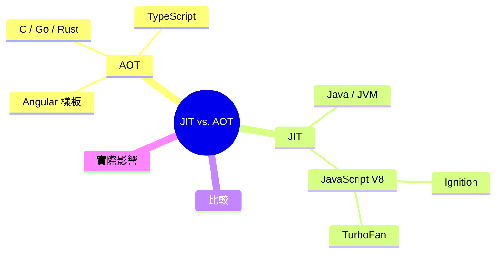
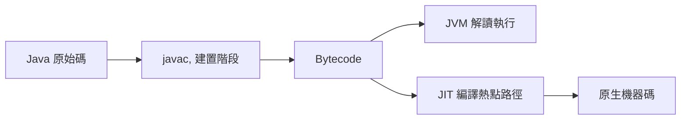
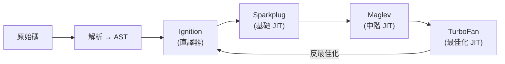

export const metadata = {
  title: 'JIT vs. AOT：程式碼如何被編譯',
  date: '2026-06-19',
  excerpt:
    '深入解析 Just-In-Time 和 Ahead-Of-Time 兩種編譯方式的運作原理、各自的適用場景，以及 V8 的分層編譯流程如何影響你寫的 JavaScript。',
  tags: ['前端', 'JavaScript'],
};

# JIT vs. AOT：程式碼如何被編譯

任何程式語言最終都必須被翻譯成處理器能執行的形式。問題在於：這個翻譯動作發生在什麼時候？

AOT 在執行前編譯；JIT 在執行過程中編譯。這個時機上的差異，決定了啟動速度、峰值效能，以及哪些最佳化手段是可行的，對前端工程師來說，兩者都以具體的方式出現在日常工作裡。



- [AOT](#aot)
- [JIT](#jit)
- [AOT vs. JIT](#aot-vs-jit)
- [實際影響](#實際影響)

---

## AOT

AOT (Ahead-Of-Time)：在程式開始執行之前，就把原始碼轉換成可執行的形式。執行的那一刻，編譯早已完成。

最直接的例子是 C、Go、Rust。它們的編譯器在建置階段執行，產出作業系統可以直接執行的機器碼，執行期不再有任何編譯工作。


### TypeScript

TypeScript 是前端工程師每天都在接觸的 AOT 範例。`tsc` (或現代工具鏈中的 SWC、esbuild) 在建置步驟把 TypeScript 編譯成 JavaScript，在這份程式碼抵達瀏覽器之前完成。型別標注在這個階段被檢查、被剝除；產出是純 JavaScript。

這正是 TypeScript 型別錯誤屬於「建置期錯誤」的原因：程式碼到達瀏覽器時，型別系統早已不存在。

### Angular 樣板

Angular 的正式建置對 HTML 樣板也套用 AOT 編譯。Angular 編譯器在 `ng build` 期間，把屬性繫結、結構型指令、pipe 等樣板語法全部轉換成 TypeScript 渲染函式，在任何程式碼抵達瀏覽器之前完成。

兩個直接效果：樣板錯誤在建置階段就被攔截，不會流到使用者端；同時，正式建置的 Bundle 不需要打包 Angular 樣板編譯器，有助於縮小 Bundle 體積。Angular 9 之後，AOT 是正式建置的預設選項。

---

## JIT

JIT (Just-In-Time) 走的是另一條路：在執行過程中即時編譯。

核心概念是：等待能帶來資訊。JIT 編譯器可以觀察程式實際的執行情況 (哪些函式最常被呼叫、參數實際上是什麼型別、哪些分支被選中)，然後針對最重要的執行路徑，產生高度最佳化的機器碼。

### Java 與 JVM

JVM 是 JIT 最標準的範例。`javac` 把 Java 原始碼編譯成 Bytecode，一種緊湊、跨平台的中間格式。JVM 先從解讀 Bytecode 開始，隨著執行過程累積熱點 (Hot Methods，頻繁執行的程式碼)，JIT 編譯器再將它們編譯為最佳化的原生機器碼。



Java 程式執行得愈久，JVM 就能最佳化得愈徹底。

### V8 與 JavaScript

V8 是 Chrome 和 Node.js 的 JavaScript 引擎，採用分層編譯流程。



Ignition 是 V8 的直譯器。它把 JavaScript 原始碼編譯成 Bytecode 後立即開始執行。Bytecode 生成速度快，這是 JavaScript 冷啟動快的核心原因。

Sparkplug 是輕量的 JIT 層，能將 Ignition 的 Bytecode 快速轉換為機器碼，最佳化程度有限，但足以讓速度超過純直譯。

Maglev (Chrome 117 加入) 介於 Sparkplug 和 TurboFan 之間，以遠低於 TurboFan 的編譯成本提供有意義的最佳化，處理「夠熱但還不值得動用 TurboFan」的程式碼。

TurboFan 是 V8 的峰值最佳化編譯器。它從 Ignition 的性能分析資料中蒐集實際型別、呼叫頻率、分支走向，為熱點函式產生高度專門化的機器碼。TurboFan 最佳化後的程式碼，速度可以比直譯 Bytecode 快上一個數量級。

### 最佳化與反最佳化

TurboFan 的最佳化建立在執行期累積的假設之上。一個始終以整數呼叫的函式，會得到針對整數運算最佳化的機器碼。一旦假設被打破，V8 就進行反最佳化：丟棄已編譯的程式碼、退回到 Ignition，並重新累積性能分析資料。

```javascript
function add(a, b) {
  return a + b;
}

// 持續以數字呼叫 → TurboFan 針對整數運算進行最佳化
add(1, 2);
add(3, 4);
add(5, 6);

// 型別假設被打破 → 反最佳化
add('hello', ' world');
```

這正是「熱點函式應保持型別一致」的效能建議的機制根源：穩定的型別讓 TurboFan 的假設持續有效，最佳化後的機器碼才能維持不被撤銷。

---

## AOT vs. JIT

| | AOT | JIT |
| - | - | - |
| 編譯時機 | 建置階段 | 執行期 |
| 啟動速度 | 快 | 較慢 (冷啟動) |
| 峰值效能 | 較低 (無執行期資料) | 較高 (自適應最佳化) |
| 錯誤偵測 | 建置階段 | 執行期 |
| Bundle 體積 | 較小 (不打包編譯器) | 較大 |
| 典型例子 | C、Go、TypeScript → JS | Java/JVM、JavaScript/V8 |

兩者沒有絕對的優劣，選擇取決於工作負載的特性。

AOT 適合啟動速度和可預測性比峰值效能更重要的場景：Serverless Function、CLI 工具、靜態資產，每毫秒的冷啟動時間都直接影響使用者體驗。

JIT 適合長期運行的程式，能接受暖機成本換取持續的高效能：持續接收流量的 Node.js 伺服器，或長時間開啟的瀏覽器分頁，執行夠久之後，TurboFan 就已將熱點路徑深度最佳化。

同樣的思維框架也出現在前端渲染策略中。SSG 在 build time 預先渲染 HTML 並放上 CDN，工作一次完成，請求進來時直接取用，這是 AOT。SSR 在每一次請求時即時渲染 HTML，需要時才執行，這是 JIT。CSR 不做任何 server 端 HTML 生成；瀏覽器收到 JavaScript Bundle 後在 client 端渲染，由 V8 的 JIT 編譯器接手。

三種策略的詳細比較，參考 [CSR vs. SSR vs. SSG](/articles/web-csr-ssr-ssg)。

---

## 實際影響

- 基準測試需要暖機。
- JavaScript 在 V8 中從直譯開始，隨著執行逐漸加溫。測量前幾次執行的基準測試，量到的是冷執行效能，而非最佳化後的穩態效能。完整的基準測試應在記錄結果前執行暖機，`benchmark.js` 和 Vitest 的 benchmark 模式都自動處理這件事。
- 型別一致性影響執行期效能。
- TypeScript 的型別在建置時已被抹除，V8 看不到它們。對 V8 而言，「型別穩定」意味著在執行期以一致的型別呼叫同一個函式，讓 TurboFan 的型別專用最佳化持續有效。同一個熱點函式混用不同型別，會觸發反最佳化。
- TypeScript 和 V8 是兩個獨立的編譯階段。
- TypeScript 的 AOT 在建置階段執行，產出純 JavaScript；V8 的 JIT 在瀏覽器中執行，把那份 JavaScript 再編譯成機器碼。兩者是同一條流水線上的獨立環節，理解這一點，能讓你清楚 TypeScript 的型別安全純粹是開發期保障，對執行期行為和效能完全沒有影響。
- 完整的前端執行生命週期，參考 [從原始碼到畫面：前端應用完整執行週期](/articles/web-source-to-screen)。
