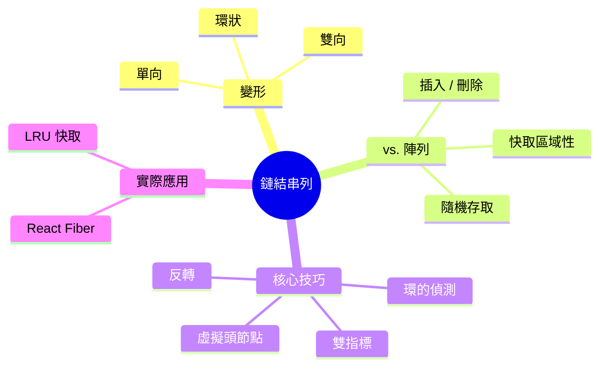
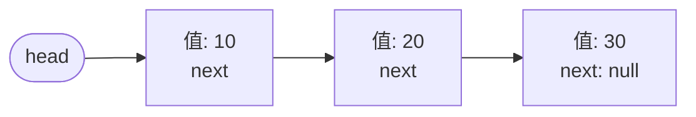
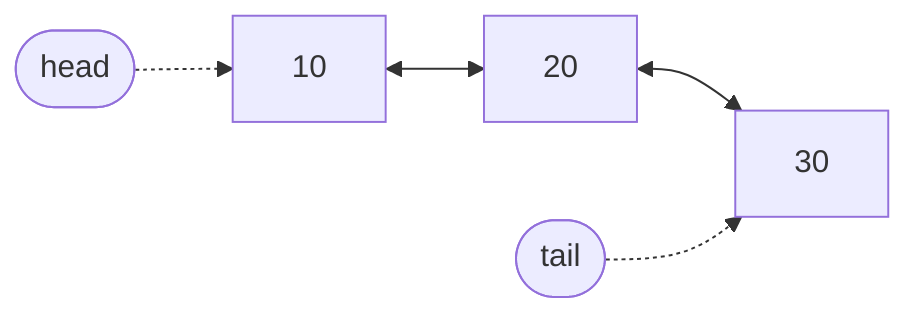
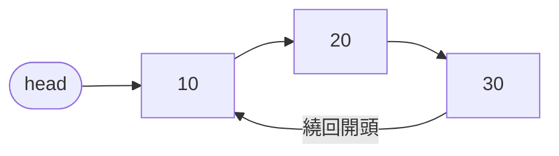
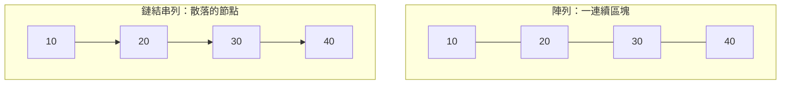
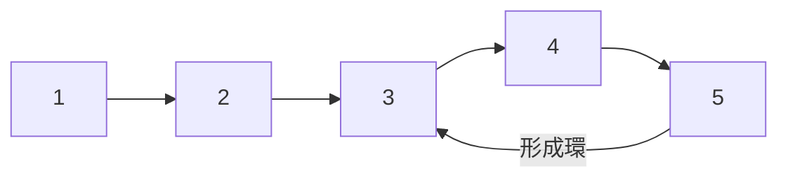
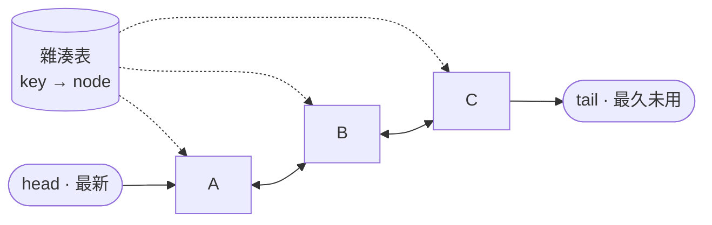

export const metadata = {
  title: '鏈結串列：由節點與指標構成的序列',
  date: '2026-08-01',
  excerpt: '深入解析鏈結串列：節點與指標如何串成一條序列、單向、雙向、環狀三種變形的差異、把快取區域性納入考量後它與陣列的真實比較，以及從面試題到 React Fiber 背後都會出現的指標操作技巧。',
  tags: ['程式設計', '資料結構', '演算法'],
};

# 鏈結串列：由節點與指標構成的序列

陣列把所有元素並排存放在同一塊記憶體裡。正是這種排列方式，讓 `arr[5]` 可以瞬間取得，位置只是起始位址加上一點算術。但也正是這種排列，讓「在開頭插入」變得昂貴：後面每一個元素都得往後挪。

鏈結串列做的是相反的取捨。它不要一整塊連續的記憶體，而是把每個元素各自包進一個物件，也就是節點 (node)，用指標 (pointer) 把節點一個接一個串起來。沒有索引算術，也不需要搬移；只要改寫一個指標，就能在常數時間內把一個節點接上或拆下。

抽象地看，兩種結構沒有誰比較好。要判斷哪一個適合，關鍵在於確實理解每一個指標替你買到了什麼、又付出了什麼代價。



- [什麼是鏈結串列](#什麼是鏈結串列)
- [單向鏈結串列](#單向鏈結串列)
- [雙向鏈結串列](#雙向鏈結串列)
- [環狀鏈結串列](#環狀鏈結串列)
- [鏈結串列 vs. 陣列](#鏈結串列-vs-陣列)
- [核心技巧](#核心技巧)
- [鏈結串列出現在哪裡](#鏈結串列出現在哪裡)
- [結論](#結論)

---

## 什麼是鏈結串列

鏈結串列是一條由節點串成的鏈。每個節點存兩樣東西：一個值，以及一個指向下一個節點的參照。串列本身只保留指向第一個節點的指標，也就是頭節點 (head)。從那裡開始，你順著 `next` 參照一路往下走，直到遇上 `null`，那代表終點。



在 JavaScript 裡，一個節點不過是個小物件：

```javascript
class ListNode {
  constructor(value) {
    this.value = value;
    this.next = null; // 指向下一個節點，到結尾則為 null
  }
}
```

它與陣列的對比，完全是記憶體層面的差別。陣列向執行環境要一整塊連續的記憶體，把元素依序排好，所以索引 `i` 的元素位在一個可以直接算出來的位置。鏈結串列從不索取整塊記憶體；每個節點各自被配置在 heap 上任何有空間的地方，而連接第 2 個節點與第 3 個節點的，只有存在第 2 個節點內部的那個指標。

這個單一的設計選擇，決定了其餘的一切：

- 沒有隨機存取。 沒有任何公式能直接跳到第 `n` 個節點。要抵達它，唯一的辦法是從頭節點出發、順著 `n` 個指標往下走，這是 O(n) 的操作。
- 重組的成本很低。 一旦你手上握著正確的節點，插入或移除只是重新指定一兩個指標的事，其他什麼都不用動。

本文接下來談的，就是讓這些指標更強大的各種變形，以及這個取捨真正划算的場景。

---

## 單向鏈結串列

上面那個結構 (每個節點只有一個 `next` 指標) 是單向鏈結串列。走訪只能往前：從任一節點都能抵達它後面的節點，卻永遠回不到前面的。我們用一個類別把節點包起來，並追蹤頭節點。

```javascript
class LinkedList {
  constructor() {
    this.head = null;
  }
}
```

### 插入

在頭部插入，正是鏈結串列為之而生的操作。你建立一個節點，把它的 `next` 指向目前的頭節點，再把頭指標移到新節點上。串列有多長都無所謂，永遠是 O(1)。

```javascript
// O(1)：新節點接到最前面
prepend(value) {
  const node = new ListNode(value);
  node.next = this.head;
  this.head = node;
}
```

在尾部插入則是完全相反的故事。只有頭指標的話，沒有捷徑能直達最後一個節點，得先走完整條串列把它找出來，這是 O(n)。

```javascript
// O(n)：走訪到結尾，再接上去
append(value) {
  const node = new ListNode(value);

  if (this.head === null) {
    this.head = node;
    return;
  }

  let current = this.head;
  while (current.next !== null) {
    current = current.next;
  }
  current.next = node;
}
```

解法是除了 `head` 之外，再額外保存一個 `tail` 指標，這樣附加也能變成 O(1)，代價是每次插入與刪除都得維持那個第二指標的正確性。這裡第一次浮現一個之後會反覆出現的主題：多一個指標換來速度，但也多了一筆要維護的成本。

### 刪除

要刪除一個節點，你得改寫它前一個節點的 `next` 指標，讓整條鏈跳過目標。單向鏈結串列的麻煩在於：一個節點沒有任何參照能回到它的前一個節點，所以即使改寫本身是常數時間，找出前一個節點卻要 O(n)。

```javascript
// O(n)：找出前一個節點，再略過目標
delete(value) {
  if (this.head === null) return;

  // 刪除頭節點是特例：它沒有前一個節點。
  if (this.head.value === value) {
    this.head = this.head.next;
    return;
  }

  let current = this.head;
  while (current.next !== null && current.next.value !== value) {
    current = current.next;
  }

  if (current.next !== null) {
    current.next = current.next.next; // 把目標從鏈上拆下
  }
}
```

注意頭節點那個特例。因為頭節點沒有前一個節點，它需要自己的分支。這種不對稱很惱人，稍後我們會看到一個乾淨的手法讓它消失。

### 走訪與搜尋

沒有隨機存取，找一個值就意味著從頭節點開始一個一個拜訪，最壞情況是 O(n)。

```javascript
// O(n)：從頭節點開始線性掃描
find(value) {
  let current = this.head;
  while (current !== null) {
    if (current.value === value) return current;
    current = current.next;
  }
  return null;
}
```

這個迴圈 (`let current = this.head`，然後用 `current = current.next` 前進直到 `null`) 幾乎是每一個鏈結串列操作的骨幹。把它內化，其餘的都只是變奏。

---

## 雙向鏈結串列

單向鏈結串列最痛的地方是刪除：要拆掉一個節點，你得先把它的前一個節點找出來。雙向鏈結串列藉由給每個節點第二個指標 `prev` (指向後方) 來解除這個限制。

```javascript
class DoublyNode {
  constructor(value) {
    this.value = value;
    this.prev = null;
    this.next = null;
  }
}
```



現在走訪可以雙向進行；而且關鍵在於，只要你手上已經握著一個節點，就能在 O(1) 內把它拆下，完全不必再掃描。它的兩個鄰居各只隔一步，透過 `prev` 與 `next` 就能抵達。這類串列幾乎總是同時追蹤 `head` 與 `tail`。

```javascript
class DoublyLinkedList {
  constructor() {
    this.head = null;
    this.tail = null;
  }

  // O(1)：接到尾端
  append(value) {
    const node = new DoublyNode(value);

    if (this.tail === null) {
      this.head = node;
      this.tail = node;
      return;
    }

    node.prev = this.tail;
    this.tail.next = node;
    this.tail = node;
  }

  // O(1)：拿到節點本身，直接拆下
  remove(node) {
    if (node.prev !== null) {
      node.prev.next = node.next;
    } else {
      this.head = node.next; // 節點原本是頭節點
    }

    if (node.next !== null) {
      node.next.prev = node.prev;
    } else {
      this.tail = node.prev; // 節點原本是尾節點
    }
  }
}
```

那個 O(1) 的 `remove` (直接拿節點、不必搜尋) 讓雙向鏈結串列能撐起 LRU 快取那類結構的關鍵性質。

不過，這份便利並非沒有代價。每個節點現在都多帶一個指標 (更多記憶體)，而且每次插入與刪除都得在兩側維持 `prev` 與 `next` 的一致 (更多出錯的可能)。你用空間與複雜度，換來了反向走訪與 O(1) 的移除。

---

## 環狀鏈結串列

在前面的串列裡，最後一個節點的 `next` 是 `null`，一條鏈有明確的盡頭。在環狀鏈結串列中，尾節點的 `next` 改為指回頭節點，把整個迴圈閉合起來。



沒有 `null` 終止符，所以走訪不會自然停止，會一直走，直到回到出發點。這正是重點：環狀串列用來模擬那些真的會循環的東西。輪流把時間配額分給每個行程的 round-robin 排程器、圍著遊戲桌而坐的玩家、會繞回第一張的輪播投影片，它們全都能乾淨地對應到「前進到下一個，而最後一個之後又是第一個」。

```javascript
// 每個節點剛好拜訪一次，繞回開頭時停下
let current = head;
do {
  console.log(current.value);
  current = current.next;
} while (current !== head);
```

代價是少了 `null`，你慣用的停止訊號也跟著不見了。任何假設有終止符的迴圈都會無限打轉，所以「何時停下」得用別的方式表示，例如「回到起點時停下」，或是用計數節點的方式。

---

## 鏈結串列 vs. 陣列

這才是真正決定你該選哪個結構的比較。紙面上，Big-O 讓鏈結串列在插入與刪除上看起來是壓倒性的贏家。但在實務上，答案要有趣得多。



先看漸進成本：

| 操作 | 陣列 | 單向鏈結 | 雙向鏈結 |
| - | - | - | - |
| 依索引存取 | O(1) | O(n) | O(n) |
| 依值搜尋 | O(n) | O(n) | O(n) |
| 在頭部插入 | O(n) | O(1) | O(1) |
| 在尾部插入 | O(1)* | O(n) / O(1)† | O(1) |
| 刪除頭部 | O(n) | O(1) | O(1) |
| 刪除已知節點 | O(n) | O(n) | O(1) |
| 每個元素的額外記憶體 | 無 | 1 個指標 | 2 個指標 |

\* 攤銷後的結果。附加通常瞬間完成，但偶爾的擴容會把整個陣列複製到更大的區塊。
† 唯有串列保有 `tail` 指標時才是 O(1)；否則要 O(n) 走到結尾。

這張表說了一個清楚的故事：陣列獨佔隨機存取，鏈結串列獨佔「在你已握著的位置上重組」。但有一欄是這張表呈現不了的，而它正是翻轉真實結果的那一欄。

### 快取區域性這個陷阱

Big-O 數的是操作次數；它對「單次記憶體存取要花多久」隻字不提。在現代硬體上，這個省略影響巨大。CPU 不是一次只從 RAM 讀一個位元組，它會一口氣拉進一整條快取行 (cache line，通常是 64 位元組)，而且一旦察覺是循序存取，還會在你開口之前先預取後面幾條。

陣列的排列正好為此而生。走訪它就像在連續記憶體上串流，所以大多數讀取其實早已待在快取裡。鏈結串列卻徹底瓦解了這個機制：它的節點散落在 heap 各處，所以每跟隨一個 `next` 指標，就是往一個無法預測的位址跳一步，通常是一次快取未命中 (cache miss)，CPU 得停下來等主記憶體。一次快取未命中的代價，可能比一次命中高出兩個數量級。

由此導出的結論常讓人意外：對許多真實的工作負載而言，即使是鏈結串列號稱拿手的任務，陣列反而更快。在陣列中間插入是 O(n)，因為要搬移元素，但那次搬移是一個緊湊、對快取友善、在連續記憶體上進行的 `memmove`。鏈結串列那個 O(1) 的插入，得先用 O(n) 的走訪抵達那個位置，而走訪的每一步都可能踩到快取未命中。當 `n` 屬於中小規模時，陣列往往完勝。

### 在兩者之間取捨

當你需要索引存取、當你走訪遠多於重組、或當 `n` 小到快取行為蓋過漸進複雜度時，選陣列 (預設選項)，涵蓋了絕大多數的日常程式碼。

當你不斷在「已經握有參照、而不必再搜尋」的位置上插入與移除、當沒有自然的索引、或當你明確需要 O(1) 的接合與穩定的節點識別時，選鏈結串列，上一節的那些結構，正好就是這些情況。

值得一提的是，JavaScript 內建的 `Array` 是動態陣列，而非鏈結串列，而且這個語言根本沒有原生的鏈結串列。需要時你得自己造一個，這也正是理解這個結構之所以重要的原因。

---

## 核心技巧

在基礎之外，有少數幾個指標技巧會一再出現，在面試題裡，也在真實函式庫的內部實作裡。每一個都是個小小的點子，卻能讓一整類操作變得乾淨俐落。

### 虛擬頭節點

還記得 `delete` 裡那個惱人的特例嗎：頭節點沒有前一個節點，所以需要自己的分支。虛擬頭節點 (又稱哨兵節點 / sentinel) 抹平了這個不對稱。你在真正的頭節點前面加上一個用完即丟的節點；現在每一個真實節點都有了前一個節點，特例也就消失了。

```javascript
// 刪除所有等於 value 的節點，頭節點不需特例處理。
function deleteValue(head, value) {
  const dummy = new ListNode(0); // 替真正的頭節點當一個替身前驅
  dummy.next = head;

  let current = dummy;
  while (current.next !== null) {
    if (current.next.value === value) {
      current.next = current.next.next; // 拆下，連頭節點也涵蓋在內
    } else {
      current = current.next;
    }
  }

  return dummy.next; // 真正的頭節點可能已經改變
}
```

虛擬節點永遠不屬於資料的一部分，它存在的唯一目的，是讓頭節點有個可以靠著的前驅。最後回傳 `dummy.next` 才能取回真正的頭節點，而它很可能與傳進來的那個不同。這是個小技巧，卻消除了一個反覆出現的差一錯誤與 null 錯誤來源。

### 快慢指標

許多問題問的是相對於某個你還不知道的長度的位置，例如中間的節點、倒數第 `k` 個。直覺的做法是先量長度，再走一次。快慢指標技巧只用一趟就搞定。

讓兩個指標從頭節點出發，但 `slow` 每走一步、`fast` 就走兩步。等 `fast` 抵達結尾時，`slow` 恰好在正中間。

```javascript
// 用單趟掃描找出中間節點
function findMiddle(head) {
  let slow = head;
  let fast = head;

  while (fast !== null && fast.next !== null) {
    slow = slow.next;       // 每次迭代 +1
    fast = fast.next.next;  // 每次迭代 +2
  }

  return slow; // 長度為偶數時，這是兩個中間節點中的後者
}
```

### 環的偵測：Floyd 演算法

如果一條串列的尾端不小心指回了串列內部，形成一個環，會怎樣？直覺的走訪會永遠跑下去。Floyd 環偵測 (也就是「龜兔賽跑」) 用了快慢指標的想法，用 O(n) 時間就能解決，而且值得注意的是，它只需要 O(1) 空間。

關鍵洞見：如果有環，快指標會在環內一圈圈追上慢指標，所以兩者終究會落在同一個節點上；如果沒有環，快指標就只會直接衝出結尾、撞上 `null`。



```javascript
// 以 O(n) 時間、O(1) 空間偵測環
function hasCycle(head) {
  let slow = head;
  let fast = head;

  while (fast !== null && fast.next !== null) {
    slow = slow.next;
    fast = fast.next.next;
    if (slow === fast) return true; // 兔子追上了烏龜
  }

  return false; // 快指標抵達結尾 → 沒有環
}
```

### 反轉鏈結串列

反轉單向鏈結串列是指標操作最經典的練習。你沒辦法往回走，所以只能邊走邊把每個 `next` 指標翻向另一邊，過程中同時握著三個參照：前一個節點、目前節點，以及前方那一個 (在覆寫掉連往它的連結之前先存起來)。

```javascript
// 原地反轉單向鏈結串列，O(n) 時間，O(1) 空間
function reverse(head) {
  let prev = null;
  let current = head;

  while (current !== null) {
    const next = current.next; // 先把後半段串列存起來
    current.next = prev;       // 把這個節點的指標翻向後方
    prev = current;            // prev 前進
    current = next;            // current 前進
  }

  return prev; // prev 就是新的頭節點
}
```

「在覆寫 `next` 之前先把它存起來」這個紀律，就是整個技巧的全部。一旦弄丟那個參照，串列剩下的部分就再也碰不到，這是一個迷你版的迷途指標 (dangling pointer) 錯誤。

---

## 鏈結串列出現在哪裡

這些結構不只是面試題的素材。它們悄悄運行在前端工程師每天使用的工具內部。

### LRU 快取

一個「最久未使用」快取必須把兩件事做得很快：依鍵查值，以及在滿了的時候淘汰最久之前用過的項目。標準解法把一個雜湊表 (hash map) 與一個雙向鏈結串列配在一起。雜湊表提供從鍵到節點的 O(1) 查找；串列則依使用的新近程度排序，最新的放在頭部。每次存取時，該節點都被拆下並移到最前面，這是 O(1)，正是因為雙向鏈結串列能在常數時間內把一個已知節點拆下。淘汰只要丟掉尾端就好。



### React Fiber

當 React 重寫它的協調器 (reconciler) 時，用一個鏈結結構取代了遞迴的樹走訪：每個 fiber 節點都帶著 `child`、`sibling` 與 `return` (父節點) 指標。透過指標、而非透過呼叫堆疊來走訪這棵樹，正是讓 React 能在渲染進行到一半時暫停、把控制權交還給瀏覽器、稍後再續上的關鍵，這是可中斷、並行渲染 (concurrent rendering) 的基礎。遞迴的走訪正好相反：它的進度都放在呼叫堆疊上，沒辦法中途凍結再續。關於遞迴與呼叫堆疊，參考 [Recursion：遞迴](/articles/recursion)。

### 瀏覽器歷史與復原 / 重做

在頁面之間前進後退，或是復原與重做編輯，都是一個「有當前位置、兩側各有鄰居」的序列，天生適合用雙向鏈結串列，其中 `prev` 是「上一頁 / 復原」，`next` 是「下一頁 / 重做」。貫穿這三個例子的，是同一個定義了整個結構的性質：當你的存取模式是「在已握有的位置上把東西接進接出」、而對個別元素的穩定參照又比跳到任意索引更重要時，鏈結串列就是對的工具。

---

## 結論

鏈結串列把陣列的連續記憶體 (以及隨之而來的瞬間索引) 換成了一條由指標相連、各自獨立配置的節點鏈。這個取捨放棄了隨機存取與對快取友善的走訪，買到的是「在你已握著的位置上」做 O(1) 重組的能力。

各種變形微調了這筆交易：單向鏈結串列是最精簡的單向鏈，雙向鏈結串列加上後向指標換來雙向走訪與已知節點的 O(1) 移除，環狀串列則把鏈閉合起來、用於真正會循環的事物。那些指標技巧 (虛擬頭節點、快慢指標、Floyd 環偵測、原地反轉) 是操作它們全部的共通語彙。

持平而論，陣列應該是你的預設選項：快取區域性意味著它獲勝的次數，比單看 Big-O 所暗示的更多。但當工作負載是「在已知位置上不斷接合」、而穩定的節點識別本身又很重要 (一個 LRU 快取、一個協調器、一個歷史堆疊)，鏈結串列就不只是可行而已，它正是那些工具賴以建立的結構。
