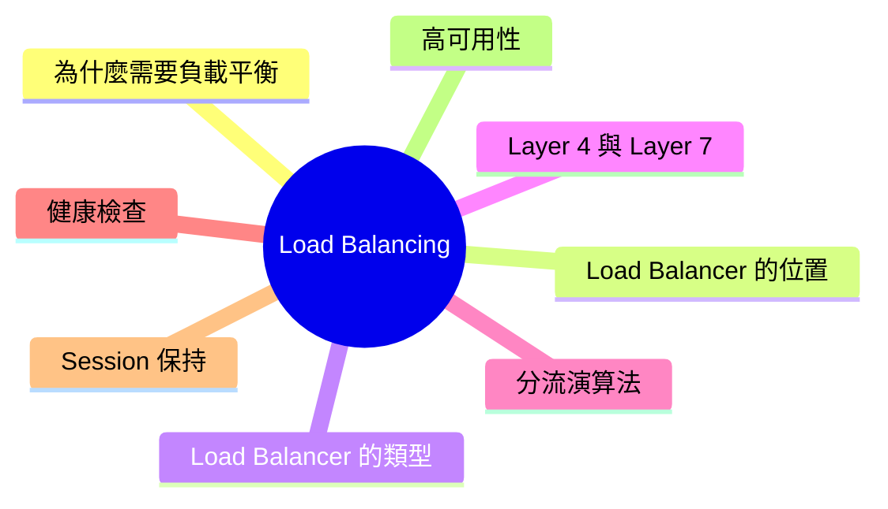
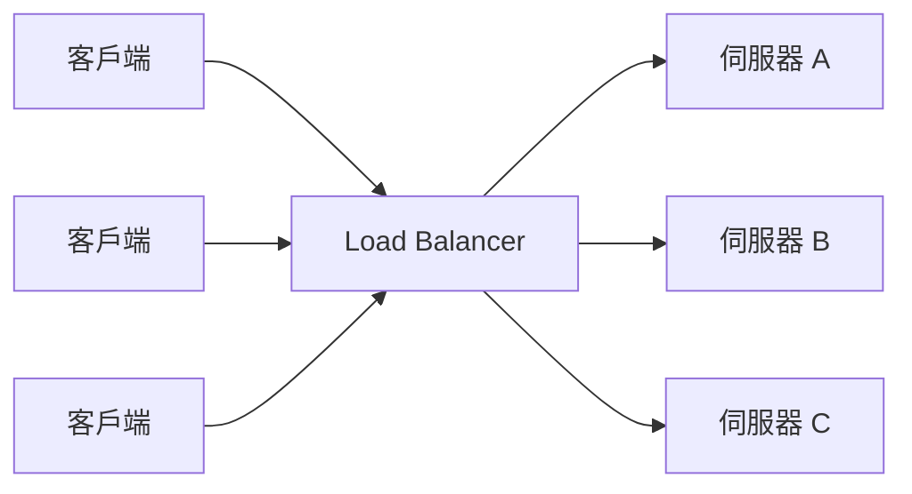
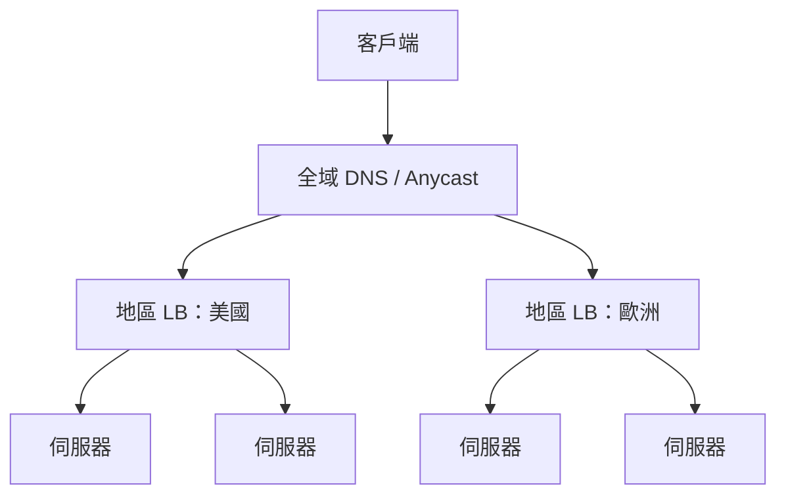
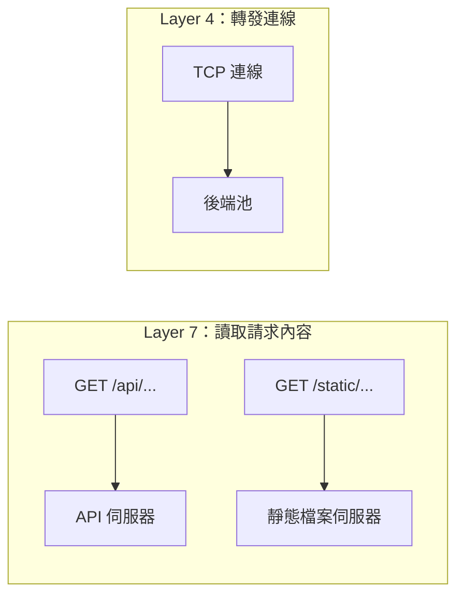
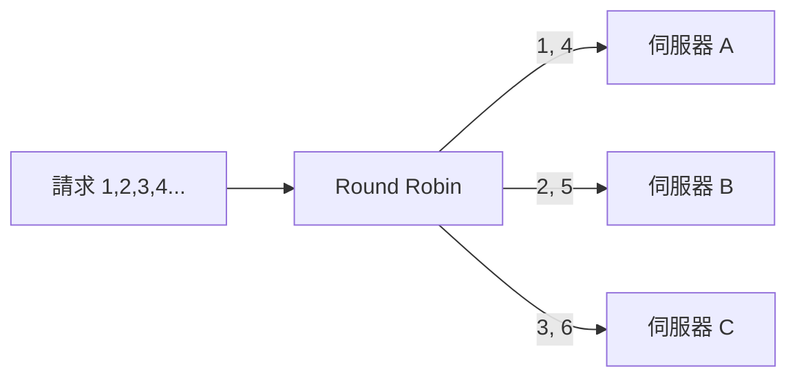
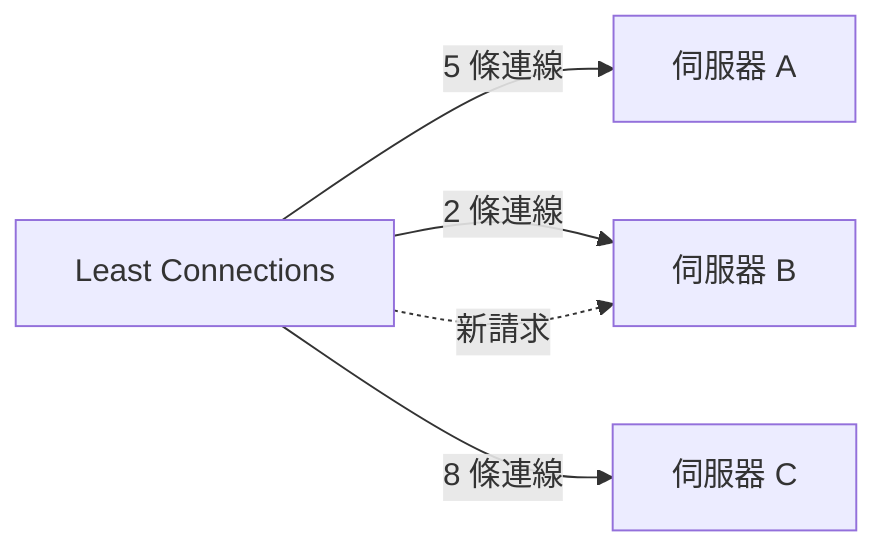
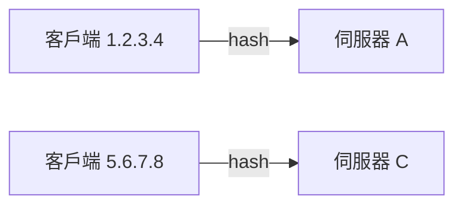
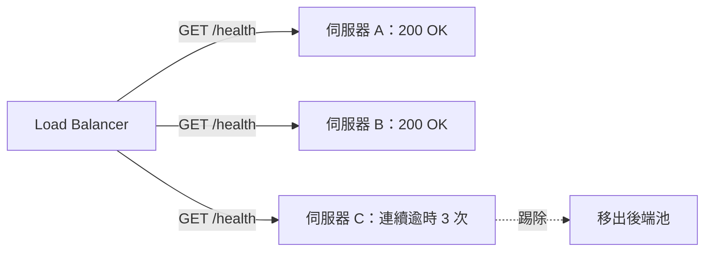
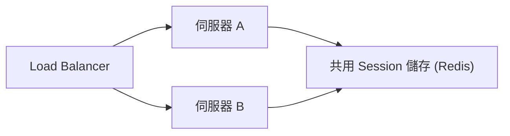
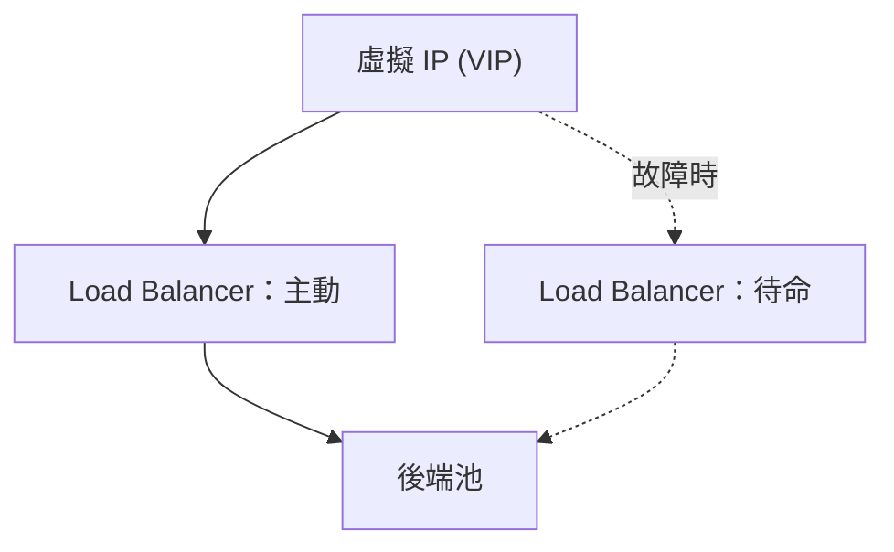

export const metadata = {
  title: 'Load Balancing：負載平衡',
  date: '2026-06-22',
  excerpt: '介紹負載平衡的運作方式，包含 Load Balancer 的位置與類型、Layer 4 與 Layer 7 的差異、常見的分流演算法、健康檢查、Session 保持，以及如何讓 Load Balancer 本身達到高可用性。',
  tags: ['網路', 'Web'],
};

# Load Balancing：負載平衡

單一伺服器有它的上限：能承受的連線數有限、CPU 會用盡、運行久了總會出問題。負載平衡 (Load Balancing) 就是突破這道上限的方法：在同一個入口後面放上多台伺服器，把進來的流量分散到它們身上。

負責分散流量的元件就是 Load Balancer (負載平衡器)。做得好，它能同時帶來兩件事：更高的容量 (加機器就能水平擴展) 與更高的可用性 (一台掛掉不會讓整個服務跟著倒)。

如果你讀過 [Proxy](/articles/web-proxy)，Load Balancer 其實就是一種 Reverse Proxy，它最核心的工作是決定每個請求該送往哪一台後端伺服器。



- [為什麼需要負載平衡](#為什麼需要負載平衡)
- [Load Balancer 的位置](#load-balancer-的位置)
- [Load Balancer 的類型](#load-balancer-的類型)
- [Layer 4 與 Layer 7](#layer-4-與-layer-7)
- [負載平衡演算法](#負載平衡演算法)
    - [Round Robin](#round-robin)
    - [Weighted Round Robin](#weighted-round-robin)
    - [Least Connections](#least-connections)
    - [Least Response Time](#least-response-time)
    - [IP Hash](#ip-hash)
    - [Consistent Hashing](#consistent-hashing)
    - [Power of Two Choices](#power-of-two-choices)
- [健康檢查](#健康檢查)
- [Session 保持](#session-保持)
- [高可用性](#高可用性)
- [設定範例](#設定範例)

---

## 為什麼需要負載平衡

假設一開始只有一台伺服器處理所有請求。當流量成長，你有兩種應對方式：

- 垂直擴展 (Scale Up)：把這台伺服器換成更強的 CPU、更大的記憶體、更快的硬碟。做法單純，但單一機器的規模有硬性上限，而且越往高階走，每單位效能的成本就越貴。
- 水平擴展 (Scale Out)：加入更多台伺服器，把工作分攤出去。理論上沒有上限，普通規格的機器也便宜。但這時就需要有人來決定每個請求該交給哪一台。

這個「有人」就是 Load Balancer，它讓水平擴展變得可行。它帶來的好處有兩個面向：

- 容量：原本會壓垮單台的流量被分散到多台，每一台都能維持在自己的負荷範圍內。
- 可用性：某台伺服器當機，或是因為部署被下線時，Load Balancer 會自動繞過它。應用層的單點故障 (Single Point of Failure) 就此消失。



關鍵的轉變在於：客戶端不再直接跟某一台伺服器溝通，而是跟 Load Balancer 溝通，再由 Load Balancer 決定請求最終落在哪裡。

---

## Load Balancer 的位置

Load Balancer 是一種 Reverse Proxy：它對外接收連線，再轉發給一群客戶端看不到的後端伺服器。客戶端只知道 Load Balancer 的位址。

正因為所有請求都會經過這個單一入口，Load Balancer 能做的就不只是分流。它天生適合順便處理：

- TLS 終止 (TLS Termination)：在邊緣統一處理 HTTPS 加解密，後端內部只需要使用純 HTTP (參考 [SSL/TLS](/articles/network-ssl-tls))
- 健康檢查：不再把流量送往出問題的後端
- 快取與壓縮：重複的回應直接由 Load Balancer 提供，不必驚動後端

規模較大的系統通常不會只有一個 Load Balancer，流量往往會經過好幾層，由全域層決定要把你導向哪個地區，再由地區層把請求分散到該地區內的伺服器。



---

## Load Balancer 的類型

「Load Balancer」描述的是一種角色，而不是單一產品。同樣的角色會出現在技術堆疊的不同位置：

- DNS 負載平衡：DNS 伺服器針對同一個網域回傳多個 IP，客戶端連向其中之一。這是跨地區分流最便宜的做法，但很粗糙：DNS 回應會被快取到 TTL 到期為止，所以伺服器故障時無法即時反應，而且要用哪個位址是由解析器決定，不是你。
- 硬體式 Load Balancer：專屬設備 (例如 F5、Citrix)，以專用硬體承載極大的吞吐量。又快又穩，但昂貴且彈性低。
- 軟體式 Load Balancer：Nginx、HAProxy、Envoy 這類跑在一般伺服器上的程式。彈性高、成本低，也是現今多數團隊的預設選擇。
- 雲端 Load Balancer：託管服務，例如 AWS ALB/NLB、GCP Cloud Load Balancing、Azure Load Balancer。不必自己維運基礎設施，就能擁有擴展、健康檢查與高可用性。

這幾層是可以組合的。典型架構會用 DNS 或 Anycast 把使用者帶到正確的地區，再由地區內的軟體式或雲端 Load Balancer 把請求分散到各台伺服器。

---

## Layer 4 與 Layer 7

Load Balancer 運作在網路堆疊的兩個層級之一，而這個選擇決定了它能做什麼、不能做什麼。(關於層級本身，可參考 [OSI 模型](/articles/network-osi) 與 [TCP/IP](/articles/network-tcp-ip)。)

Layer 4 Load Balancer 運作在傳輸層。它看到的是 TCP/UDP 封包 (IP 位址與通訊埠)，在不拆開內容的情況下轉發。它在連線建立時決定這條連線要送往哪裡，之後這條連線上的每個封包都走相同路徑。它完全不知道流量是 HTTP、影音串流，還是資料庫協定。

Layer 7 Load Balancer 運作在應用層。它會終止連線、讀取真正的 HTTP 請求，再根據內容來分流：網址路徑、`Host` 標頭、Cookie，請求裡的任何東西都行。這讓它的能力強大許多，代價是每個請求要做更多事。



| | Layer 4 | Layer 7 |
| - | - | - |
| 處理對象 | TCP/UDP、IP + 通訊埠 | HTTP/HTTPS 請求內容 |
| 分流時機 | 每條連線一次 | 每個請求一次 |
| 能否依網址、Host、Cookie 分流 | 不行 | 可以 |
| TLS 終止 | 不行 (直接穿透) | 可以 |
| 負擔 | 較低，只需轉發封包 | 較高，需要解析每個請求 |
| 常見用途 | 純吞吐量、非 HTTP 協定 | Web 應用、微服務路由、API |

舉個能凸顯差異的例子：Layer 7 Load Balancer 可以從單一對外位址，把 `/api/*` 送往 API 伺服器、把 `/static/*` 送往另一組靜態檔案伺服器。Layer 4 做不到，因為它根本看不到路徑。換來的是，Layer 4 更輕量，能用極少的 CPU 承載龐大的連線量。

---

## 負載平衡演算法

請求進來之後，Load Balancer 必須挑出一台後端。它所採用的演算法，正是整件事的核心。怎麼選，取決於你的伺服器效能是否一致、以及你的請求成本是否一致。

### Round Robin

依固定順序輪流派發請求：伺服器 A、再 B、再 C，然後回到 A。



它極為單純，當所有伺服器規格相近、所有請求成本也差不多時運作良好。它的弱點是忽略現實：就算某台已經吃力，它還是會繼續把請求送過去，因為它只數輪到誰，不看實際負載。

### Weighted Round Robin

同樣是輪流，但每台伺服器依容量分配一個權重 (weight)。權重為 3 的伺服器，每當權重為 1 的伺服器拿到一個請求時，它會拿到三個。

當你手上的機器規格並不一致 (例如幾台高規機器搭配幾台較小的機器)，Weighted Round Robin 就是解法。你讓輪流偏向較大的伺服器，使流量的比例對上容量的比例。

### Least Connections

把每個新請求送往當下「目前連線數最少」的伺服器。



它會依實際負載調整，而不是盲目輪流，因此當請求的處理時間長短不一時，它是更好的預設選擇。用 Round Robin 時，某台伺服器可能悄悄累積一堆又慢又長命的請求；Least Connections 則會自然地把新工作導向最閒的那台。它也有加權的變體，把伺服器容量一併納入連線數的計算。

### Least Response Time

比 Least Connections 更進一步：挑出「連線數最少」與「平均回應時間最短」綜合表現最好的伺服器。一台伺服器也許連線數不多卻依然很慢 (硬碟飽和、被同主機的鄰居拖累)，而回應時間能反映出這點。它更準確，但需要 Load Balancer 持續測量每台後端的延遲。

### IP Hash

對客戶端的 IP 位址做雜湊 (hash)，用結果來挑伺服器。同一個客戶端會固定落在同一台後端。



這讓你不靠 Cookie 就能達到 Session 黏著性，伺服器在記憶體中保有該客戶端的狀態時很有用。問題出在重新平衡：當你增加或移除一台伺服器，雜湊對應就會位移，一大部分客戶端會被重新指派到不同後端，連帶丟失它們在記憶體裡的狀態。Consistent Hashing 正是為了解決這件事。

### Consistent Hashing

單純的取模雜湊 (`hash(key) % N`) 有個殘酷的失效模式：只要改變 `N`，幾乎每一個 key 都會對應到新的位置。Consistent Hashing 的做法是把伺服器與 key 都放在一個概念上的環 (ring) 上；每個 key 歸屬於它順時針方向的下一台伺服器。

它的優勢在於池子變動時的表現。在 $n$ 台伺服器中增加或移除一台，平均只有約

$$\frac{K}{n}$$

個 key 會移動 ($K$ 為 key 的總數)，其餘的維持原位。對比取模雜湊幾乎所有 $K$ 個 key 都可能移動，差距非常大。為了讓分布平均，每台伺服器會在環上放置多個點 (虛擬節點，virtual node)。這是分散式快取與分片資料庫的標準做法，因為在那些場景中，重新對應一個 key 意味著一次快取失效或一次資料搬移。

### Power of Two Choices

要永遠挑到「絕對負載最低」的伺服器，得追蹤全域狀態，既昂貴又難協調。Power of Two Choices 是一個精巧又便宜的近似法：隨機挑兩台伺服器，把請求送給其中較閒的那一台。

多取樣這一台，數學結果就大不相同。把 $n$ 個請求分散到 $n$ 台伺服器，純隨機指派會讓最忙的伺服器負載大約是

$$\frac{\ln n}{\ln \ln n}$$

而取兩台挑較輕的那台，則會把它降到大約

$$\frac{\ln \ln n}{\ln 2}$$

這是指數級的改善，卻幾乎不需要真正 Least Connections 那樣的協調成本。正因如此，它在大型分散式系統中相當受歡迎。

---

## 健康檢查

只有把流量分給「真的能運作」的伺服器，分流才有意義。健康檢查 (Health Check) 是 Load Balancer 用來判斷哪些後端有資格接收流量的機制，分為兩種。

主動健康檢查 (Active Health Check) 會定期主動探測每台後端，例如送一個 HTTP `GET /health`，或單純嘗試建立一條 TCP 連線。後端在連續失敗達到一定次數後會被標記為下線，並且要再連續通過一定次數才會重新上線。門檻的拿捏很重要：太敏感，一個短暫的小抖動就把健康的伺服器踢掉；太寬鬆，已死的伺服器卻還在收流量。

被動健康檢查 (Passive Health Check) 不發送人造探測，而是觀察真實流量。如果對真實請求的回應開始逾時或回傳錯誤，Load Balancer 就把該後端標記為不健康並停止導流。這能在使用者實際碰上問題的當下就抓到，也是離群偵測 (Outlier Detection) 與斷路器 (Circuit Breaker) 的基礎。



兩者互補：主動檢查能在一台生病的伺服器服務到任何一個真實請求之前就攔下它；被動檢查則能抓到那些只有在真實負載下才會浮現的問題。

---

## Session 保持

許多應用會把每個使用者的狀態存在伺服器記憶體，如登入的 Session、購物車、填到一半的表單。問題來了：如果請求 1 在伺服器 A 上建立了 Session，而請求 2 卻被導到伺服器 B，伺服器 B 根本不知道這位使用者是誰。

傳統解法是 Session 保持，也叫黏性 Session (Sticky Session)：在使用者的 Session 期間，把他綁定在同一台後端。常見有兩種做法：

- 以 Cookie 為基礎：Load Balancer 注入一個標示所選後端的 Cookie，後續帶有這個 Cookie 的請求都會被送回同一台伺服器。這是 Layer 7 的功能。
- 以 IP 為基礎：IP Hash 讓客戶端的位址永遠對應到同一台伺服器。在 Layer 4 就能運作，但對於共用 NAT 之後、或在不同網路間漫遊的客戶端會失效。

黏著有用，但它和 Load Balancer 的核心目的互相牴觸：

- 負載傾斜：熱門的 Session 可能全擠在某一台，其他台卻閒著。
- 移除時會中斷：一台黏著的伺服器下線，所有釘在上面的 Session 都會遺失。
- 限制擴展：新加入的伺服器只會接到新的 Session，分不到既有流量。

更好的答案是把伺服器設計成無狀態 (Stateless)：把 Session 狀態移出伺服器記憶體，放進一個兩台伺服器都能讀取的共用儲存。



當狀態放在像 Redis 這樣的共用儲存或乾脆用一個簽章過的權杖，例如 [JWT](/articles/network-jwt)，完全帶在請求中），任何一台伺服器都能處理任何請求。這正是讓你能自由水平擴展、部署時不丟 Session、並放心採用最單純、最平均演算法的關鍵。黏性 Session 是一種權宜之計；無狀態伺服器才是該有的設計。

---

## 高可用性

前面每一張圖背後都藏著一個尷尬的問題：如果所有流量都流經 Load Balancer，那 Load Balancer 自己不就是個單點故障嗎？確實，除非你針對它做設計。一個會拖垮整個網站的 Load Balancer，比沒有 Load Balancer 還糟。

標準做法是不只跑一台。兩種配置方式：

- 主動-被動 (Active-Passive)：一台 Load Balancer 服務流量，另一台待命。它們共用一個虛擬 IP (VIP)，這是一個浮動位址，平常指向主動節點。兩台之間互傳心跳 (例如 VRRP 協定，`keepalived` 即是其實作)；當主動節點停止回應，VIP 就移交給待命節點接手。客戶端完全不會察覺位址有變。
- 主動-主動 (Active-Active)：兩台 Load Balancer 同時服務流量，前面再以 DNS Round Robin 或 Anycast 分流。你同時得到故障轉移與額外容量，代價是更多的協調。



在最大的規模上，連入口本身都會用 Anycast 分散到不同地理位置：同一個 IP 位址從全球各地的資料中心對外宣告，由網際網路自身的路由 (BGP) 把每個客戶端帶到最近的那一個。整個站點故障時，流量只會自動改道到次近的位置，不必改 DNS，也不必等快取過期。

每一層的原則都一樣：絕不讓單一一台機器 (無論它多可靠) 成為使用者與服務之間唯一的那道關卡。

---

## 設定範例

上面的概念能直接對應到實際設定。以下用兩個最常見的軟體式 Load Balancer，把同一組後端池表達出來。

Nginx，以 `upstream` 定義後端池：

```nginx
upstream backend {
    least_conn;                                   # 演算法
    server backend1.example.com:8080 weight=3;    # 拿到 3 倍流量
    server backend2.example.com:8080;
    server backend3.example.com:8080 backup;      # 只有其他台都下線時才啟用
}

server {
    listen 80;
    server_name example.com;

    location / {
        proxy_pass http://backend;
        proxy_set_header Host $host;
        proxy_set_header X-Real-IP $remote_addr;
    }
}
```

HAProxy，搭配明確的健康檢查：

```haproxy
frontend http_in
    bind *:80
    default_backend servers

backend servers
    balance roundrobin
    option httpchk GET /health          # 主動健康檢查
    server web1 10.0.0.1:8080 check weight 3
    server web2 10.0.0.2:8080 check
    server web3 10.0.0.3:8080 check backup
```

兩者表達的是同一套概念：一組後端池、一個演算法 (`least_conn` / `roundrobin`)、各台的權重、一台備援伺服器，以及 (在 HAProxy 的例子中) 一個對 `/health` 的主動健康檢查。

---

## 總結

負載平衡能把一堆伺服器變成單一、可擴展、有韌性的服務。各個環節是這樣銜接起來的：

- Load Balancer 是一種 Reverse Proxy，工作是為每個請求挑出一台後端，同時給你容量與可用性。
- Layer 4 又快又「盲」地轉發連線；Layer 7 讀取請求並做聰明的分流，代價是更高的負擔。
- 演算法決定請求落在哪台：機器規格一致用 Round Robin、工作負載不一用 Least Connections、重新對應成本高時用 Consistent Hashing、想用便宜手段逼近最佳平衡則用 Power of Two Choices。
- 健康檢查讓流量遠離壞掉的後端；Session 保持是一種權宜之計，而無狀態伺服器讓它變得不再必要。
- 而 Load Balancer 本身絕不能是單點故障，應成對部署，或用 Anycast 分散它。

負載平衡正是 [Reverse Proxy](/articles/web-proxy) 最具代表性的工作場景，再加上讓它足以上線運行的演算法、健康檢查與故障轉移。至於邊緣如何在把請求交給後端之前先解開 HTTPS，可參考 [SSL/TLS](/articles/network-ssl-tls)。
