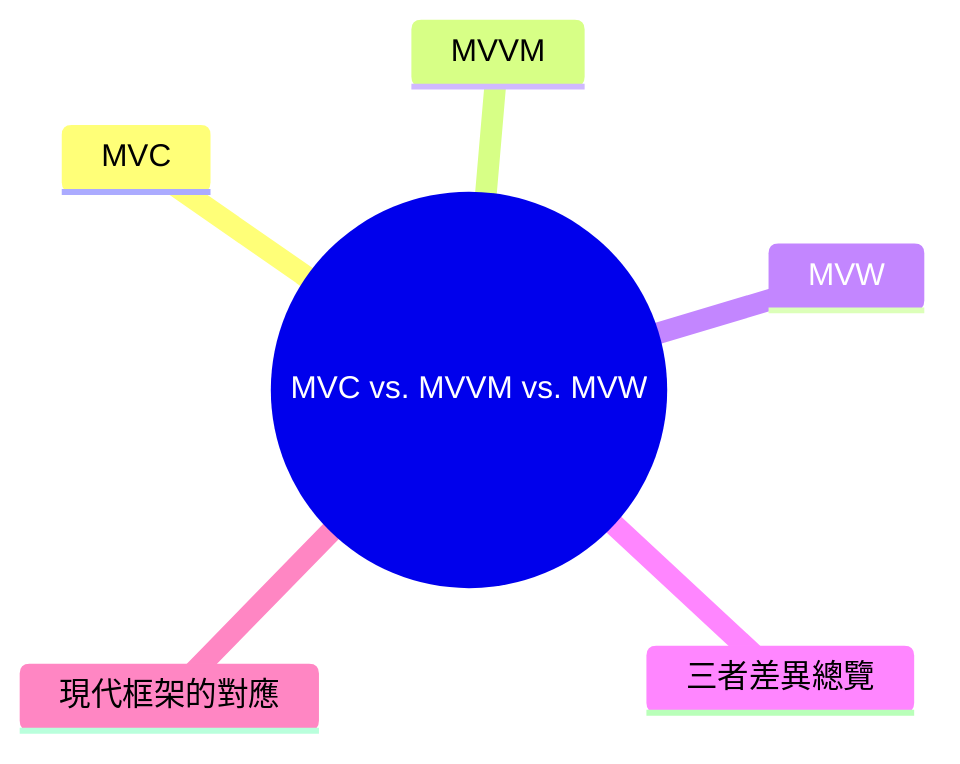
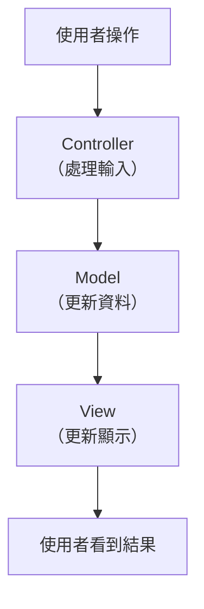
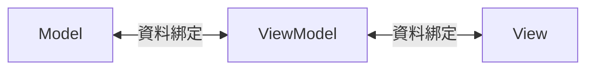

export const metadata = {
  title: 'MVC vs. MVVM vs. MVW：架構模式的差異',
  date: '2026-04-11',
  excerpt: '介紹 MVC、MVVM、MVW 三種架構模式的差異，包含各自的職責分工、資料流方向，以及 Angular、Vue、React 三個框架與這些模式的對應關係。',
  tags: ['架構', '設計模式'],
};

# MVC vs. MVVM vs. MVW：架構模式的差異

MVC、MVVM、MVW 是前端和應用程式開發中常見的架構模式，都是為了解決同一個問題：如何組織程式碼，讓 UI、資料和邏輯清楚分離。



- [MVC](#mvc)
- [MVVM](#mvvm)
- [MVW](#mvw)
- [三者差異總覽](#三者差異總覽)
- [現代框架的對應](#現代框架的對應)

---

## MVC

MVC (Model-View-Controller) 是最經典的架構模式，將應用程式分成三個角色：

- Model：資料和業務邏輯。管理應用程式的狀態，處理資料的取得和存儲。
- View：UI 的呈現。只負責顯示資料，不包含業務邏輯。
- Controller：中介者。接收使用者的輸入，更新 Model，再決定顯示哪個 View。



### MVC 的特性

- Controller 是 View 和 Model 的橋樑
- View 不直接操作 Model
- 一個 Controller 可以對應多個 View
- 傳統的後端框架 (例如 Ruby on Rails、Laravel、Spring MVC) 廣泛使用這個模式

### MVC 的問題

在前端應用中，Controller 很容易變得過於龐大，承載了太多邏輯 (俗稱 Massive View Controller)。隨著應用程式變複雜，這個問題更加明顯。

---

## MVVM

MVVM (Model-View-ViewModel) 是 MVC 的演進，特別適合有資料綁定 (Data Binding) 機制的前端框架。

- Model：資料和業務邏輯，與 MVC 相同。
- View：UI 的呈現，宣告式地描述畫面結構。
- ViewModel：View 的資料和狀態。提供 View 需要的資料，並處理 View 的行為，但不直接操作 DOM。



### MVVM 的核心：雙向資料綁定

MVVM 最大的特色是 View 和 ViewModel 之間的雙向資料綁定：

- Model 的資料改變 → ViewModel 更新 → View 自動更新
- 使用者在 View 操作 → ViewModel 自動收到通知 → 更新 Model

這讓開發者不需要手動操作 DOM，框架會自動處理 View 的更新。

### Angular 的 MVVM

Angular 是典型的 MVVM 框架：

- Model：Service 和資料物件
- ViewModel：Component 的 TypeScript 類別 (屬性和方法)
- View：Component 的 HTML 模板

```typescript
// ViewModel (Component)
@Component({
  selector: 'app-counter',
  template: `
    <p>{{ count }}</p>
    <button (click)="increment()">+1</button>
  `,
})
export class CounterComponent {
  count = 0; // 狀態

  increment() {
    this.count++; // 操作狀態，View 自動更新
  }
}
```

模板中的 `{{ count }}` 是單向綁定 (Model → View)，`(click)` 是事件綁定 (View → ViewModel)。

### Vue 的 MVVM

Vue 也是 MVVM 框架：

- Model：`data()` 或 `ref()` / `reactive()` 中的響應式資料
- ViewModel：`setup()` 或 Options API 中的邏輯
- View：Template

```vue
<template>
  <p>{{ count }}</p>
  <button @click="count++">+1</button>
</template>

<script setup>
import { ref } from 'vue';
const count = ref(0);
</script>
```

---

## MVW

MVW (Model-View-Whatever) 是 Angular 團隊提出的說法，意思是「不管中間那層叫什麼，只要做好分離就好」。

這個說法反映了一個現實：現代框架的架構很難嚴格對應到 MVC 或 MVVM，不同的框架和用法可能更接近不同的模式。

### React 的情況

React 官方從不聲稱自己是 MVC 或 MVVM。嚴格來說，React 只是一個 View 函式庫，只處理 UI 的渲染部分。

狀態管理、資料流、業務邏輯的組織方式由開發者自己決定 (或透過 Redux、Zustand 等工具)。

```jsx
// React 元件接近 ViewModel 的概念
function Counter() {
  const [count, setCount] = useState(0); // 狀態 (接近 ViewModel)

  return (
    <div>
      <p>{count}</p>
      <button onClick={() => setCount(count + 1)}>+1</button>
    </div>
  );
}
```

React 的資料流是單向的：狀態改變 → 重新渲染 View，這與 MVVM 的雙向綁定不同。

---

## 三者差異總覽

| | MVC | MVVM | MVW |
| - | - | - | - |
| 中間層 | Controller | ViewModel | Whatever (不強制) |
| 資料流 | 單向 | 雙向綁定 | 視實作而定 |
| DOM 操作 | Controller 可能操作 | ViewModel 不操作 DOM | 視框架而定 |
| 典型使用場景 | 後端框架、傳統 MPA | 前端框架 (Angular、Vue) | React 等現代框架 |

---

## 現代框架的對應

| 框架 | 最接近的模式 | 說明 |
| - | - | - |
| Angular | MVVM | Component = ViewModel，雙向資料綁定 |
| Vue | MVVM | 響應式系統實現雙向綁定 |
| React | 接近 MVW | 單向資料流，官方不定義架構模式 |

---

## 總結

- MVC 是最經典的分離模式，Controller 是 View 和 Model 的橋樑
- MVVM 透過雙向資料綁定讓 View 和 ViewModel 自動同步，適合現代前端框架
- MVW 是更寬鬆的說法，反映現代框架不一定嚴格對應傳統架構模式的現實

這些模式的核心目標都一樣：讓 UI、資料和邏輯各司其職，降低耦合，提高可維護性。
