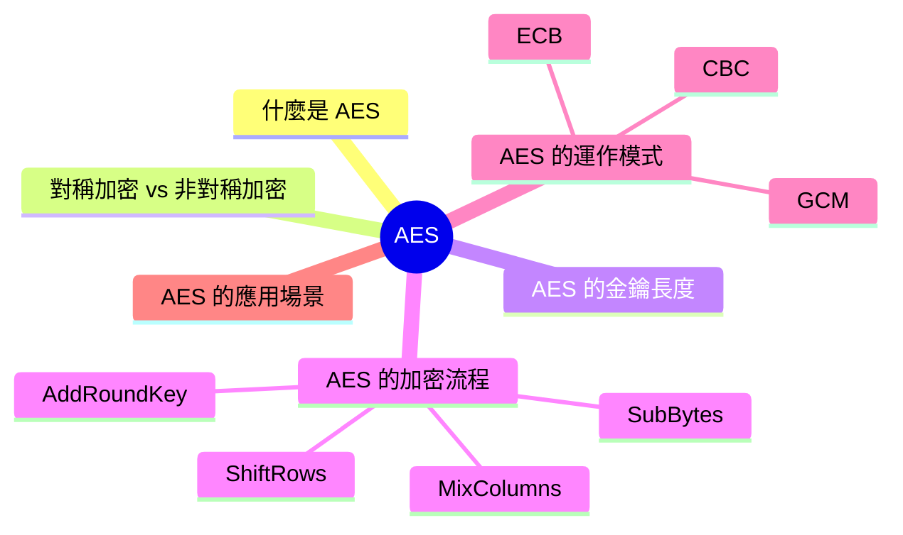
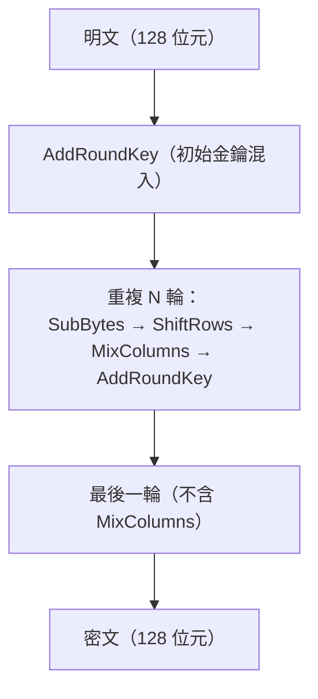
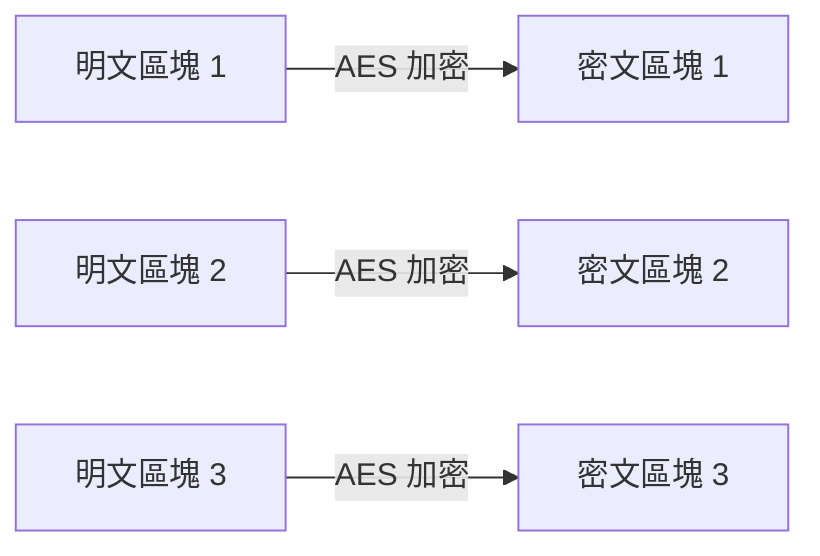
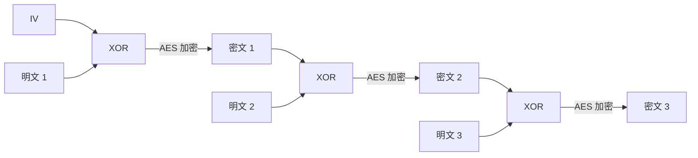

export const metadata = {
  title: '進階加密標準 (AES)',
  date: '2026-04-29',
  excerpt: '介紹 AES 進階加密標準的核心概念，包含對稱與非對稱加密的差異、三種金鑰長度的比較，以及 ECB、CBC、GCM 三種運作模式的特性與使用建議。',
  tags: ['資訊安全', '網路'],
};

# 進階加密標準 (AES)

AES (Advanced Encryption Standard，進階加密標準) 是目前最廣泛使用的對稱加密演算法，用來保護各種敏感資料，從 HTTPS 連線到磁碟加密都有它的身影。



- [什麼是 AES](#什麼是-aes)
- [對稱加密 vs 非對稱加密](#對稱加密-vs-非對稱加密)
- [AES 的金鑰長度](#aes-的金鑰長度)
- [AES 的加密流程](#aes-的加密流程)
- [AES 的運作模式](#aes-的運作模式)
- [AES 的應用場景](#aes-的應用場景)

---

## 什麼是 AES

AES 是一種對稱加密演算法，加密和解密使用同一把金鑰。

它由比利時密碼學家 Joan Daemen 和 Vincent Rijmen 設計，原名 Rijndael，2001 年被美國國家標準與技術研究院 (NIST) 選為聯邦加密標準，正式命名為 AES。

AES 是分組加密 (Block Cipher)，將資料切成固定大小的區塊 (128 位元)，逐塊加密。

---

## 對稱加密 vs 非對稱加密

| | 對稱加密 | 非對稱加密 |
| - | - | - |
| 金鑰 | 加密和解密用同一把金鑰 | 公鑰加密，私鑰解密 |
| 速度 | 快 | 慢 |
| 適合場景 | 大量資料加密 | 金鑰交換、數位簽章 |
| 代表演算法 | AES、ChaCha20 | RSA、ECC |

實務上，HTTPS 先用非對稱加密交換一把對稱金鑰，之後的資料傳輸改用 AES，兼顧安全性和效能。

---

## AES 的金鑰長度

AES 支援三種金鑰長度：

| 金鑰長度 | 加密輪數 | 安全性 |
| - | - | - |
| AES-128 | 10 輪 | 足夠安全，大多數場景使用 |
| AES-192 | 12 輪 | 較高安全性 |
| AES-256 | 14 輪 | 最高安全性，用於高度敏感資料 |

以現有的計算能力，暴力破解 AES-128 在實際上是不可能的。

---

## AES 的加密流程

AES 將 128 位元的資料塊排列成一個 4×4 的位元組矩陣 (稱為 State)，然後對這個矩陣重複執行四個步驟，完成一輪加密。



### SubBytes (位元組替換)

將 State 中每個位元組，透過一個固定的 S-Box (替換盒) 換成另一個值：

```
b[i][j] = S(a[i][j])
```

S-Box 是一個 256 個項目的查表，每個輸入值對應唯一的輸出值。這一步引入非線性，讓加密結果無法用簡單的線性代數方式反推。

```text
輸入矩陣 (State)            輸出矩陣
┌────┬────┬────┬────┐      ┌────┬────┬────┬────┐
│ a  │ b  │ c  │ d  │      │S(a)│S(b)│S(c)│S(d)│
├────┼────┼────┼────┤  →   ├────┼────┼────┼────┤
│ e  │ f  │ g  │ h  │      │S(e)│S(f)│S(g)│S(h)│
├────┼────┼────┼────┤      ├────┼────┼────┼────┤
│ i  │ j  │ k  │ l  │      │S(i)│S(j)│S(k)│S(l)│
├────┼────┼────┼────┤      ├────┼────┼────┼────┤
│ m  │ n  │ o  │ p  │      │S(m)│S(n)│S(o)│S(p)│
└────┴────┴────┴────┘      └────┴────┴────┴────┘
```

### ShiftRows (行位移)

將 State 矩陣的每一行向左循環位移：

```text
第 0 行：不移動          [a0, a1, a2, a3] → [a0, a1, a2, a3]
第 1 行：左移 1 位       [b0, b1, b2, b3] → [b1, b2, b3, b0]
第 2 行：左移 2 位       [c0, c1, c2, c3] → [c2, c3, c0, c1]
第 3 行：左移 3 位       [d0, d1, d2, d3] → [d3, d0, d1, d2]
```

這讓資料在矩陣的各欄之間交錯混合，確保後續的 MixColumns 能影響整個矩陣的所有位置。

### MixColumns (列混合)

對 State 矩陣的每一欄進行數學運算，將每欄的四個位元組混合成新的四個位元組。

運算基於 GF(2⁸) (伽羅瓦域) 的有限域算術，每欄的四個元素乘以固定矩陣：

```text
[2 3 1 1]   [a]   [a']
[1 2 3 1] × [b] = [b']
[1 1 2 3]   [c]   [c']
[3 1 1 2]   [d]   [d']
```

這一步讓每個輸入位元組影響整欄的輸出，產生強烈的雪崩效應 (Avalanche Effect) —— 輸入一個位元的改變，輸出會有大量位元跟著改變。

### AddRoundKey (輪金鑰加)

將 State 矩陣與這一輪的子金鑰 (Round Key) 進行逐位元組的 XOR 運算：

```text
State ⊕ RoundKey = 新的 State
```

子金鑰由原始金鑰透過 Rijndael 金鑰擴展演算法 (Key Schedule) 派生，每一輪使用不同的子金鑰。這是金鑰真正影響加密結果的步驟。

---

## AES 的運作模式

AES 一次處理 128 位元的資料塊，當資料超過一個區塊時，需要決定如何處理多個區塊。

### ECB (Electronic Codebook)

每個區塊獨立加密：



問題：相同的明文區塊產生相同的密文區塊，資料的規律性在加密後仍然可見。ECB 有嚴重的安全問題，不應使用。

### CBC (Cipher Block Chaining)

每個區塊加密前，先與前一個密文區塊進行 XOR：



需要隨機的 IV 確保相同明文每次產生不同密文。比 ECB 安全，但加密必須循序進行，且不提供完整性驗證。

### GCM (Galois/Counter Mode)

目前最推薦的模式，同時提供加密和完整性驗證 (AEAD)：加密可平行化、速度快，並產生 Authentication Tag 供接收方驗證資料未被篡改。TLS 1.3 使用 AES-GCM 作為主要加密套件。

---

## AES 的應用場景

網路傳輸：HTTPS (TLS) 使用 AES-GCM 加密傳輸資料。

磁碟加密：macOS FileVault、Windows BitLocker、Linux LUKS 都使用 AES。

檔案加密：ZIP、7z 的加密功能和 VeraCrypt 等工具使用 AES。

通訊應用：Signal、WhatsApp 等 E2EE 應用使用 AES 加密訊息內容。

密碼管理器：1Password、Bitwarden 使用 AES-256 加密儲存的密碼。

---

## 總結

- AES 是對稱加密演算法，加密和解密使用同一把金鑰
- 加密流程由四個步驟組成：SubBytes (非線性替換)、ShiftRows (行位移)、MixColumns (列混合)、AddRoundKey (混入金鑰)，重複執行多輪
- 支援 128、192、256 位元三種金鑰長度，AES-256 安全性最高
- 運作模式：ECB 不安全不應使用，CBC 安全但循序執行，GCM 推薦使用
- 廣泛應用於 HTTPS、磁碟加密、通訊應用、密碼管理器等
