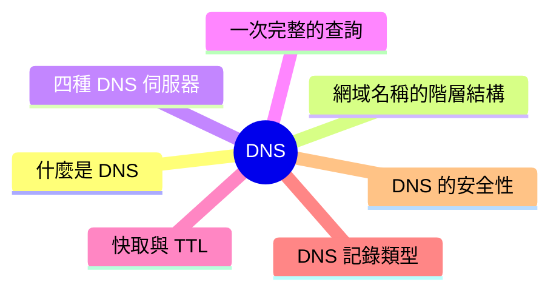
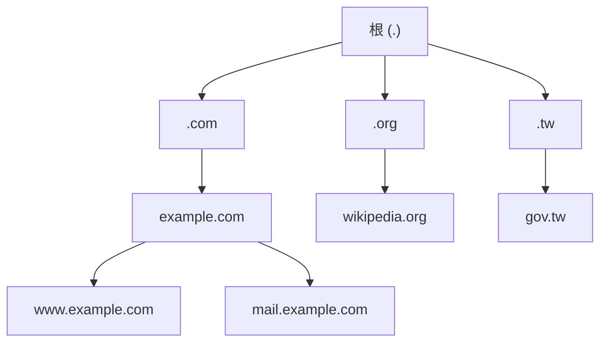
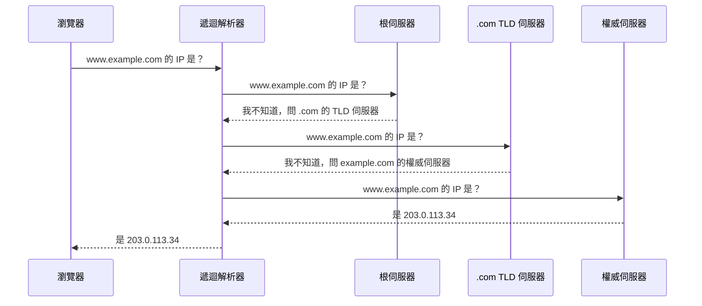
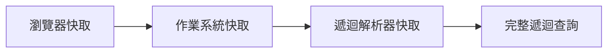

export const metadata = {
  title: 'DNS：網際網路的命名系統',
  date: '2026-06-22',
  excerpt: '介紹 DNS 的運作原理，包含網域名稱的階層結構、四種 DNS 伺服器的角色、一次完整的遞迴查詢流程、快取與 TTL 機制、常見的記錄類型，以及 DNS 的安全性。',
  tags: ['網路', 'Web'],
};

# DNS：網際網路的命名系統

當你在瀏覽器輸入 `google.com`，電腦其實不認得這串文字。網路上的機器靠 IP 位址互相溝通，而 IP 位址是一串不好記的數字 (例如 `142.250.80.46`)。

DNS (Domain Name System) 的工作，就是把人類好記的網域名稱，翻譯成機器使用的 IP 位址。它常被比喻成網際網路的電話簿：你知道對方的名字 (網域名稱)，DNS 幫你查到電話號碼 (IP 位址)。



- [什麼是 DNS](#什麼是-dns)
- [網域名稱的階層結構](#網域名稱的階層結構)
- [四種 DNS 伺服器](#四種-dns-伺服器)
- [一次完整的 DNS 查詢](#一次完整的-dns-查詢)
- [快取與 TTL](#快取與-ttl)
- [常見的 DNS 記錄類型](#常見的-dns-記錄類型)
- [DNS 的安全性](#dns-的安全性)

---

## 什麼是 DNS

最直覺的想法，是把全世界的網域名稱和 IP 位址放進一張大表，需要時查一下就好。但網際網路上有數十億個網域，每天還不斷新增、變更，這張表會大到沒有任何一台伺服器裝得下，也不可能有單一機構即時維護。一旦那台伺服器故障，整個網際網路就跟著癱瘓。

DNS 的解法是把這張表拆開，分散到全世界數百萬台伺服器上，並用階層的方式組織起來。沒有任何一台伺服器知道所有答案，但每一台都知道「下一步該問誰」。這種設計稱為委派 (Delegation)：上層只負責指路，把實際的答案交給下層管理。

所以 DNS 本質上是一個分散式、有階層的資料庫。理解 DNS，關鍵就在於理解這個階層怎麼劃分，以及一次查詢如何沿著階層找到答案。

---

## 網域名稱的階層結構

一個網域名稱要從右往左讀，每一段代表階層中的一層：

```
www.example.com.
 │     │     │ └ 根 (Root)
 │     │     └ 頂級網域 (TLD)
 │     └ 第二級網域 (Second-Level Domain)
 └ 子網域 (Subdomain)
```

- 根 (Root)：階層的最頂端，以一個句點表示。我們平常省略不寫，但 `www.example.com` 完整來說其實是 `www.example.com.`。
- 頂級網域 (Top-Level Domain, TLD)：最右邊的部分，例如 `.com`、`.org`，或國家代碼 `.tw`、`.jp`。
- 第二級網域 (Second-Level Domain)：通常是你向註冊商申請、可以自由命名的部分，例如 `example`。
- 子網域 (Subdomain)：在第二級網域之下再細分，例如 `www`、`mail`、`blog`。

整串完整、包含結尾句點、能唯一定位到某台主機的名稱，稱為完整網域名稱 (Fully Qualified Domain Name, FQDN)。

這個階層其實是一棵樹，根在最上面，往下逐層展開：



關鍵在於：每一層只負責管理它的下一層。根伺服器不知道 `example.com` 在哪，但知道誰管理 `.com`；`.com` 不知道 `www.example.com` 的 IP，但知道誰管理 `example.com`。查詢就是沿著這棵樹一路往下問。

---

## 四種 DNS 伺服器

一次查詢會牽涉到四種角色不同的伺服器：

- 遞迴解析器 (Recursive Resolver)：代表你去四處詢問、最後把答案帶回來的角色。通常由你的 ISP 提供，也可以指定公共解析器，例如 Google 的 `8.8.8.8` 或 Cloudflare 的 `1.1.1.1`。
- 根名稱伺服器 (Root Name Server)：階層的起點。它不知道任何網域的 IP，但能告訴你該去哪台 TLD 伺服器。全球有 13 組根伺服器 (編號 A 到 M)，透過 anycast 技術部署在世界各地的眾多實體節點上。
- 頂級網域伺服器 (TLD Name Server)：管理某個 TLD 之下的所有網域。例如 `.com` 的 TLD 伺服器知道 `example.com` 的權威伺服器是誰。
- 權威名稱伺服器 (Authoritative Name Server)：握有某個網域實際記錄的伺服器，也就是答案的最終來源。它回答的不是「去問別人」，而是真正的 IP 位址。

可以把遞迴解析器想成一位幫你跑腿的助理：你只丟給它一個問題，剩下的逐層詢問都由它完成，你不需要知道中間問了幾台伺服器。

---

## 一次完整的 DNS 查詢

把上面四種角色串起來，看一次完整的查詢。假設你第一次連上 `www.example.com`，所有快取都還是空的：



整個過程其實混合了兩種查詢方式：

- 瀏覽器對解析器發出的是遞迴查詢 (Recursive Query)：「請給我最終答案，過程我不管。」
- 解析器對根、TLD、權威伺服器發出的是迭代查詢 (Iterative Query)：每一步得到的不是答案，而是「下一步該問誰」的指引。

這個分工很重要。客戶端只需要實作最簡單的邏 —— 一次、拿一個答案；所有逐層追問的複雜度，都集中在解析器身上。

值得一提的是，多數查詢走的是 UDP 而非 TCP。DNS 的請求和回應通常很小，UDP 沒有握手成本、延遲更低，很適合這種「一問一答」的場景。只有當回應太大 (例如啟用 DNSSEC 時) 或需要區域傳送 (Zone Transfer) 時，才會改用 TCP。

---

## 快取與 TTL

如果每次連線都要從根伺服器一路問到底，DNS 會慢得難以使用，根伺服器也會被流量壓垮。實際上，剛才那種完整查詢很少發 —— 為每一層都有快取。

查詢結果會被快取在多個層級，由近到遠依序檢查：



只要任何一層命中快取，查詢就在那裡結束，後面的步驟全部省略。所以絕大多數查詢，其實在你的電腦或解析器上就直接回答了，根本碰不到根伺服器。

那一筆記錄該快取多久？這由 TTL (Time To Live) 決定。每筆 DNS 記錄都帶有一個 TTL 值，以秒為單位，告訴各層快取「這個答案可以沿用多久」。TTL 到期後，快取就會丟棄該記錄，下次查詢重新向上詢問。

TTL 的設定是一種取捨：

- TTL 設長 (例如 86400 秒，一天)：快取命中率高、查詢更快、對權威伺服器的負擔更小，但記錄一旦變更，舊值會殘留很久。
- TTL 設短 (例如 300 秒，五分鐘)：記錄變更能很快生效，但查詢頻率提高，負載也隨之上升。

這也解釋了為什麼換主機、改 DNS 設定後，新設定不會立刻全球生 —— 段新舊記錄並存的等待期，俗稱 DNS 傳播 (DNS Propagation)。常見的做法是在預定變更前幾天，先把 TTL 調短，等變更完成、確認穩定後再調回來。

---

## 常見的 DNS 記錄類型

DNS 不只回答 IP 位址。一個網域底下可以設定多種記錄，每種記錄回答不同的問題：

| 記錄類型 | 用途 | 範例 |
| - | - | - |
| A | 將網域指向一個 IPv4 位址 | `example.com → 203.0.113.34` |
| AAAA | 將網域指向一個 IPv6 位址 | `example.com → 2001:db8::1` |
| CNAME | 別名，將一個網域指向另一個網域 | `www.example.com → example.com` |
| MX | 指定負責收發該網域電子郵件的伺服器 | `example.com → mail.example.com (優先序 10)` |
| NS | 指定該網域的權威名稱伺服器 | `example.com → ns1.example.com` |
| TXT | 儲存任意文字，常用於驗證網域所有權與郵件防偽 (SPF、DKIM) | `v=spf1 include:_spf.example.com ~all` |
| SOA | 記錄該 DNS 區域的管理資訊 (主伺服器、序號、各項預設 TTL) | — |
| PTR | 反向查詢，把 IP 位址對應回網域名稱 | `203.0.113.34 → example.com` |

實務上，可以用 `dig` 這類工具直接查詢某個網域的記錄：

```
$ dig example.com

;; ANSWER SECTION:
example.com.    3600    IN    A    203.0.113.34
```

這一行的意思是：`example.com` 的 A 記錄是 `203.0.113.34`，TTL 為 3600 秒，`IN` 表示 Internet 類別。讀懂這一行，就讀懂了 DNS 回應的核心。

關於 CNAME 有個常見的限制值得記住：一個名稱若設了 CNAME，就不能再設其他記錄，因此根網域 (像 `example.com` 本身) 通常不能用 CNAME，只能用 A 或 AAAA。這也是許多 DNS 設定踩雷的地方。

---

## DNS 的安全性

DNS 設計於網際網路的早期，當時的首要目標是能運作、夠快，安全並不在考量之內。傳統的 DNS 查詢以明文透過 UDP 傳送，沒有加密，也沒有任何方式驗證回應是否真的來自正確的伺服器。這留下兩個根本問題：查詢可以被竊聽，回應也可以被偽造。後面兩種防禦機制，正好各自對應其中一個問題。

### DNS 快取下毒

DNS 快取下毒 (DNS Cache Poisoning) 也稱為 DNS 偽冒 (DNS Spoofing)。攻擊者搶在真正的權威伺服器之前，回傳一筆偽造的記錄給解析器。解析器把這個假答案快取起來，之後所有向它查詢的使用者，都會被導向攻擊者控制的伺服 —— 使你輸入的網址完全正確。

### DNSSEC：保證真實性

DNSSEC (DNS Security Extensions) 為 DNS 記錄加上數位簽章。權威伺服器用私鑰簽署記錄，解析器則沿著階層用對應的公鑰驗證簽章。只要記錄被篡改，簽章就對不上，假答案會被拒絕。

要特別釐清：DNSSEC 保證的是真實性與完整性 (這筆記錄確實來自正確的來源、且未被篡改)，它並不加密內容。換句話說，DNSSEC 防的是偽造，不是竊聽。

### 加密 DNS：保證隱私

要防竊聽，需要的是加密。傳統 DNS 即使內容沒被篡改，過程仍是明文，沿途任何 —— 的 ISP、公共 Wi-Fi 的管理 —— 能看到你查詢了哪些網域。兩種主流的加密 DNS 協定解決這件事：

- DoH (DNS over HTTPS)：把 DNS 查詢包進 HTTPS，走 443 埠。由於和一般網頁流量混在一起，難以被區分或封鎖。
- DoT (DNS over TLS)：用 TLS 加密 DNS，走專屬的 853 埠。流量容易識別，便於網路管理，但也因此較容易被針對性封鎖。

DNSSEC 與加密 DNS 並不衝突，反而互補：前者確保答案沒被偽造，後者確保過程沒被偷看。

---

## 總結

- DNS 把人類好記的網域名稱，翻譯成機器使用的 IP 位址，本質上是一個分散式、有階層的資料庫
- 網域名稱由右往左、依根、TLD、第二級網域、子網域分層，每一層只負責委派下一層
- 一次查詢由遞迴解析器代勞，沿著根、TLD、權威伺服器逐層迭代詢問，最後把答案帶回給客戶端
- 多層快取與 TTL 讓絕大多數查詢不必走完整流程；TTL 的長短是查詢效率與變更生效速度之間的取捨
- 除了 A/AAAA，DNS 還有 CNAME、MX、NS、TXT 等多種記錄，各自回答不同的問題
- 傳統 DNS 既可被竊聽也可被偽造：DNSSEC 以簽章保證真實性，DoH/DoT 以加密保證隱私
