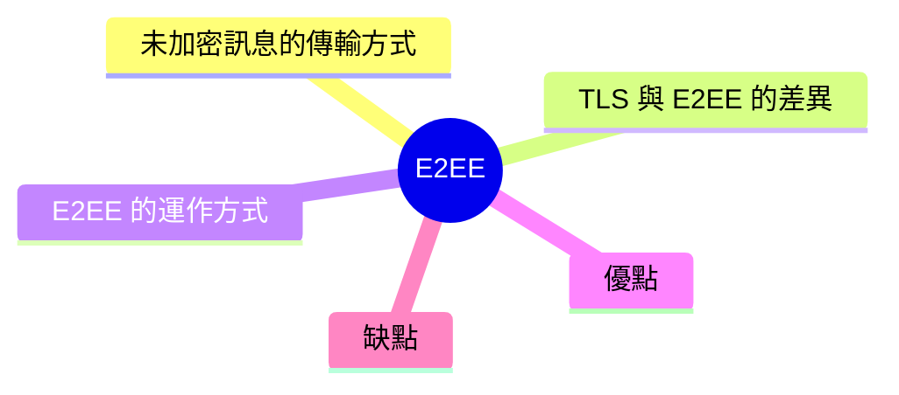
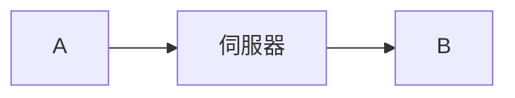
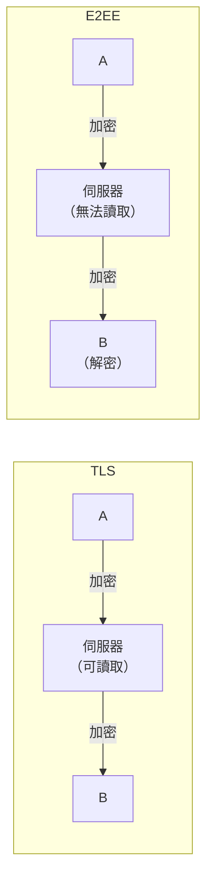
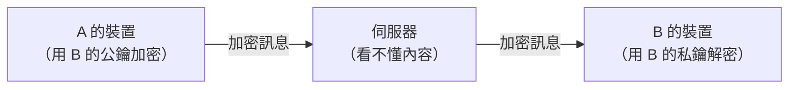

export const metadata = {
  title: '端對端加密 (E2EE)',
  date: '2026-04-26',
  excerpt: '介紹端對端加密（E2EE）的運作原理，包含與 TLS 的差異、非對稱加密的流程，以及 E2EE 的優點與缺點。',
  tags: ['資訊安全', '網路'],
};

# 端對端加密 (E2EE)

端對端加密 (End-to-End Encryption，E2EE) 是一種加密方式，確保訊息只有發送端和接收端可以讀取，中間任何人——包括傳輸訊息的伺服器——都無法解密內容。

把它想像成一封只有寄件人和收件人看得到內容的信，郵差送信，但看不到裡面寫什麼。

- [未加密訊息的傳輸方式](#未加密訊息的傳輸方式)
- [TLS 與 E2EE 的差異](#tls-與-e2ee-的差異)
- [E2EE 的運作方式](#e2ee-的運作方式)
- [優點](#優點)
- [缺點](#缺點)

---

## 未加密訊息的傳輸方式

以一個通訊應用程式為例：帳戶 A 想傳訊息給帳戶 B，中間必須透過伺服器轉傳。

這是典型的客戶端-伺服器模型，伺服器是中間方。A 和伺服器之間、伺服器和 B 之間的傳輸可以用 TLS 加密，但訊息到了伺服器之後，伺服器本身是可以讀取內容的。

---

## TLS 與 E2EE 的差異

TLS (Transport Layer Security) 和 E2EE 都使用公鑰加密，但保護的範圍不同：

- TLS：保護客戶端和伺服器之間的傳輸安全。訊息在傳輸中加密，但伺服器收到後可以解密讀取。
- E2EE：保護發送端到接收端的全程。伺服器只是傳遞加密後的訊息，無法解密內容。

TLS 解決的是傳輸中的安全問題，E2EE 解決的是伺服器端也不應該知道內容的問題。

---

## E2EE 的運作方式

E2EE 採用非對稱加密 (公鑰加密)，每個使用者有一對金鑰：

- 公鑰 (Public Key)：可以公開分享，用來加密訊息
- 私鑰 (Private Key)：只有自己持有，用來解密訊息

流程如下：

1. 產生金鑰對

A 和 B 各自產生一對公鑰和私鑰。公鑰可以公開，私鑰絕對不離開自己的裝置。

2. 交換公鑰

A 和 B 互相交換公鑰 (通常透過伺服器傳遞，但伺服器只看得到公鑰，沒有私鑰就無法解密訊息)。

3. 加密訊息

A 想傳訊息給 B，用 B 的公鑰 加密。加密後的訊息只有持有 B 私鑰的人才能解開。

4. 解密訊息

B 收到訊息後，用自己的 私鑰 解密，讀取內容。

整個過程中，伺服器只傳遞加密的密文，無法讀取訊息內容。

---

## 優點

### 高度隱私

只有通訊雙方能讀取訊息。服務提供者、網路業者、甚至政府機關都無法取得內容，除非拿到其中一方的私鑰。

### 防止中間人攻擊

訊息在傳輸過程中即使被截獲，沒有對應的私鑰也無法解密，無法被篡改或利用。

### 建立信任

使用者不需要信任服務提供者，訊息的安全性由加密機制本身保障，而不是靠對方的承諾。

---

## 缺點

### 金鑰管理困難

私鑰一旦遺失，加密的訊息就永遠無法恢復。在大型組織中，金鑰管理需要額外的基礎設施。

### 備份和多裝置同步複雜

私鑰要在多台裝置上使用，需要安全地同步，這在實作上有相當的難度。

### 法律和監管挑戰

E2EE 讓執法機構難以合法監控，即使面對犯罪調查也無法要求服務提供者提供通訊內容，因為服務提供者本身也看不到。

### 效能開銷

加解密需要計算資源，在效能有限的裝置上可能有明顯影響。

### 功能限制

服務提供者無法讀取內容，意味著無法提供基於內容的功能，例如關鍵字搜尋、內容審核、廣告投放等。

---

## 總結

E2EE 讓訊息的加密和解密只發生在通訊兩端，任何中間方都無法讀取內容。

它的核心是非對稱加密：公鑰加密，私鑰解密，私鑰永遠不離開使用者的裝置。

常見使用 E2EE 的服務包括：Signal、WhatsApp (預設開啟)、iMessage (裝置間)、ProtonMail。
