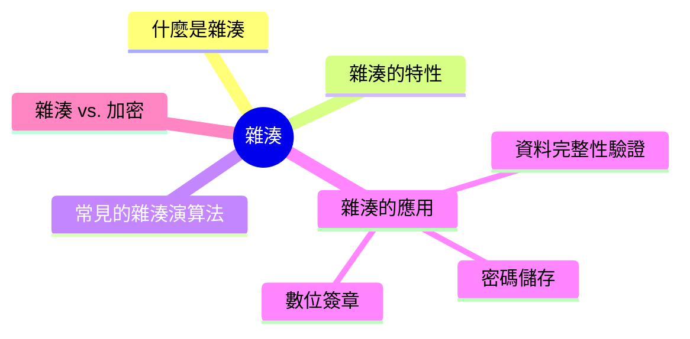
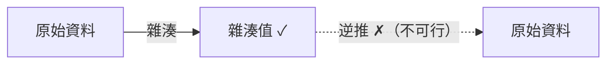

export const metadata = {
  title: '雜湊 (Hashing)',
  date: '2026-03-31',
  excerpt: '介紹雜湊的核心概念與特性，包含單向性、雪崩效應、抗碰撞性、常見演算法 (MD5、SHA-256、bcrypt、Argon2)，以及在密碼儲存、資料完整性驗證、數位簽章中的應用。',
  tags: ['資訊安全', '網路'],
};

# 雜湊 (Hashing)

雜湊 (Hashing) 是將任意長度的資料，透過雜湊函數轉換成固定長度輸出的過程，這個輸出稱為雜湊值 (Hash Value) 或摘要 (Digest)。



- [什麼是雜湊](#什麼是雜湊)
- [雜湊的特性](#雜湊的特性)
- [常見的雜湊演算法](#常見的雜湊演算法)
- [雜湊的應用](#雜湊的應用)
- [雜湊 vs. 加密](#雜湊-vs-加密)

---

## 什麼是雜湊

雜湊函數接收任意長度的輸入，輸出固定長度的雜湊值：

```mermaid
flowchart LR
    A['"Hello"'] -->|SHA-256| H1["185f8db32921bd46d35c... (64 個十六進位字元)"]
    B['"Hello World"'] -->|SHA-256| H2["a591a6d40bf420404a01... (64 個十六進位字元)"]
    C["一個 1GB 的檔案"] -->|SHA-256| H3["... (64 個十六進位字元)"]
```

無論輸入多長，輸出永遠是相同長度。

---

## 雜湊的特性

### 單向性 (One-Way)

雜湊是不可逆的——從雜湊值無法還原出原始資料。這和加密不同，加密有對應的解密操作。



### 確定性 (Deterministic)

相同的輸入永遠產生相同的輸出：

```
SHA-256("Hello") = 185f8db32921bd46d35c...   (每次都一樣)
```

### 雪崩效應 (Avalanche Effect)

輸入微小的變化，輸出會有大幅度的不同：

```
SHA-256("Hello")  = 185f8db32921bd46d35c...
SHA-256("hello")  = 2cf24dba5fb0a30e26e8...   (完全不同)
```

一個字母大小寫的差異，就讓雜湊值完全改變。

### 抗碰撞性 (Collision Resistance)

兩個不同的輸入產生相同雜湊值的情況稱為碰撞 (Collision)。好的雜湊演算法要讓找到碰撞在計算上不可行。

---

## 常見的雜湊演算法

### MD5

輸出 128 位元 (32 個十六進位字元)。

```
MD5("Hello") = 8b1a9953c4611296a827abf8c47804d7
```

MD5 已被證明不安全，可以在短時間內找到碰撞。不應再用於安全用途，但仍可用於非安全場景 (例如檔案去重)。

### SHA-1

輸出 160 位元 (40 個十六進位字元)。

SHA-1 也已被攻破，Google 在 2017 年展示了 SHA-1 的碰撞攻擊。不應再用於安全用途。

### SHA-256 / SHA-512 (SHA-2 家族)

SHA-256 輸出 256 位元 (64 個十六進位字元)，SHA-512 輸出 512 位元。

```
SHA-256("Hello") = 185f8db32921bd46d35c54d8e3d7e7b262f41f529a1caeb3...
```

目前最廣泛使用的安全雜湊演算法，用於 TLS、數位憑證、區塊鏈等。

### SHA-3

SHA-3 是 SHA-2 的替代方案 (不是改進版)，使用不同的內部結構 (Keccak 演算法)。安全性高，但目前使用率低於 SHA-2。

### bcrypt / Argon2 / scrypt (密碼雜湊)

專門用於密碼儲存的慢速雜湊演算法，故意設計成計算耗時，讓暴力破解更困難：

- bcrypt：最廣泛使用的密碼雜湊，可調整計算成本 (work factor)
- Argon2：2015 年密碼雜湊競賽的勝出者，目前的最佳實踐推薦
- scrypt：記憶體密集型，對抗特殊硬體 (GPU、ASIC) 的暴力破解

一般的雜湊演算法 (SHA-256) 不應直接用於密碼儲存，必須使用專門的密碼雜湊演算法。

---

## 雜湊的應用

### 密碼儲存

不應直接儲存使用者密碼，應該儲存密碼的雜湊值。驗證時，對輸入的密碼重新計算雜湊，比對儲存的雜湊值：

```javascript
const bcrypt = require('bcrypt');

// 儲存密碼 (注冊時)
const hash = await bcrypt.hash('userPassword', 12); // 12 是 work factor
// 儲存 hash 到資料庫，不儲存原始密碼

// 驗證密碼 (登入時)
const isValid = await bcrypt.compare('userPassword', hash);
```

Salt (加鹽)：bcrypt 等演算法會自動加入隨機的 Salt，確保相同的密碼每次雜湊結果不同，防止彩虹表攻擊。

### 資料完整性驗證

下載檔案時，可以透過比對雜湊值確認檔案未被篡改：

```bash
# 計算檔案的 SHA-256
sha256sum ubuntu.iso

# 比對官方提供的雜湊值
# 如果結果相同，表示檔案完整
```

Git 也使用 SHA-1 (舊版) 和 SHA-256 (新版) 作為每個 commit 和檔案的識別碼，確保版本歷史的完整性。

### 數位簽章

在非對稱加密中，數位簽章不直接對原始資料簽署，而是先對資料計算雜湊值，再對雜湊值簽署：

1. 計算資料的雜湊值：H = SHA-256(data)
2. 用私鑰對雜湊值簽署：Signature = RSA(H, privateKey)
3. 驗證：重新計算雜湊值，用公鑰解密簽章，比對兩個雜湊值

這樣做的原因：直接對大量資料進行非對稱加密非常慢，對固定長度的雜湊值操作效率高得多。

### HMAC (Hash-based Message Authentication Code)

HMAC 結合雜湊和密鑰，用來驗證訊息的完整性和來源：

```
HMAC = Hash(key + message)
```

JWT 的 HS256 簽章就是使用 HMAC-SHA256。

---

## 雜湊 vs. 加密

| | 雜湊 | 加密 |
| - | - | - |
| 可逆性 | 不可逆 (單向) | 可逆 (有解密操作) |
| 目的 | 驗證完整性、身份 | 保護資料機密性 |
| 金鑰 | 不需要 (HMAC 例外) | 需要 |
| 輸出長度 | 固定 | 與輸入相關 |
| 應用 | 密碼儲存、完整性驗證 | 資料傳輸、儲存加密 |

---

## 總結

- 雜湊是單向的，不可從雜湊值還原原始資料
- 好的雜湊演算法具備確定性、雪崩效應和抗碰撞性
- MD5 和 SHA-1 不再安全，應使用 SHA-256 或以上
- 密碼儲存必須使用專門的慢速雜湊演算法 (bcrypt、Argon2)
- 雜湊廣泛用於密碼儲存、完整性驗證、數位簽章、HMAC
