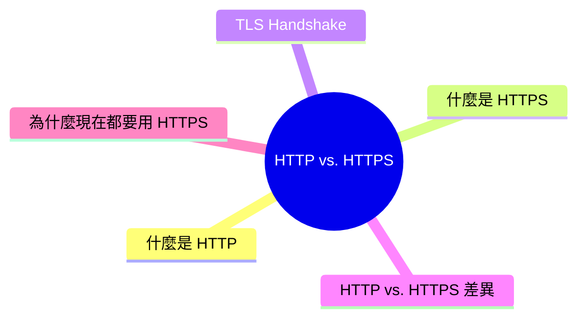
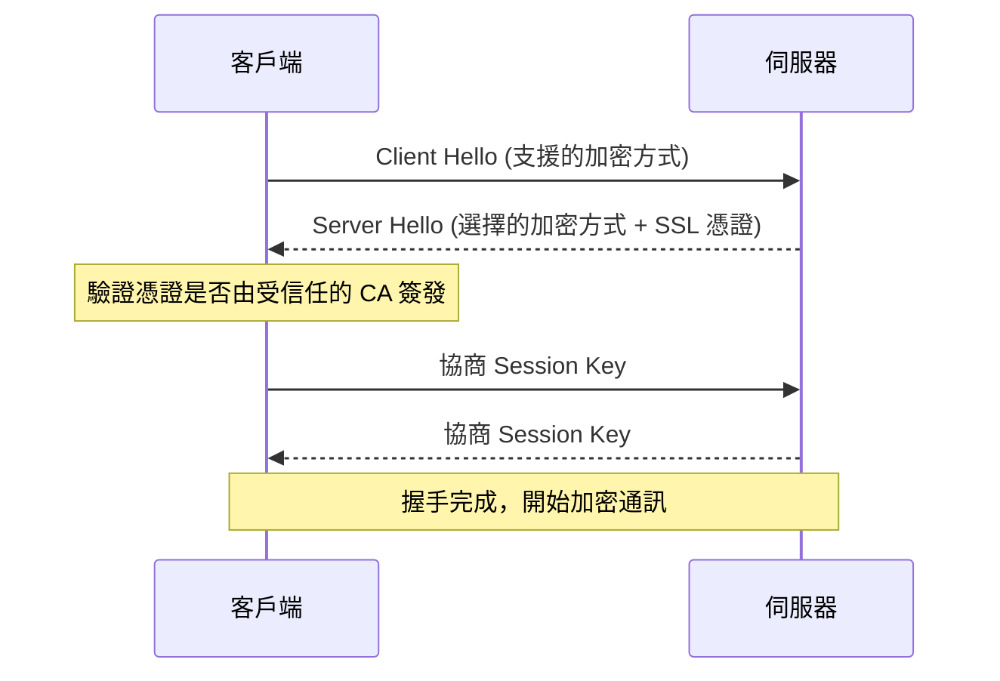

export const metadata = {
  title: 'HTTP vs. HTTPS：傳輸協定的差異',
  date: '2026-04-03',
  excerpt: '介紹 HTTP 與 HTTPS 的差異，包含 TLS 加密機制、TLS Handshake 流程、兩者的比較，以及為什麼現代網站應該全面使用 HTTPS。',
  tags: ['網路'],
};

# HTTP vs. HTTPS：傳輸協定的差異

HTTP 和 HTTPS 都是用於客戶端和伺服器之間傳輸資料的協定，差別在於 HTTPS 多了一層加密。

- [什麼是 HTTP](#什麼是-http)
- [什麼是 HTTPS](#什麼是-https)
- [TLS Handshake](#tls-handshake)
- [HTTP vs. HTTPS 差異](#http-vs-https-差異)
- [為什麼現在都要用 HTTPS](#為什麼現在都要用-https)

---

## 什麼是 HTTP

HTTP (HyperText Transfer Protocol) 是網路上最基本的資料傳輸協定，定義了客戶端 (通常是瀏覽器) 和伺服器之間如何請求和回應資料。

HTTP 的請求和回應都是明文傳輸，沒有任何加密。任何可以監聽網路封包的人，都可以直接看到傳輸的內容，包括帳號、密碼、個人資料。

---

## 什麼是 HTTPS

HTTPS (HTTP Secure) 是 HTTP 加上 TLS (Transport Layer Security)  加密層的版本。

TLS 在 HTTP 之下運作，確保：

- 加密：傳輸的資料被加密，第三方無法讀取內容
- 完整性：資料在傳輸過程中沒有被篡改
- 身份驗證：確認你連接的是真正的伺服器，而不是冒充者

HTTPS 使用 SSL 憑證 (TLS 憑證) 來驗證伺服器的身份。憑證由受信任的第三方機構 (Certificate Authority，CA) 簽發。

---

## TLS Handshake

建立 HTTPS 連線時，在傳輸資料之前，客戶端和伺服器需要先完成 TLS Handshake (握手)，協商加密方式並驗證身份。

簡化的流程：

握手完成後，後續的所有 HTTP 通訊都用這個 Session Key 加密傳輸。

---

## HTTP vs. HTTPS 差異

| | HTTP | HTTPS |
| - | - | - |
| 全名 | HyperText Transfer Protocol | HTTP Secure |
| 預設埠號 | 80 | 443 |
| 加密 | 無 | TLS 加密 |
| 資料完整性 | 無保護 | 有保護 |
| 身份驗證 | 無 | SSL 憑證驗證 |
| 速度 | 略快 (無加密開銷) | 現代硬體下幾乎無差異 |
| SEO | 較差 | Google 偏好 HTTPS |

---

## 為什麼現在都要用 HTTPS

### 安全性

HTTP 是明文傳輸，在公共 Wi-Fi 等不安全的網路環境下，任何人都可以用封包捕獲工具 (例如 Wireshark) 攔截並讀取傳輸的內容。

常見的攻擊：

- 中間人攻擊 (Man-in-the-Middle Attack)：攻擊者在客戶端和伺服器之間攔截通訊，讀取或篡改資料
- 竊聽 (Eavesdropping)：被動監聽網路流量，取得帳號密碼等敏感資訊

HTTPS 的加密讓這些攻擊無效，即使封包被攔截，攻擊者也無法解讀內容。

### 瀏覽器警告

現代瀏覽器對 HTTP 網站顯示「不安全」警告，對使用者造成信任問題。

### SEO

Google 明確表示 HTTPS 是搜尋排名的因素之一，HTTP 網站在搜尋結果中會處於劣勢。

### 功能限制

某些瀏覽器 API 只在 HTTPS 下才能使用：

- Service Worker
- Geolocation API
- Push Notifications
- Camera / Microphone API

### 憑證取得

過去 SSL 憑證需要付費，現在 Let's Encrypt 提供免費的憑證，大多數的主機服務也提供一鍵申請憑證的功能，已經沒有理由不使用 HTTPS。

---

## 總結

- HTTP：明文傳輸，無加密，有安全風險
- HTTPS：HTTP + TLS 加密，保護資料的機密性、完整性和身份驗證
- TLS Handshake 在連線建立時協商加密方式，現代硬體下幾乎沒有額外的效能開銷
- 現代網站應該全面使用 HTTPS，憑證可以透過 Let's Encrypt 免費取得
