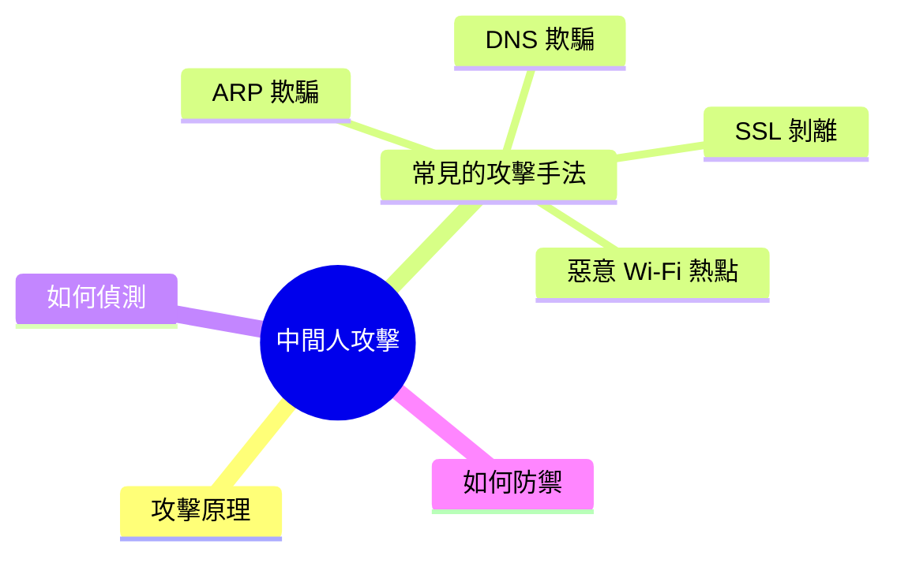
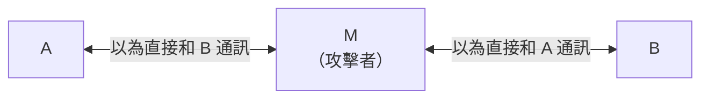
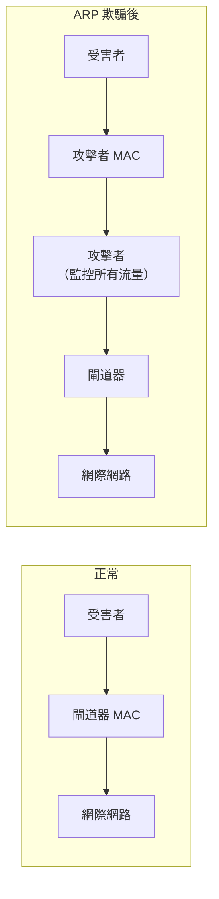
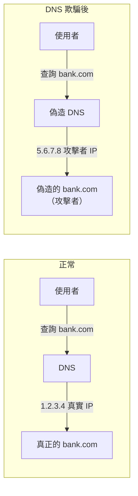

export const metadata = {
  title: '中間人攻擊 (MITM)',
  date: '2026-03-31',
  excerpt: '介紹中間人攻擊 (MITM) 的原理與常見手法，包含 ARP 欺騙、DNS 欺騙、SSL 剝離、惡意 Wi-Fi 熱點，以及如何偵測和防禦 MITM 攻擊。',
  tags: ['資訊安全', '網路'],
};

# 中間人攻擊 (MITM)

中間人攻擊 (Man-in-the-Middle Attack，MITM) 是指攻擊者在通訊雙方之間偷偷插入自己，攔截、讀取甚至竄改傳輸的資料，而雙方都不知道通訊已被監控。



- [攻擊原理](#攻擊原理)
- [常見的攻擊手法](#常見的攻擊手法)
- [如何偵測](#如何偵測)
- [如何防禦](#如何防禦)

---

## 攻擊原理

正常的通訊是直接在 A 和 B 之間進行：


MITM 攻擊中，攻擊者 (M) 插入中間，A 和 B 都以為自己在和對方直接通訊：



攻擊者可以：
- 竊聽 (Eavesdropping)：讀取傳輸的資料
- 竄改 (Tampering)：修改傳輸的內容
- 注入 (Injection)：插入惡意內容

---

## 常見的攻擊手法

### ARP 欺騙 (ARP Spoofing)

ARP (Address Resolution Protocol) 用於將 IP 位址解析為 MAC 位址，但它沒有驗證機制。

攻擊者向區域網路發送偽造的 ARP 回應，讓同一網路的裝置以為攻擊者的 MAC 位址對應到目標 IP (例如閘道器的 IP)，流量因此被導向攻擊者：



ARP 欺騙是最常見的區域網路 MITM 手法。

### DNS 欺騙 (DNS Spoofing)

攻擊者偽造 DNS 回應，將正常的網域名稱 (例如 `bank.com`) 解析到攻擊者控制的 IP 位址，讓使用者連到釣魚網站：



### SSL 剝離 (SSL Stripping)

使用者原本想連到 `https://bank.com`，攻擊者在中間攔截請求，與使用者維持 HTTP 連線，自己再用 HTTPS 連到真正的伺服器：


使用者以為在瀏覽正常網站，但傳輸的資料 (例如密碼) 都以明文流經攻擊者。

### 惡意 Wi-Fi 熱點 (Evil Twin)

攻擊者在公共場所建立一個和合法 Wi-Fi 名稱相同 (或相似) 的偽造熱點，使用者連上後，所有流量都經過攻擊者：


---

## 如何偵測

MITM 攻擊的特性是難以直接察覺，但有一些跡象可以注意：

### 憑證警告

瀏覽器顯示「您的連線不是私人連線」或「憑證無效」，可能是有人在中間插入了假憑證。不要忽略這類警告，更不要點擊「繼續訪問」。

### HTTP 而非 HTTPS

如果預期是 HTTPS 的網站顯示為 HTTP，可能正受到 SSL 剝離攻擊。

### 憑證資訊異常

點擊瀏覽器的鎖頭圖示查看憑證詳細資訊，確認憑證的發行機構 (CA) 和有效期限是否正常。

### 網路流量異常

在區域網路中，使用 `arp -a` 查看 ARP 表，如果有兩個不同的 IP 對應到同一個 MAC 位址，可能正在受到 ARP 欺騙。

---

## 如何防禦

### 使用 HTTPS

HTTPS (TLS) 是防禦 MITM 最基本也最重要的措施。TLS 提供：

- 加密：即使流量被攔截，攻擊者也無法讀取內容
- 身份驗證：驗證伺服器的憑證，確認是在和真正的伺服器通訊

瀏覽器在連到 HTTP 網站時會顯示「不安全」警告，看到這個警告應提高警覺。

### HSTS (HTTP Strict Transport Security)

HSTS 讓瀏覽器記住：這個網域只接受 HTTPS 連線，之後不再允許 HTTP，防止 SSL 剝離攻擊：

```
Strict-Transport-Security: max-age=31536000; includeSubDomains
```

### 憑證固定 (Certificate Pinning)

行動應用程式可以在程式碼中預先指定信任的憑證，只接受特定的憑證，即使攻擊者插入偽造憑證也無法通過驗證。

### 避免使用公共 Wi-Fi 進行敏感操作

公共 Wi-Fi 是 MITM 攻擊的高風險環境。必要時使用 VPN，讓流量在到達目的地之前先加密。

### DNS over HTTPS (DoH)

傳統 DNS 查詢是明文的，容易被攔截和竄改。DoH 將 DNS 查詢加密傳輸，防止 DNS 欺騙。

---

## 總結

MITM 攻擊的核心是插入通訊中間，在雙方不知情的情況下監控或竄改資料。

常見手法：ARP 欺騙 (區域網路)、DNS 欺騙 (網域解析)、SSL 剝離 (HTTPS 降級)、惡意 Wi-Fi 熱點。

防禦的核心是使用 HTTPS：

- 部署 HTTPS，讓流量加密且伺服器身份可驗證
- 啟用 HSTS 防止 SSL 剝離
- 看到憑證警告要重視，不要忽略
