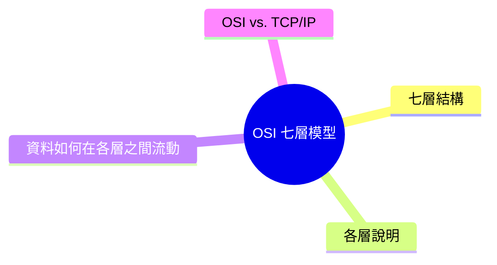
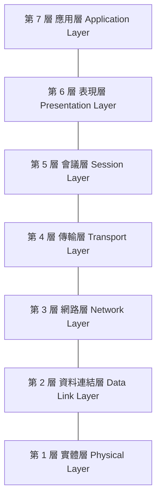
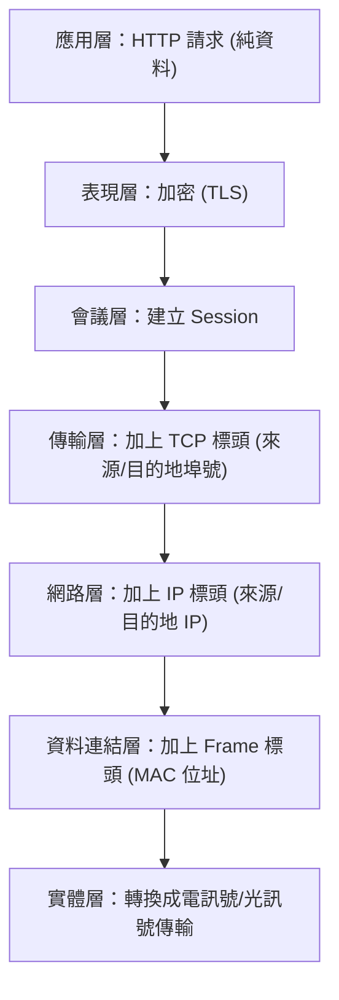
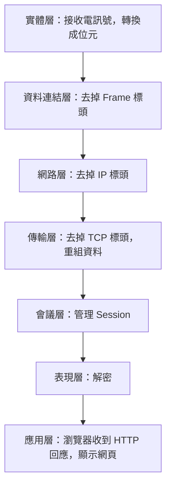
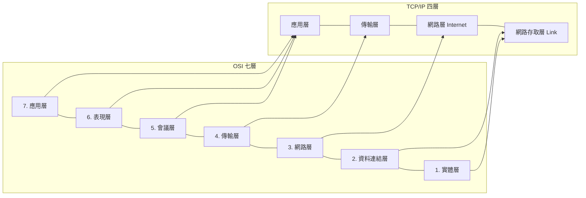

export const metadata = {
  title: 'OSI 七層模型：網路通訊的概念框架',
  date: '2026-04-10',
  excerpt: '介紹 OSI 七層模型的架構與各層職責，包含每層的功能、常見協定與範例、資料在各層之間的封裝與解封裝流程，以及與 TCP/IP 四層模型的對應關係。',
  tags: ['網路'],
};

# OSI 七層模型：網路通訊的概念框架

OSI (Open Systems Interconnection) 模型是一個描述網路通訊如何運作的概念框架，將網路通訊分成七個層次，每一層有明確的職責。

OSI 模型本身不是一套實際使用的協定，而是一個理論模型，用來理解和討論網路系統的設計。

- [七層結構](#七層結構)
- [各層說明](#各層說明)
- [資料如何在各層之間流動](#資料如何在各層之間流動)
- [OSI vs. TCP/IP](#osi-vs-tcpip)

---

## 七層結構

OSI 模型將網路通訊分為七層，從最靠近硬體的底層到最靠近使用者的頂層：

記憶口訣 (從上到下)：All People Seem To Need Data Processing

---

## 各層說明

### 第 7 層：應用層 (Application Layer)

最靠近使用者的一層，提供應用程式與網路之間的介面。

- 職責：定義應用程式如何與網路通訊
- 常見協定：HTTP、HTTPS、FTP、SMTP、DNS
- 範例：瀏覽器發送 HTTP 請求、電子郵件客戶端使用 SMTP 發信

### 第 6 層：表現層 (Presentation Layer)

負責資料的格式轉換、加密、壓縮，確保兩端能理解彼此的資料格式。

- 職責：資料格式轉換、加密解密、壓縮解壓縮
- 常見協定：TLS/SSL、JPEG、PNG、ASCII、UTF-8
- 範例：HTTPS 的 TLS 加密發生在這一層

### 第 5 層：會議層 (Session Layer)

負責建立、管理和終止兩個裝置之間的對話 (Session)。

- 職責：建立和維持連線、處理中斷後的恢復
- 常見協定：NetBIOS、RPC (Remote Procedure Call)
- 範例：視訊通話的連線管理

### 第 4 層：傳輸層 (Transport Layer)

負責端對端的資料傳輸，決定資料如何可靠地從來源送到目的地。

- 職責：分割和重組資料、錯誤控制、流量控制
- 常見協定：TCP、UDP
- 範例：TCP 的三向握手確保可靠連線；UDP 的無連線傳輸用於串流

### 第 3 層：網路層 (Network Layer)

負責邏輯定址和路由，決定封包如何在不同網路之間傳送。

- 職責：IP 定址、路由選擇、封包轉發
- 常見協定：IP (IPv4、IPv6)、ICMP
- 範例：路由器在這一層根據 IP 位址決定封包的路徑

### 第 2 層：資料連結層 (Data Link Layer)

負責相同網路內兩個節點之間的資料傳輸，提供錯誤偵測。

- 職責：MAC 定址、訊框 (Frame) 的建立和解析、錯誤偵測
- 常見協定：Ethernet、Wi-Fi (802.11)、ARP
- 範例：網路交換器 (Switch) 在這一層根據 MAC 位址轉發訊框

### 第 1 層：實體層 (Physical Layer)

最底層，負責實際的位元 (0 和 1) 在實體媒介上的傳輸。

- 職責：定義電壓、訊號、傳輸速率、連接器規格
- 常見標準：乙太網路線 (Cat5e、Cat6) 、光纖、Wi-Fi 無線電波
- 範例：網路線傳輸電訊號、光纖傳輸光訊號

---

## 資料如何在各層之間流動

當你在瀏覽器輸入網址，背後發生的事情橫跨了 OSI 的所有七層：

發送端 (從上到下)

每一層從上層接收資料，加上自己的標頭，再傳給下一層：

接收端 (從下到上)

每一層去掉自己的標頭，將資料傳給上一層：

---

## OSI vs. TCP/IP

OSI 是概念模型，實際網際網路使用的是 TCP/IP 四層模型。兩者的對應關係如下：

TCP/IP 將 OSI 的應用層、表現層、會議層合併成一個應用層，將資料連結層和實體層合併成網路存取層。

| | OSI 模型 | TCP/IP 模型 |
| - | - | - |
| 層數 | 7 層 | 4 層 |
| 用途 | 概念框架，用於理解和教學 | 實際網際網路的實作標準 |
| 靈活性 | 較高 (每層獨立定義) | 較低 (為實際部署優化) |

---

## 總結

OSI 七層模型是理解網路通訊的重要概念工具：

- 每一層有明確的職責，層與層之間相互獨立
- 資料從應用層向下封裝，在實體層傳輸，再從下到上解封裝
- 實際網際網路使用 TCP/IP 四層模型，OSI 是概念模型，用於理解和討論網路系統

學習 OSI 的價值在於建立清晰的網路通訊心智模型，當你遇到網路問題時，能夠快速判斷問題發生在哪一層。
