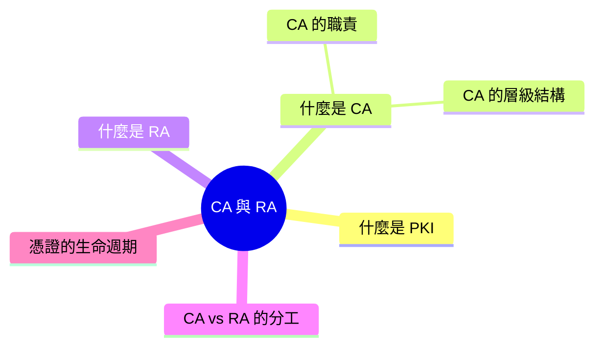
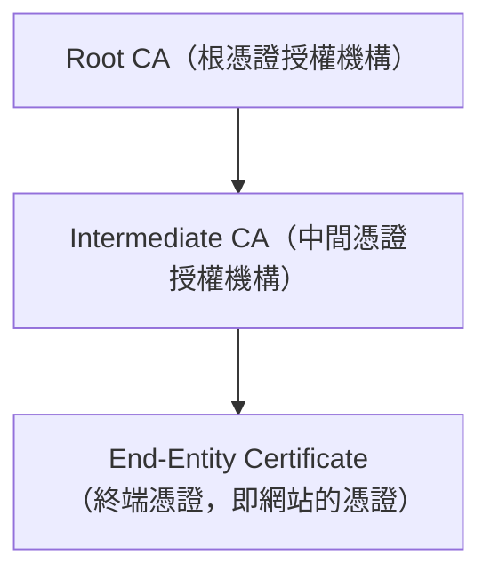
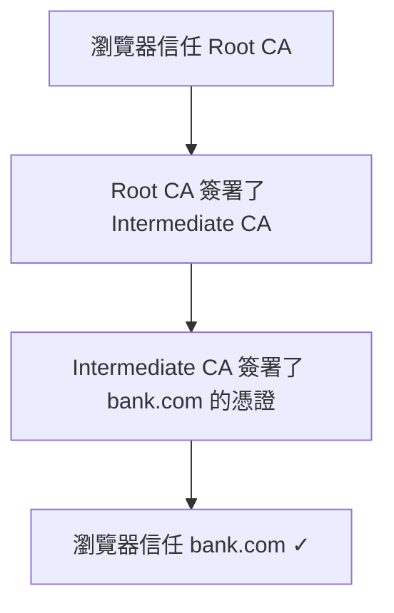
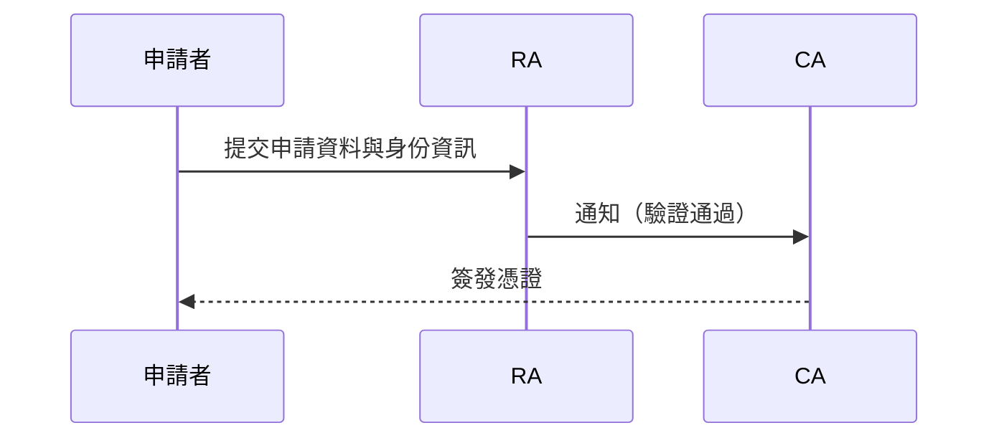

export const metadata = {
  title: '證書授權機構 (CA) 與註冊機構 (RA)',
  date: '2026-04-23',
  excerpt: '介紹 PKI 體系中的證書授權機構 (CA) 與註冊機構 (RA)，包含 CA 的層級結構、RA 的身份驗證職責、兩者的分工，以及數位憑證從申請到撤銷的生命週期。',
  tags: ['資訊安全', '網路'],
};

# 證書授權機構 (CA) 與註冊機構 (RA)

當你的瀏覽器顯示鎖頭圖示，代表它信任這個網站的憑證。但這個信任從哪裡來？

背後是一套叫做 PKI (Public Key Infrastructure，公開金鑰基礎建設) 的體系，而 CA 和 RA 是這個體系的核心角色。

- [什麼是 PKI](#什麼是-pki)
- [什麼是 CA](#什麼是-ca)
- [什麼是 RA](#什麼是-ra)
- [CA vs RA 的分工](#ca-vs-ra-的分工)
- [憑證的生命週期](#憑證的生命週期)

---

## 什麼是 PKI

PKI 是一套用來管理數位憑證和公鑰加密的框架，解決一個核心問題：如何確認一個公鑰真的屬於它宣稱的擁有者？

當你連到 `https://bank.com`，瀏覽器需要確認它拿到的公鑰真的是 bank.com 的，而不是中間人偽造的。PKI 透過受信任的第三方 (CA) 來做這個驗證。

PKI 的主要組成：

- CA (Certificate Authority)：簽發和管理數位憑證的機構
- RA (Registration Authority)：負責驗證申請者身份的機構
- 數位憑證：綁定公鑰和身份的電子文件
- CRL / OCSP：憑證撤銷機制

---

## 什麼是 CA

CA (Certificate Authority，證書授權機構) 是 PKI 體系中的核心信任錨點，負責簽發數位憑證。

### CA 的職責

- 簽發憑證：確認申請者的身份後，用自己的私鑰簽發憑證
- 維護信任鏈：憑證上有 CA 的數位簽章，瀏覽器信任 CA，所以也信任 CA 簽發的憑證
- 撤銷憑證：當憑證的私鑰外洩或憑證資訊不再正確，CA 可以撤銷憑證

常見的 CA 包括：DigiCert、Comodo、GlobalSign，以及提供免費憑證的 Let's Encrypt。

### CA 的層級結構

CA 不是單一機構，而是有層級的：

Root CA 是最頂層的信任來源，它的憑證預先安裝在作業系統和瀏覽器中。Root CA 通常不直接簽發網站憑證，而是授權給 Intermediate CA 代為簽發。

這樣設計的原因是安全性：Root CA 的私鑰極度敏感，通常存放在離線的硬體安全模組中，減少曝露風險。日常的憑證簽發工作由 Intermediate CA 執行。

當瀏覽器驗證一個網站的憑證時，會沿著這條鏈往上追溯，確認最終能連到它信任的 Root CA：

---

## 什麼是 RA

RA (Registration Authority，註冊機構) 是 PKI 體系中負責驗證申請者身份的機構。

RA 是 CA 的前端，代替 CA 執行身份審核的工作：

- 收集申請者的身份資料
- 驗證申請者的身份是否屬實
- 確認申請者是否有權申請該憑證 (例如確認申請者真的擁有該網域)
- 審核通過後，通知 CA 簽發憑證

RA 本身不簽發憑證，只做身份驗證，實際的憑證簽發仍由 CA 執行。

並非所有的 CA 都有獨立的 RA，有些 CA 把 RA 的功能整合在內部，直接處理所有申請。

---

## CA vs RA 的分工

| | CA | RA |
| - | - | - |
| 主要職責 | 簽發憑證 | 驗證身份 |
| 是否簽發憑證 | 是 | 否 |
| 信任來源 | 是 (瀏覽器信任 CA) | 否 (信任由 CA 提供) |
| 典型角色 | DigiCert、Let's Encrypt | 企業內部審核單位、代理商 |

---

## 憑證的生命週期

一個數位憑證從申請到失效，經歷以下階段：

1. 申請

申請者產生一組金鑰對，將公鑰和相關資訊 (網域名稱、組織名稱等) 打包成 CSR (Certificate Signing Request)，送給 RA 或 CA。

2. 驗證

RA 或 CA 驗證申請者的身份。驗證的嚴格程度依憑證類型而異：

- DV (Domain Validation)：只驗證網域所有權，自動化驗證，數分鐘完成 (Let's Encrypt 使用此方式)
- OV (Organization Validation)：驗證網域和組織身份，需要人工審核
- EV (Extended Validation)：最嚴格，驗證組織的法律身份，以前會在瀏覽器顯示綠色地址列

3. 簽發

驗證通過後，CA 用自己的私鑰簽署憑證，憑證包含公鑰、有效期、網域名稱、CA 的數位簽章等資訊。

4. 使用

網站將憑證安裝在伺服器上，瀏覽器連線時驗證憑證有效性。

5. 撤銷或到期

憑證有有效期限 (通常是 90 天到 1 年)，到期需要更新。如果私鑰外洩或資訊有誤，CA 可以提前撤銷憑證，並透過 CRL (憑證撤銷清單) 或 OCSP 讓外界得知。

---

## 總結

- PKI 是管理公鑰信任的框架，CA 和 RA 是其中的核心機構
- CA 簽發數位憑證，是信任鏈的來源
- RA 驗證申請者的身份，是 CA 的前端審核機構
- CA 有層級結構：Root CA → Intermediate CA → 終端憑證
- 憑證的可信度取決於 CA 的可信度，瀏覽器預先信任一批 Root CA
