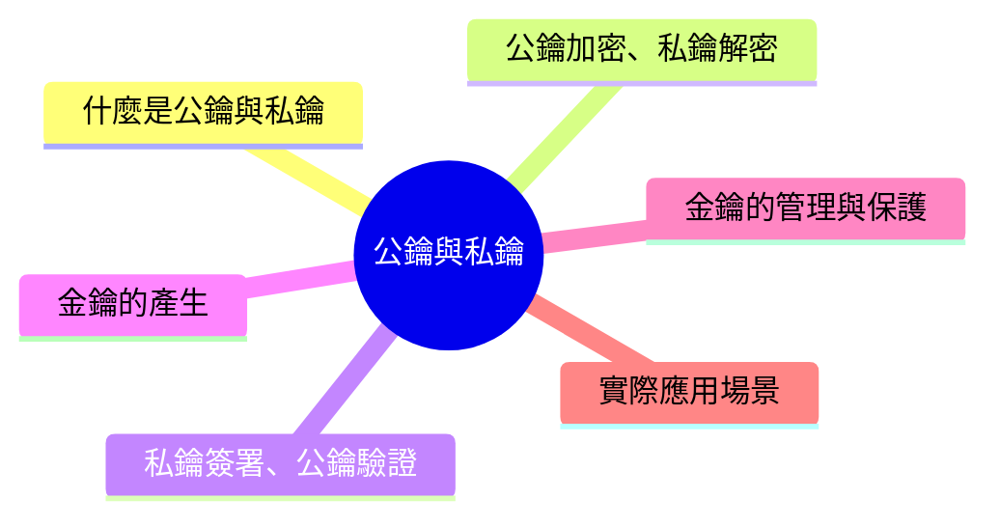

export const metadata = {
  title: '公鑰與私鑰',
  date: '2026-04-24',
  excerpt: '介紹公鑰與私鑰的核心概念，包含公鑰加密私鑰解密、私鑰簽署公鑰驗證、金鑰的產生與保護，以及在 HTTPS、SSH、JWT 等場景的實際應用。',
  tags: ['資訊安全', '網路'],
};

# 公鑰與私鑰

公鑰 (Public Key) 和私鑰 (Private Key) 是非對稱加密的核心概念。

它們是一對數學相關聯的金鑰，各自有不同的用途，共同構成了現代網路安全的基礎——HTTPS、數位簽章、SSH、加密通訊都依賴這套機制。



- [什麼是公鑰與私鑰](#什麼是公鑰與私鑰)
- [公鑰加密、私鑰解密](#公鑰加密私鑰解密)
- [私鑰簽署、公鑰驗證](#私鑰簽署公鑰驗證)
- [金鑰的產生](#金鑰的產生)
- [金鑰的管理與保護](#金鑰的管理與保護)
- [實際應用場景](#實際應用場景)

---

## 什麼是公鑰與私鑰

公鑰和私鑰是一對數學上相關聯的金鑰，由同一個演算法 (例如 RSA 或 ECC) 同時產生：

- 公鑰：可以安全地公開給任何人
- 私鑰：必須嚴格保密，只有擁有者持有

兩把金鑰的關係：

- 公鑰加密的資料，只有對應的私鑰能解密
- 私鑰簽署的資料，任何人都可以用公鑰驗證

這套機制的安全性建立在數學上的單向困難性：從公鑰推算出私鑰，在計算上是不可行的 (RSA 基於大數質因數分解困難，ECC 基於橢圓曲線離散對數問題)。

---

## 公鑰加密、私鑰解密

這是非對稱加密最直接的用途：傳送方用接收方的公鑰加密資料，只有持有私鑰的接收方才能解密。

```text
Charmy 想傳送訊息給 Tina：

1. Tina 公開他的公鑰
2. Charmy 用 Tina 的公鑰加密訊息
3. 加密後的訊息傳送給 Tina
4. 只有 Tina 的私鑰能解密

即使訊息被攔截，沒有 Tina 的私鑰，攔截者也無法讀取內容
```

這解決了對稱加密的核心問題：金鑰不需要透過安全管道傳輸，因為公鑰本來就是公開的。

---

## 私鑰簽署、公鑰驗證

非對稱加密的另一個重要用途是數位簽章，方向與加密相反：私鑰簽署、公鑰驗證。

```text
Charmy 想證明文件是她發出的：

1. Charmy 對文件產生雜湊值 (Hash)
2. Charmy 用自己的私鑰加密這個雜湊值，產生數位簽章
3. Charmy 將文件和簽章一起傳送
4. 任何人都可以用 Charmy 的公鑰解密簽章，得到雜湊值
5. 重新計算文件的雜湊值，若兩者相符，確認：
   文件確實由 Charmy 簽署 (只有 Charmy 的私鑰能產生這個簽章)
   文件內容未被篡改 (雜湊值相符)
```

數位簽章同時提供身份驗證和完整性驗證。

---

## 金鑰的產生

公鑰和私鑰必須由特定的演算法產生，不能隨意選取。

### RSA 金鑰

RSA 金鑰的安全性建立在大數質因數分解的困難性，常見的金鑰長度：

- 2048 位元：目前廣泛使用的最低標準
- 3072 位元：更高安全性
- 4096 位元：最高安全性，但速度較慢

### ECC 金鑰

ECC (橢圓曲線加密) 在相同安全強度下，金鑰長度遠短於 RSA：

- 256 位元 (P-256)：相當於 RSA-3072 的安全強度
- 384 位元 (P-384)：更高安全性
- Ed25519：現代 ECC 變體，速度快、安全性高，在 SSH 和 TLS 1.3 中廣泛使用

### 用 OpenSSL 產生金鑰 (範例)

```bash
# 產生 RSA-2048 私鑰
openssl genrsa -out private_key.pem 2048

# 從私鑰提取公鑰
openssl rsa -in private_key.pem -pubout -out public_key.pem

# 產生 Ed25519 金鑰對
openssl genpkey -algorithm Ed25519 -out private_key.pem
openssl pkey -in private_key.pem -pubout -out public_key.pem
```

---

## 金鑰的管理與保護

私鑰一旦外洩，所有用對應公鑰加密的資料都可能被解密，所有以該私鑰簽署的內容也無法被信任。

### 保護私鑰

- 加密儲存：私鑰應該用密碼加密後儲存，即使檔案被竊取也無法直接使用
- 硬體安全模組 (HSM)：高度敏感的私鑰 (例如 CA 的根憑證私鑰) 存放在專用硬體中，私鑰永遠不離開硬體
- Keychain / Secure Enclave：在 Apple 裝置上，私鑰可以存放在 Keychain 或 Secure Enclave，受硬體保護
- 最小權限原則：私鑰的存取應限制在最小範圍

### 金鑰輪換

私鑰應該定期更換，降低長期使用同一把金鑰帶來的風險。TLS 憑證通常有效期為 90 天至 1 年，到期需要更換。

### 私鑰外洩時

如果私鑰可能外洩，應立即：

1. 撤銷 (Revoke) 對應的憑證
2. 產生新的金鑰對
3. 重新申請憑證

---

## 實際應用場景

HTTPS / TLS

TLS 握手時，伺服器用私鑰證明自己的身份 (數位簽章)，客戶端用公鑰驗證。握手完成後，協商出一把對稱金鑰用於後續通訊。

SSH

SSH 金鑰登入：使用者將公鑰放在伺服器的 `~/.ssh/authorized_keys`，登入時用私鑰簽署，伺服器用公鑰驗證，不需要密碼。

```bash
# 產生 SSH 金鑰對
ssh-keygen -t ed25519 -C "your@email.com"

# 將公鑰複製到伺服器
ssh-copy-id -i ~/.ssh/id_ed25519.pub user@server
```

電子郵件加密 (PGP / GPG)

PGP 使用公私鑰對電子郵件加密和簽署。發送方用收件者的公鑰加密郵件，只有收件者能解密。

加密通訊 (Signal、WhatsApp)

這些應用使用 Signal Protocol，基於公私鑰的金鑰交換機制，實現端對端加密。

JWT 簽章

使用 RS256 或 ES256 的 JWT，由伺服器用私鑰簽署，客戶端或第三方可以用公鑰驗證 Token 的真實性。

---

## 總結

- 公鑰：可以公開，用於加密資料或驗證簽章
- 私鑰：必須保密，用於解密資料或簽署內容
- 兩把金鑰在數學上相關聯，從公鑰推算私鑰在計算上不可行
- 私鑰的安全是整個系統安全的基礎，必須妥善保護
