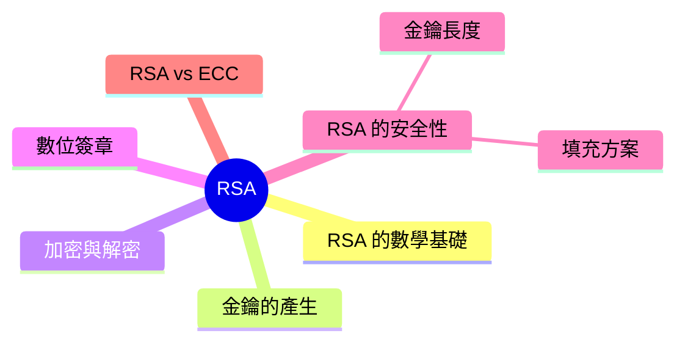

export const metadata = {
  title: 'RSA 加密演算法',
  date: '2026-05-03',
  excerpt: '介紹 RSA 加密演算法的核心概念，包含數學基礎、金鑰產生流程、加密與解密、數位簽章、填充方案的重要性，以及與 ECC 的比較。',
  tags: ['資訊安全', '網路'],
};

# RSA 加密演算法

RSA 是最廣泛使用的非對稱加密演算法，由 Ron Rivest、Adi Shamir 和 Leonard Adleman 在 1977 年發明，名稱取自三位發明者的姓氏首字母。

RSA 的安全性建立在一個數學難題：大數的質因數分解。將兩個大質數相乘很容易，但要把乘積分解回原本的兩個質數，在計算上極為困難。



- [RSA 的數學基礎](#rsa-的數學基礎)
- [金鑰的產生](#金鑰的產生)
- [加密與解密](#加密與解密)
- [數位簽章](#數位簽章)
- [RSA 的安全性](#rsa-的安全性)
- [RSA vs ECC](#rsa-vs-ecc)

---

## RSA 的數學基礎

RSA 的核心是模冪運算 (Modular Exponentiation)：

```
加密：C = M^e mod n
解密：M = C^d mod n
```

其中：
- `M` 是明文 (以數字表示)
- `C` 是密文
- `e` 是公鑰指數 (Public Exponent)
- `d` 是私鑰指數 (Private Exponent)
- `n` 是模數 (Modulus)

`n = p × q`，`p` 和 `q` 是兩個大質數。`n` 是公開的，但 `p` 和 `q` 是私密的。

`e` 和 `d` 的選取滿足：`e × d ≡ 1 (mod λ(n))`，其中 `λ(n)` 是 Carmichael 函數。

直覺理解：用 `e` 次方「鎖住」訊息，用 `d` 次方「解鎖」。這兩個操作在數學上互為逆運算。

---

## 金鑰的產生

RSA 金鑰對的產生步驟：

1. 選取兩個大質數

```
p = 大質數 (例如：61)
q = 大質數 (例如：53)
```

實際使用中，`p` 和 `q` 各為 1024 位元以上的質數。

2. 計算模數 n

```
n = p × q = 61 × 53 = 3233
```

`n` 是公鑰和私鑰共用的模數，也決定了金鑰長度 (RSA-2048 代表 `n` 是 2048 位元)。

3. 計算 λ(n)

```
λ(n) = lcm(p-1, q-1) = lcm(60, 52) = 780
```

4. 選取公鑰指數 e

`e` 必須滿足：`1 < e < λ(n)`，且 `gcd(e, λ(n)) = 1` (與 λ(n) 互質)。

常用的 `e` 是 65537 (`2^16 + 1`)，因為它是質數且在二進位中只有兩個 1，計算效率高。

5. 計算私鑰指數 d

`d` 是 `e` 對 `λ(n)` 的模反元素：

```
e × d ≡ 1 (mod λ(n))
17 × d ≡ 1 (mod 780)
d = 413
```

公鑰：`(e, n)` = `(17, 3233)` (公開)

私鑰：`(d, n)` = `(413, 3233)` (保密)

---

## 加密與解密

以上面產生的金鑰為例：

加密 (用公鑰)：

```
明文 M = 65
密文 C = M^e mod n = 65^17 mod 3233 = 2790
```

解密 (用私鑰)：

```
密文 C = 2790
明文 M = C^d mod n = 2790^413 mod 3233 = 65
```

加密結果 `2790` 傳送給接收方，接收方用私鑰 `d = 413` 解密，還原出原始的 `65`。

---

## 數位簽章

RSA 也可以用於數位簽章，方向與加密相反：私鑰簽署、公鑰驗證。

簽署 (用私鑰)：

```
訊息 M 的雜湊值 H = hash(M)
簽章 S = H^d mod n
```

驗證 (用公鑰)：

```
從簽章還原雜湊值：H' = S^e mod n
重新計算訊息的雜湊值：H = hash(M)
若 H' = H，簽章有效
```

任何人都可以用公鑰驗證簽章，但只有持有私鑰的人才能產生有效的簽章。

---

## RSA 的安全性

### 金鑰長度

RSA 的安全性取決於質因數分解的困難程度，而困難程度與金鑰長度密切相關：

| 金鑰長度 | 安全強度 | 建議使用場景 |
| - | - | - |
| 1024 位元 | 不安全 | 已棄用，不應使用 |
| 2048 位元 | 112 位元安全強度 | 目前最低標準 |
| 3072 位元 | 128 位元安全強度 | 建議用於需要長期保護的資料 |
| 4096 位元 | 140 位元安全強度 | 最高安全性，但速度較慢 |

NIST 建議在 2030 年以後使用至少 3072 位元的 RSA 金鑰，或改用 ECC。

### 填充方案 (Padding)

原始 RSA (Textbook RSA) 直接對數字進行模冪運算，有多種已知的攻擊方式。現代 RSA 加密必須使用填充方案：

- PKCS#1 v1.5：早期標準，已發現漏洞 (Bleichenbacher 攻擊)，不建議用於新系統
- OAEP (Optimal Asymmetric Encryption Padding)：現代標準，用於加密，是目前的推薦方式
- PSS (Probabilistic Signature Scheme)：用於數位簽章，是目前的推薦方式

直接使用「Textbook RSA」 (不加填充) 是嚴重的安全錯誤。

---

## RSA vs ECC

RSA 是廣泛使用的標準，但 ECC (橢圓曲線加密) 在許多場景中是更好的選擇：

| | RSA | ECC |
| - | - | - |
| 安全基礎 | 大數質因數分解 | 橢圓曲線離散對數 |
| 金鑰長度 (同等安全) | 3072 位元 | 256 位元 |
| 速度 | 較慢 | 較快 |
| 記憶體使用 | 較多 | 較少 |
| 應用廣泛度 | 非常廣泛 | 日益普及 |
| TLS 1.3 | 仍支援 | 首選 (ECDH) |

對於新系統，ECC (特別是 Ed25519 或 P-256) 通常是比 RSA 更好的選擇。RSA 在需要向下相容舊系統時仍然重要。

---

## 總結

- RSA 的安全性建立在大數質因數分解的困難性
- 公鑰 `(e, n)` 用於加密，私鑰 `(d, n)` 用於解密
- 私鑰也可以用於數位簽章，公鑰用於驗證
- 現代 RSA 必須使用填充方案 (OAEP 加密，PSS 簽章)，不加填充的 RSA 不安全
- 金鑰長度至少 2048 位元，新系統建議使用 3072 位元以上或改用 ECC
