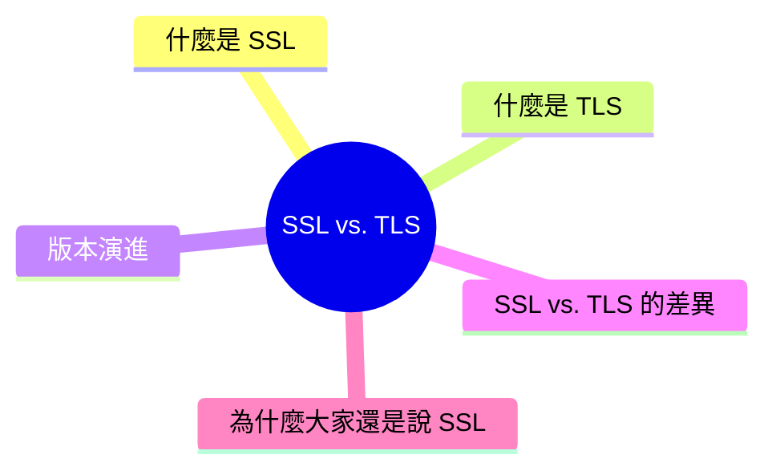

export const metadata = {
  title: 'SSL vs. TLS：加密協定的演進',
  date: '2026-04-04',
  excerpt: '介紹 SSL 與 TLS 的差異與演進歷史，包含各版本的發布與廢棄時間、TLS 1.3 的改進，以及為什麼業界至今仍習慣說「SSL 憑證」。',
  tags: ['網路'],
};

# SSL vs. TLS：加密協定的演進

當你看到網址列的鎖頭圖示，代表連線受到加密保護。這個加密機制背後，就是 SSL 或 TLS 協定。

很多人把兩者混用，說「SSL 憑證」或「TLS 憑證」都在指同一件事。但嚴格來說，SSL 和 TLS 是不同的協定，而且 SSL 早已被廢棄。

- [什麼是 SSL](#什麼是-ssl)
- [什麼是 TLS](#什麼是-tls)
- [版本演進](#版本演進)
- [SSL vs. TLS 的差異](#ssl-vs-tls-的差異)
- [為什麼大家還是說「SSL」](#為什麼大家還是說ssl)

---

## 什麼是 SSL

SSL (Secure Sockets Layer) 是 1990 年代由 Netscape 開發的加密協定，目的是讓 HTTP 連線能夠加密傳輸。

SSL 先後推出了三個版本：

- SSL 1.0：從未公開發布，有嚴重安全漏洞
- SSL 2.0：1995 年發布，後來發現多個安全問題
- SSL 3.0：1996 年發布，但 2015 年因為 POODLE 漏洞被正式廢棄

目前所有版本的 SSL 都已被廢棄，不應該再使用。

---

## 什麼是 TLS

TLS (Transport Layer Security) 是 SSL 的繼任者，由 IETF 在 1999 年基於 SSL 3.0 開發。

TLS 修正了 SSL 的安全問題，並持續改進，目前的版本是 TLS 1.3 (2018 年發布)。

TLS 同樣提供三個核心保障：

- 加密 (Encryption)：傳輸的資料無法被第三方讀取
- 完整性 (Integrity)：資料在傳輸過程中沒有被篡改
- 身份驗證 (Authentication)：確認伺服器身份，防止中間人攻擊

---

## 版本演進

| 版本 | 發布年份 | 狀態 |
| - | - | - |
| SSL 1.0 | 未公開 | 廢棄 |
| SSL 2.0 | 1995 | 廢棄 (RFC 6176) |
| SSL 3.0 | 1996 | 廢棄 (RFC 7568) |
| TLS 1.0 | 1999 | 廢棄 (2021) |
| TLS 1.1 | 2006 | 廢棄 (2021) |
| TLS 1.2 | 2008 | 仍在使用 |
| TLS 1.3 | 2018 | 目前推薦版本 |

TLS 1.0 和 1.1 在 2021 年被主要瀏覽器 (Chrome、Firefox、Safari) 停止支援，現代網站應該至少支援 TLS 1.2，建議使用 TLS 1.3。

### TLS 1.3 的改進

TLS 1.3 相較於 1.2 有幾個重要改進：

- 更快的握手：從 2-RTT (Round Trip Time) 減少到 1-RTT，有時甚至是 0-RTT
- 移除過時的加密演算法：淘汰了 RC4、DES、3DES 等已知不安全的演算法
- Forward Secrecy 成為強制要求：即使伺服器的私鑰日後外洩，過去的通訊內容也無法被解密

---

## SSL vs. TLS 的差異

| | SSL | TLS |
| - | - | - |
| 開發者 | Netscape | IETF |
| 發布年份 | 1995 (SSL 2.0) | 1999 (TLS 1.0) |
| 目前狀態 | 全部廢棄 | TLS 1.2 / 1.3 在使用 |
| 安全性 | 已知漏洞 | 持續更新改進 |
| 握手效率 | 較慢 | TLS 1.3 大幅改善 |

---

## 為什麼大家還是說「SSL」

即使 SSL 早已廢棄，業界仍然習慣說：

- SSL 憑證 (實際上是 TLS 憑證)
- SSL/TLS (兩者並列)
- 申請 SSL (實際上是申請 TLS 憑證)

這是純粹的歷史習慣。SSL 這個詞在 HTTPS 普及之初就深入人心，後來改成 TLS 但名稱沒有跟著改，所以即使憑證廠商、主機服務商、開發工具都還在用「SSL 憑證」這個說法，實際上指的都是 TLS。

知道這個區別之後，看到「SSL 憑證」不需要困惑，它就是用來啟用 HTTPS 的 TLS 憑證。

---

## 總結

- SSL 是 TLS 的前身，所有版本都已廢棄，不應再使用
- TLS 是現行的加密協定，TLS 1.2 和 TLS 1.3 是目前有效的版本
- TLS 1.3 效能更好、安全性更高，是目前的推薦版本
- 業界習慣說「SSL 憑證」，實際上指的是 TLS 憑證，兩者在日常使用中是同一件事
