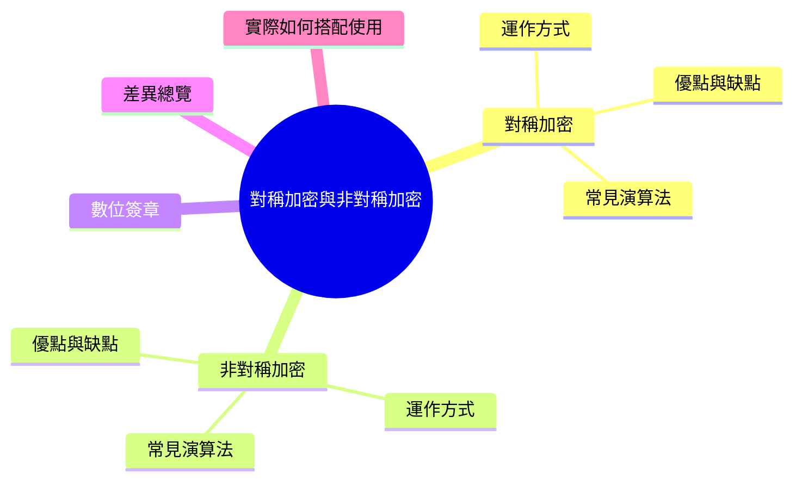
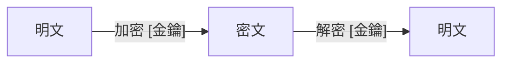
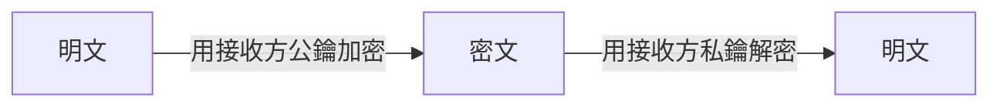
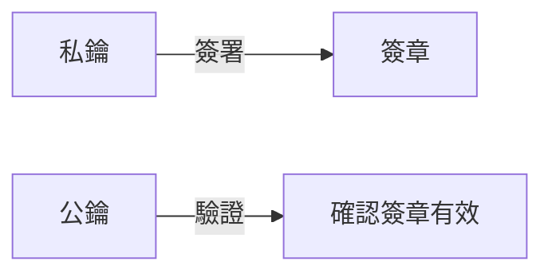
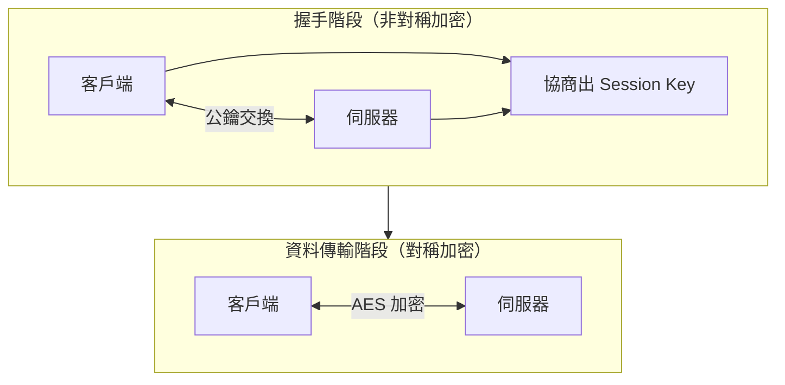

export const metadata = {
  title: '對稱加密與非對稱加密',
  date: '2026-04-30',
  excerpt: '介紹對稱加密與非對稱加密的運作方式與差異，包含各自的優缺點、常見演算法、數位簽章的原理，以及兩者在 HTTPS 中如何搭配使用。',
  tags: ['資訊安全', '網路'],
};

# 對稱加密與非對稱加密

加密是保護資料安全的核心技術，而加密演算法主要分為兩大類：

- 對稱加密 (Symmetric Encryption)：加密和解密使用同一把金鑰
- 非對稱加密 (Asymmetric Encryption)：使用一對金鑰，公鑰加密、私鑰解密

兩者各有優缺點，現實中的安全系統往往同時使用兩種加密方式。

- [對稱加密](#對稱加密)
- [非對稱加密](#非對稱加密)
- [數位簽章](#數位簽章)
- [差異總覽](#差異總覽)
- [實際如何搭配使用](#實際如何搭配使用)

---

## 對稱加密

### 運作方式

對稱加密使用同一把金鑰加密和解密。

雙方必須事先共享這把金鑰。只要金鑰不外洩，傳輸的資料就是安全的。

### 優點

- 速度快：運算量小，適合大量資料的加密
- 實作簡單：演算法相對直觀

### 缺點

- 金鑰分發問題：雙方必須在安全的管道下共享金鑰。如果通訊管道本身不安全，金鑰傳輸就有風險
- 金鑰管理複雜：N 個使用者互相通訊，需要 N×(N-1)/2 把金鑰，人數越多金鑰數量快速增加

### 常見演算法

- AES (Advanced Encryption Standard)：目前最廣泛使用的對稱加密演算法，支援 128、192、256 位元金鑰
- ChaCha20：Google 設計，用於 TLS 1.3，在低階硬體上比 AES 更快
- 3DES：DES 的改良版，已逐漸被 AES 取代

---

## 非對稱加密

### 運作方式

非對稱加密使用一對數學相關聯的金鑰：

- 公鑰 (Public Key)：可以公開分享給任何人，用來加密訊息
- 私鑰 (Private Key)：只有擁有者持有，用來解密訊息

公鑰和私鑰在數學上是相關聯的，用公鑰加密的資料只有對應的私鑰才能解密。即使攻擊者拿到了公鑰，也無法從中推算出私鑰。

### 優點

- 解決金鑰分發問題：公鑰可以公開傳輸，不需要安全的共享管道
- 支援數位簽章：私鑰可以用來簽署，公鑰可以用來驗證 (詳見下一節)

### 缺點

- 速度慢：非對稱加密的運算量遠大於對稱加密，不適合加密大量資料
- 金鑰長度較長：需要更長的金鑰才能達到同等的安全強度

### 常見演算法

- RSA：最廣泛使用的非對稱加密演算法，安全性基於大數質因數分解的困難性
- ECC (Elliptic Curve Cryptography)：基於橢圓曲線數學，在相同安全強度下金鑰長度更短、速度更快，逐漸取代 RSA
- Diffie-Hellman (DH)：不直接用於加密，而是用來在不安全的管道上安全地協商出一把對稱金鑰

---

## 數位簽章

非對稱加密除了加密資料，也可以用來做數位簽章 (Digital Signature)，驗證資料的來源和完整性。

簽章的方向與加密相反：

流程：

1. 發送方對資料產生雜湊值 (Hash)
2. 用私鑰對雜湊值進行加密，產生數位簽章
3. 接收方用公鑰解密簽章，得到雜湊值
4. 接收方對收到的資料重新計算雜湊值
5. 比對兩個雜湊值是否相同，確認資料未被篡改且來源可信

數位簽章廣泛用於：憑證驗證 (TLS)、軟體更新驗證、區塊鏈交易。

---

## 差異總覽

| | 對稱加密 | 非對稱加密 |
| - | - | - |
| 金鑰數量 | 一把 (加解密共用) | 一對 (公鑰 + 私鑰) |
| 速度 | 快 | 慢 (約慢 100–1000 倍) |
| 金鑰分發 | 需要安全管道共享金鑰 | 公鑰可以公開傳輸 |
| 適合場景 | 大量資料加密 | 金鑰交換、數位簽章 |
| 安全強度 | AES-128 ≈ RSA-3072 | 需要更長金鑰達到同等強度 |
| 代表演算法 | AES、ChaCha20 | RSA、ECC |

---

## 實際如何搭配使用

對稱加密和非對稱加密在現實中通常搭配使用，取長補短。

HTTPS（TLS)的流程：

1. 客戶端和伺服器使用非對稱加密（如 ECDH)協商出一把對稱金鑰
2. 後續所有資料傳輸改用對稱加密（AES-GCM)加密

這樣的設計兼顧了安全性和效能：非對稱加密解決了金鑰分發問題，對稱加密處理大量資料的加解密。

---

## 總結

- 對稱加密：速度快、金鑰管理複雜，適合大量資料加密
- 非對稱加密：速度慢、解決金鑰分發問題，適合金鑰交換和數位簽章
- 現代安全系統通常混合使用兩者：用非對稱加密交換金鑰，再用對稱加密傳輸資料
