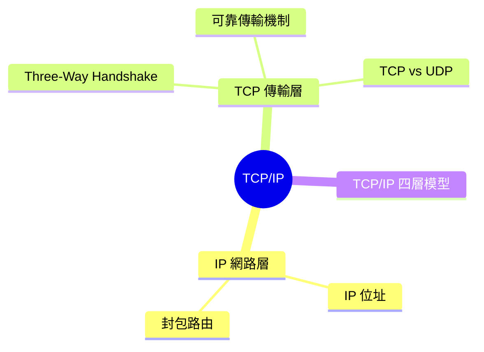
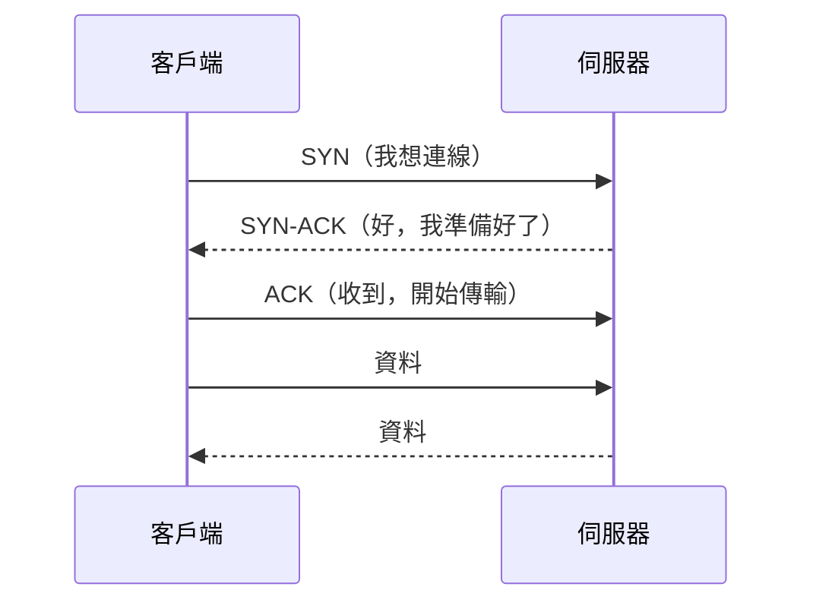
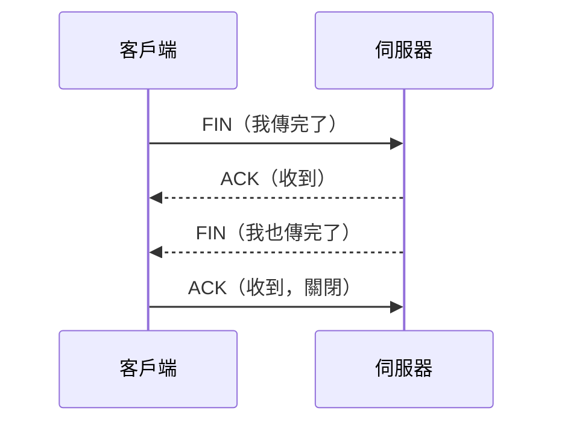
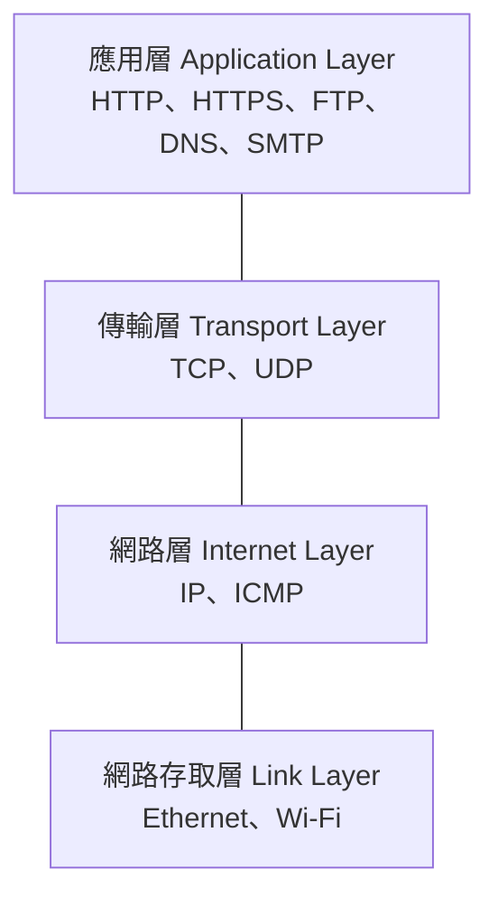
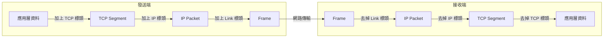

export const metadata = {
  title: 'TCP/IP：網路通訊的基礎',
  date: '2026-04-09',
  excerpt: '介紹 TCP/IP 的核心概念，包含 IP 定址與封包路由、TCP 的三向握手與可靠傳輸機制、TCP 與 UDP 的差異，以及 TCP/IP 四層模型的架構。',
  tags: ['網路'],
};

# TCP/IP：網路通訊的基礎

網際網路上所有的資料傳輸，幾乎都建立在 TCP/IP 這套協定組合上。

TCP/IP 不是單一協定，而是兩個協定的組合：

- IP (Internet Protocol)：負責定址和路由，決定封包要送到哪裡
- TCP (Transmission Control Protocol)：負責可靠傳輸，確保資料完整且有序地到達



- [IP：網路層](#ip網路層)
- [TCP：傳輸層](#tcp傳輸層)
- [TCP vs UDP](#tcp-vs-udp)
- [TCP/IP 四層模型](#tcpip-四層模型)

---

## IP：網路層

IP 協定定義了網際網路上每台裝置的位址，以及資料封包如何從來源送到目的地。

### IP 位址

每台連上網路的裝置都有一個 IP 位址，作為網路上的唯一識別。

IPv4：四組 0–255 的數字，以點分隔：

```
192.168.1.1
203.0.113.42
```

IPv4 最多能表示約 43 億個位址，隨著裝置數量增加，位址已經不夠用。

IPv6：128 位元的十六進位格式，提供幾乎無限的位址空間：

```
2001:0db8:85a3:0000:0000:8a2e:0370:7334
```

### 封包與路由

IP 不直接傳送整份資料，而是將資料切割成小的封包 (Packet) 分別傳送。每個封包包含：

- 來源 IP 位址
- 目的地 IP 位址
- 資料內容 (Payload)

封包在網路上獨立路由，可能走不同的路徑，也可能不按順序到達。IP 本身不保證封包一定到達，也不保證順序，這些由上層的 TCP 負責處理。

---

## TCP：傳輸層

TCP 建立在 IP 之上，提供可靠的、有序的、有錯誤檢測的資料傳輸。

### Three-Way Handshake

在傳送任何資料之前，TCP 需要先建立連線，透過 Three-Way Handshake (三向握手)：



- SYN (Synchronize)：客戶端發起連線請求
- SYN-ACK：伺服器確認並回應
- ACK (Acknowledge)：客戶端確認，連線建立

### 可靠傳輸機制

TCP 透過幾個機制確保資料可靠到達：

序列號 (Sequence Number)

每個封包都有序列號，接收方可以用序列號將封包重新排序，確保資料按正確順序組合。

確認應答 (ACK)

接收方每收到封包就發送 ACK 確認。如果發送方在一定時間內沒收到 ACK，就會重新發送封包。

錯誤偵測 (Checksum)

每個 TCP 封包包含校驗碼，接收方用來驗證資料在傳輸過程中是否損壞。

### 關閉連線：Four-Way Handshake

TCP 連線的關閉需要四步驟：



---

## TCP vs UDP

TCP 的可靠性是有代價的，每次傳輸都需要建立連線和等待 ACK，會有一定的延遲。

UDP (User Datagram Protocol) 是另一個傳輸層協定，沒有 TCP 的可靠機制，但因此速度更快、延遲更低。

| | TCP | UDP |
| - | - | - |
| 連線方式 | 需要握手建立連線 | 無連線，直接傳送 |
| 可靠性 | 保證送達、有序 | 不保證送達、不保證順序 |
| 速度 | 較慢 | 較快 |
| 適合場景 | HTTP、Email、檔案傳輸 | 影音串流、線上遊戲、DNS |

雖然 UDP 不可靠，但在某些場景中速度比可靠性更重要。例如視訊通話，偶爾掉一個封包 (畫面短暫糊掉) 比等待重傳 (畫面卡住) 更可接受。

---

## TCP/IP 四層模型

TCP/IP 協定組通常以四層模型描述，每一層有不同的職責：



資料從應用層往下傳，每一層加上自己的標頭 (Header)，送出後再由對方的各層依序解開：



這個過程稱為封裝 (Encapsulation) 與解封裝 (Decapsulation)。

---

## 總結

- IP 負責定址和路由，把封包送到正確的目的地
- TCP 負責可靠傳輸，透過握手、序列號、ACK 確保資料完整有序地到達
- Three-Way Handshake 是 TCP 建立連線的過程：SYN → SYN-ACK → ACK
- UDP 是 TCP 的替代，犧牲可靠性換取更低延遲
- TCP/IP 四層模型描述了網路通訊中各層的職責分工
