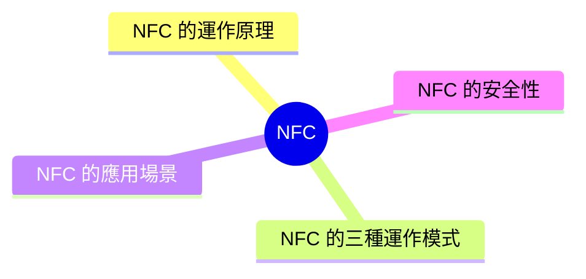
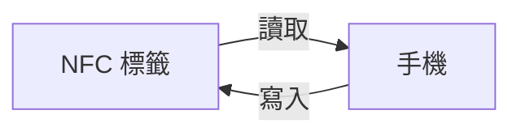
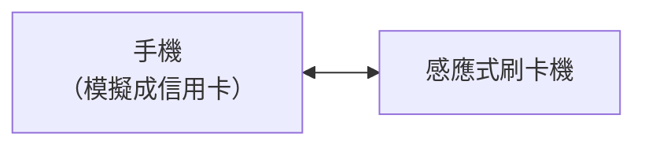
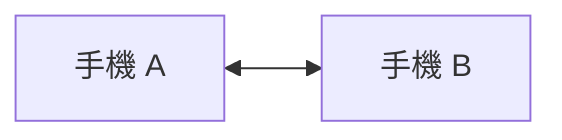

export const metadata = {
  title: 'NFC：近場通訊',
  date: '2026-03-31',
  excerpt: '介紹 NFC 近場通訊的運作原理與三種模式，包含讀卡寫卡、卡片模擬、點對點，以及行動支付、交通卡、門禁、NFC 標籤自動化等應用場景，並說明 NFC 的安全機制。',
  tags: ['無線通訊', '行動裝置'],
};

# NFC：近場通訊

NFC (Near Field Communication，近場通訊) 是一種短距離無線通訊技術，讓兩個裝置在距離約 4 公分以內時可以交換資料。

手機感應捷運悠遊卡、Apple Pay、門禁卡，背後都是 NFC。

- [NFC 的運作原理](#nfc-的運作原理)
- [NFC 的三種運作模式](#nfc-的三種運作模式)
- [NFC 的應用場景](#nfc-的應用場景)
- [NFC 的安全性](#nfc-的安全性)

---

## NFC 的運作原理

NFC 基於 RFID (Radio Frequency Identification) 技術，使用 13.56 MHz 的無線電頻率傳輸資料。

### 主動與被動裝置

NFC 裝置分為兩種：

- 主動裝置 (Active Device)：有自己的電源，可以主動發射電磁場，例如手機、NFC 讀卡機
- 被動裝置 (Passive Device)：沒有電源，從主動裝置的電磁場中獲得能量運作，例如 NFC 標籤 (Tag)、感應式信用卡

這就是為什麼 NFC 標籤貼紙可以在沒有電池的情況下運作——它從手機的電磁場中取得電力。

### 傳輸速度與距離

- 傳輸速度：106 kbps、212 kbps、424 kbps
- 有效距離：通常在 4 公分以內
- 必須非常接近才能通訊，這是設計上的安全機制

---

## NFC 的三種運作模式

### 讀卡/寫卡模式 (Reader/Writer Mode)

主動裝置 (例如手機) 讀取或寫入被動裝置 (例如 NFC 標籤) 中的資料。

應用：掃描 NFC 標籤開啟 URL、寫入聯絡人資訊到 NFC 名片。

### 卡片模擬模式 (Card Emulation Mode)

裝置模擬成一張 NFC 卡片，讓讀卡機把它當作實體卡片處理。

這是 Apple Pay、Google Pay、悠遊卡感應付款的運作方式。

### 點對點模式 (Peer-to-Peer Mode)

兩個主動裝置直接互相傳輸資料。

應用：兩支手機靠近交換聯絡資訊、配對藍牙裝置。

---

## NFC 的應用場景

### 行動支付

Apple Pay、Google Pay、Samsung Pay 都使用 NFC 的卡片模擬模式。支付時，手機傳送加密的支付憑証 (Token)，不傳送真實的信用卡號。

### 大眾運輸

悠遊卡、八達通、Suica 等交通卡使用 NFC，快速感應進出閘口。有些手機可以模擬這些交通卡，直接用手機過閘口。

### 門禁與識別

公司、飯店的門禁卡大多基於 NFC 或 RFID，感應卡片開門。

### NFC 標籤自動化

在物品上貼 NFC 標籤，手機靠近時自動執行特定動作：

- 放在床頭：觸碰後開啟鬧鐘、調成靜音
- 放在辦公桌：觸碰後連上公司 Wi-Fi、開啟工作應用
- 放在車內：觸碰後開啟導航、播放音樂

### 資料交換

兩支裝置靠近，快速交換聯絡人、名片、Wi-Fi 密碼或檔案。

---

## NFC 的安全性

### 短距離是主要的安全保障

NFC 的有效距離只有約 4 公分，攻擊者必須非常靠近才能攔截訊號。雖然理論上使用特殊設備可以在稍遠距離攔截，但在公共場所要做到這點而不被察覺仍然困難。

### 行動支付的安全機制

Apple Pay 和 Google Pay 不傳送真實的信用卡號，而是傳送一次性的支付憑證 (Token)，即使被攔截也無法被重複使用。

每次付款還需要生物驗證 (Face ID、指紋)，手機遺失後攻擊者無法使用。

### NFC 標籤的潛在風險

惡意的 NFC 標籤可能觸發手機開啟惡意網址或執行不安全的操作。現代手機在讀取 NFC 標籤時通常會顯示確認提示，不會自動執行所有操作。

不要隨意感應來路不明的 NFC 標籤，就像不要隨意點擊不明連結一樣。

### 感應式信用卡的風險

有些感應式信用卡 (RFID/NFC) 可以在不接觸的情況下被讀取，理論上攻擊者可以在你不知情的情況下讀取卡片資訊。實際上，現代感應式信用卡傳送的也是 Token 而非真實卡號，且交易需要進一步驗證。

---

## 總結

- NFC 是短距離 (約 4 公分) 無線通訊技術，使用 13.56 MHz 頻率
- 三種模式：讀卡/寫卡 (讀取 NFC 標籤)、卡片模擬 (行動支付)、點對點 (裝置間交換)
- 主要應用：行動支付、交通卡、門禁、NFC 標籤自動化
- 短距離設計是主要的安全機制，行動支付額外使用 Token 和生物驗證強化安全
