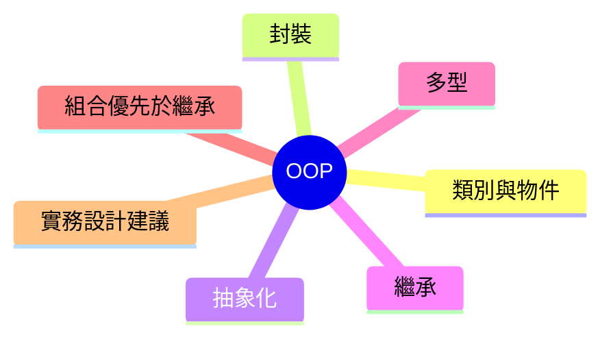

export const metadata = {
  title: '物件導向程式設計 OOP：核心觀念與實作原則',
  date: '2026-05-28',
  excerpt: '介紹物件導向程式設計 (OOP) 的核心觀念，包含類別與物件、封裝、抽象化、繼承、多型，以及為什麼實務上通常建議優先使用組合而非繼承。',
  tags: ['軟體設計', '最佳實踐', 'OOP'],
};

# 物件導向程式設計 OOP：核心觀念與實作原則

物件導向程式設計 (Object-Oriented Programming，OOP) 是一種以「物件」為中心的程式設計方式。物件同時包含資料 (狀態) 與行為 (方法)。

OOP 的重點不是把所有東西都寫成 class，而是讓程式碼更容易理解、測試、擴充與維護。



- [類別與物件](#類別與物件)
- [封裝](#封裝)
- [抽象化](#抽象化)
- [繼承](#繼承)
- [多型](#多型)
- [組合優先於繼承](#組合優先於繼承)
- [實務設計建議](#實務設計建議)
- [重點總覽](#重點總覽)

---

## 類別與物件

類別 (Class) 是藍圖；物件 (Object) 是依照藍圖建立的實例。

```typescript
class User {
  constructor(
    public id: string,
    public name: string,
  ) {}

  rename(newName: string) {
    this.name = newName;
  }
}

const user = new User('u-1', 'Charmy');
user.rename('Alicia');
```

在這個例子中：

- `User` 定義資料結構與行為
- `user` 是一個有自己狀態的具體物件

---

## 封裝

封裝 (Encapsulation) 是把內部狀態保護起來，只對外提供合理的操作方式。

```typescript
class BankAccount {
  #balance = 0;

  deposit(amount: number) {
    if (amount <= 0) {
      throw new Error('金額必須大於 0');
    }
    this.#balance += amount;
  }

  withdraw(amount: number) {
    if (amount <= 0) {
      throw new Error('金額必須大於 0');
    }
    if (amount > this.#balance) {
      throw new Error('餘額不足');
    }
    this.#balance -= amount;
  }

  getBalance() {
    return this.#balance;
  }
}
```

為什麼重要：

- 避免外部直接把狀態改成不合法的值
- 讓商業規則與資料集中管理
- 降低模組之間的意外耦合

---

## 抽象化

抽象化 (Abstraction) 是定義「要做什麼」，而不是暴露「怎麼做」。

```typescript
interface PaymentGateway {
  charge(amount: number): Promise<void>;
}

class StripeGateway implements PaymentGateway {
  async charge(amount: number): Promise<void> {
    // 呼叫 Stripe API
    console.log(`Charging ${amount} with Stripe`);
  }
}

class CheckoutService {
  constructor(private gateway: PaymentGateway) {}

  async checkout(amount: number) {
    await this.gateway.charge(amount);
  }
}
```

`CheckoutService` 依賴的是抽象 (`PaymentGateway`)，不是某個特定廠商。這樣在替換實作或寫測試時會更有彈性。

---

## 繼承

繼承 (Inheritance) 讓子類別重用父類別的行為。

```typescript
class Animal {
  move() {
    return 'moving';
  }
}

class Bird extends Animal {
  fly() {
    return 'flying';
  }
}
```

當類別之間有穩定的「is-a」關係時，繼承可以帶來重用效益。

但如果繼承階層太深，常常會讓耦合變高。父類別一改動，可能影響多個子類別。

---

## 多型

多型 (Polymorphism) 是指不同物件可以透過同一個介面被使用，但各自有不同實作。

```typescript
interface NotificationSender {
  send(message: string): void;
}

class EmailSender implements NotificationSender {
  send(message: string) {
    console.log(`Email: ${message}`);
  }
}

class SmsSender implements NotificationSender {
  send(message: string) {
    console.log(`SMS: ${message}`);
  }
}

function notify(sender: NotificationSender, message: string) {
  sender.send(message);
}

notify(new EmailSender(), 'Order confirmed');
notify(new SmsSender(), 'Order confirmed');
```

`notify` 不需要為每個通知管道寫 `if/else`，新增新管道時也不用修改既有流程。

---

## 組合優先於繼承

OOP 在實務上很常用的一條原則是：優先使用組合 (Composition)，而不是繼承。

組合是把行為拆成可替換的元件，再由物件組裝使用，而不是建立僵硬的繼承樹。

```typescript
interface Logger {
  log(message: string): void;
}

class ConsoleLogger implements Logger {
  log(message: string) {
    console.log(message);
  }
}

class OrderService {
  constructor(private logger: Logger) {}

  placeOrder(orderId: string) {
    this.logger.log(`Placing order: ${orderId}`);
  }
}
```

優點：

- 耦合較低
- 單元測試更容易 (可注入 mock)
- 行為更容易替換與擴充

---

## 實務設計建議

- 用 OOP 建模「行為」，不只是資料容器。只有 getter/setter 的 class 往往設計價值不高。
- 類別保持小而專注。若同時負責多件不相關的事，應考慮拆分。
- 依賴抽象 (介面) 而非具體實作。
- 繼承要保守使用，預設先考慮組合。
- OOP 只是工具之一。在某些情境下，純函式與不可變資料可能更簡潔。

---

## 重點總覽

| 概念 | 核心想法 | 主要好處 | 常見陷阱 |
| - | - | - | - |
| 類別/物件 | 將資料與行為封裝在一起 | 建模清楚 | 建立很多沒有行為價值的 class |
| 封裝 | 隱藏內部狀態並保護不變條件 | 降低錯誤與副作用 | 暴露可任意修改的內部資料 |
| 抽象化 | 依賴契約而非細節 | 易替換、易測試 | 抽象洩漏，仍綁定實作細節 |
| 繼承 | 透過 is-a 關係重用行為 | 共享共通邏輯 | 脆弱且過深的繼承階層 |
| 多型 | 相同介面，不同實作 | 擴充時少改舊程式碼 | 小場景過度設計 |
| 組合 | 用組裝取代階層綁定 | 彈性高、可測試性高 | 過度切碎導致邊界不清楚 |

---

## 總結

OOP 的價值在於設計品質，不在於 class 的數量。

善用封裝、抽象化與多型，可以讓程式碼更容易演進；再搭配「組合優先於繼承」，通常能得到更高彈性、較低副作用的系統設計。

實務上的目標始終一樣：讓程式碼可以安心修改，而不容易牽一髮動全身。