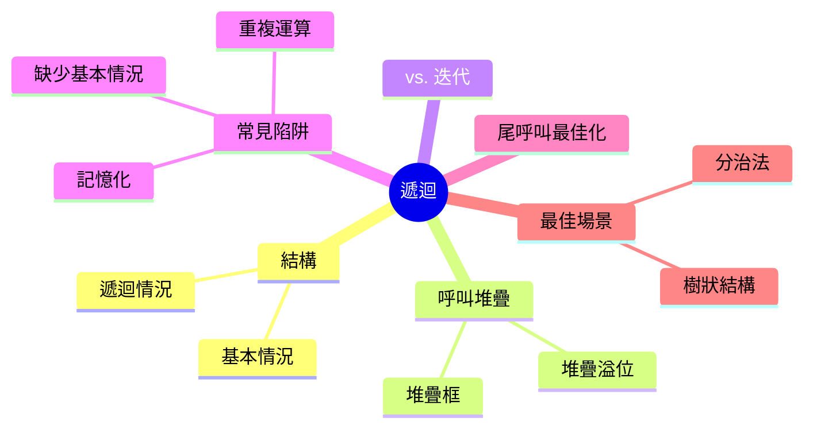
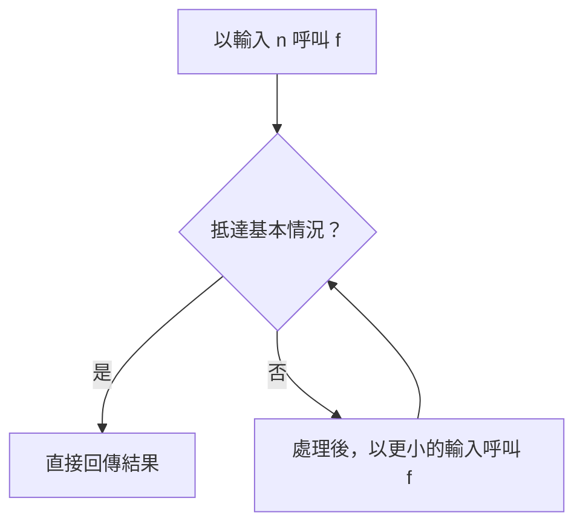
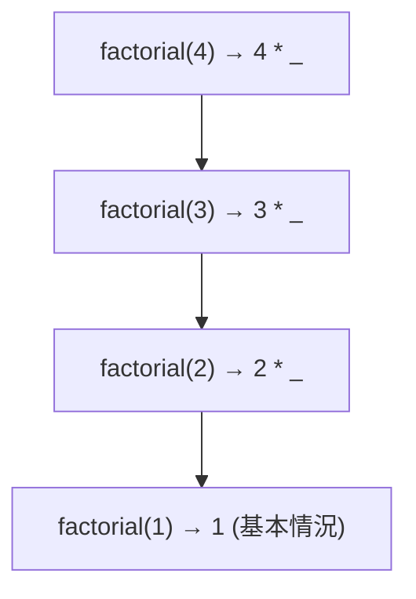
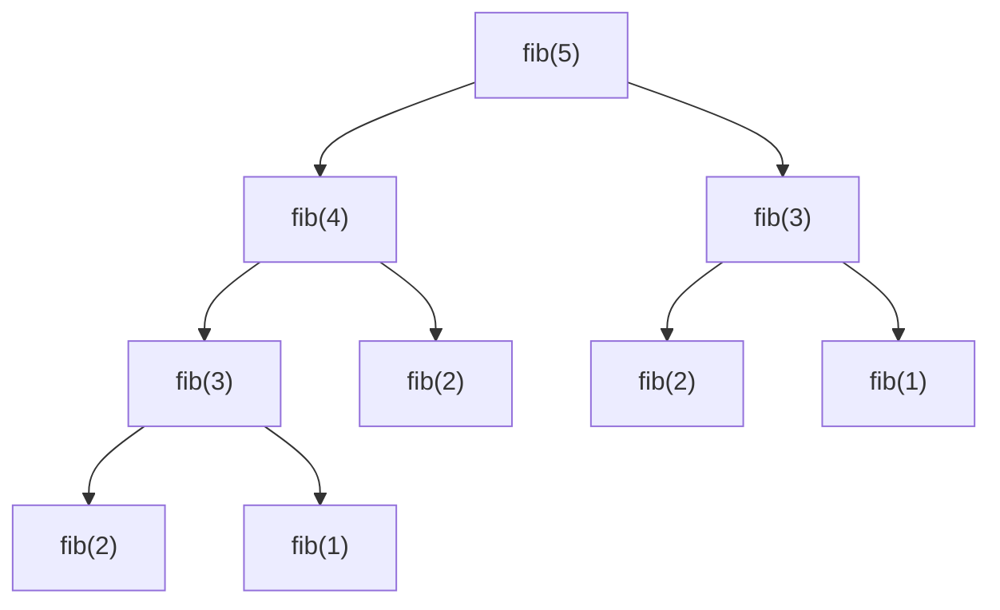

export const metadata = {
  title: 'Recursion：遞迴',
  date: '2026-08-01',
  excerpt: '深入解析遞迴：一個會呼叫自己的函式究竟如何運作、它在呼叫堆疊上的成本、什麼時候該用它而非迴圈，以及那些讓遞迴從優雅變成堆疊溢位的陷阱與解法。',
  tags: ['程式設計', 'JavaScript'],
};

# Recursion：遞迴

遞迴 (Recursion) 指的是一個會呼叫自己的函式。這聽起來幾乎是循環論證，一個東西用自己來定義，怎麼可能不會無窮轉下去？關鍵在於：每一段能運作的遞迴都有一個出口，而且每一步都在往那個出口靠近。

遞迴不是用來炫技的把戲。有些問題本質上就是遞迴的 (樹狀結構、巢狀資料、任何由自身的縮小版本組成的東西)，這類問題，遞迴能比迴圈更直接地表達解法。它的代價是執行在呼叫堆疊上，而堆疊有其上限，值得理解清楚。



- [遞迴函式的結構](#遞迴函式的結構)
- [呼叫堆疊](#呼叫堆疊)
- [遞迴 vs. 迭代](#遞迴-vs-迭代)
- [常見陷阱](#常見陷阱)
- [尾呼叫最佳化](#尾呼叫最佳化)
- [遞迴的最佳場景](#遞迴的最佳場景)
- [總結](#總結)

---

## 遞迴函式的結構

每一段正確的遞迴都有兩個部分：

- 基本情況 (base case)：函式停止、直接回傳一個值、不再呼叫自己的條件。這就是出口。
- 遞迴情況 (recursive case)：函式以更小或更簡單的輸入呼叫自己，往基本情況靠近一步。

階乘是課本上的標準範例。`n` 的階乘是 `n` 乘以 `n - 1` 的階乘，而 1 的階乘是 1。

```javascript
function factorial(n) {
  if (n <= 1) return 1;        // 基本情況
  return n * factorial(n - 1); // 遞迴情況
}
```

讓人卡住的往往是「怎麼推理它」。不要試圖在腦中追蹤整個過程，而是做一次「遞迴的信任跳躍」：假設 `factorial(n - 1)` 已經回傳了正確答案，再用它來定義當前這一層。只要基本情況是對的、每一次呼叫都讓輸入往它縮小，整段就會成立。

兩個條件決定遞迴是否正確，破壞任何一個都會出錯：

- 基本情況必須可被抵達。少了它，函式就會永遠呼叫自己。
- 每一次遞迴呼叫都必須往基本情況靠近。一個沒讓輸入縮小的呼叫 (`factorial(n)` 又呼叫 `factorial(n)`，或是減錯了變數)，一樣不會終止。



函式也可以間接地遞迴：`isEven` 呼叫 `isOdd`，`isOdd` 又呼叫回 `isEven`。這叫做相互遞迴 (mutual recursion)，但規則一樣：整個循環裡某處必須有基本情況，而且每繞一圈都必須有進展。

---

## 呼叫堆疊

要看清遞迴真正的成本，得看呼叫堆疊 (call stack)。每一次函式呼叫都會拿到自己的一個堆疊框 (stack frame)，一小塊記憶體，存放這次呼叫的參數和區域變數。一個函式呼叫另一個時，新的框會被推 (push) 到頂端；回傳時，它的框會被彈 (pop) 出去。(這正是執行環境背後的同一套機制，完整脈絡可參考 [JavaScript Execution Context (執行環境)](/articles/javascript-execution-context)。)

遞迴會把框一層層疊起來。追蹤 `factorial(4)`：每一次呼叫都得等下面那次回傳才能完成，於是框就堆了上去。



`factorial(4)` 在等 `factorial(3)`，後者在等 `factorial(2)`，再等 `factorial(1)`。直到 `factorial(1)` 命中基本情況、回傳 1，堆疊才開始回收：`factorial(2)` 回傳 2、`factorial(3)` 回傳 6、`factorial(4)` 回傳 24。在遞迴觸底、各層框沿路解開之前，沒有任何一個乘法被算出來。

危險就藏在這裡。每個待解的呼叫都佔著一個框，而堆疊並非無限。遞迴太深就會把它撐爆：

```javascript
function countDown(n) {
  if (n === 0) return;
  countDown(n - 1);
}

countDown(100000); // RangeError: Maximum call stack size exceeded
```

確切的上限取決於引擎，以及每個框佔多少空間，在 V8 中通常是「上萬層」這個量級，而非數百萬。任何深度會隨輸入規模增長的遞迴，都只差一個夠大的輸入就會撞上這個錯誤。

---

## 遞迴 vs. 迭代

任何能用遞迴寫的東西，都能改用迴圈寫，反之亦然，兩者在能力上是等價的。要選哪一個，看的是哪一個更貼合問題，以及各自的成本。

把階乘改寫成迭代版：

```javascript
function factorial(n) {
  let result = 1;
  for (let i = 2; i <= n; i++) {
    result *= i;
  }
  return result;
}
```

答案相同，但成本結構天差地遠。迴圈跑在常數記憶體只需一個 `result` 變數，反覆重用；遞迴版則為每一層深度各佔一個框。

| | 遞迴 | 迭代 |
| - | - | - |
| 記憶體 | O(深度)，每次呼叫一個框 | O(1)，常數 |
| 適合表達 | 巢狀或分支的結構 | 線性的序列 |
| 失效模式 | 深輸入導致堆疊溢位 | 不會因深度而失效 |
| 效能 | 每一步都有函式呼叫的開銷 | 通常較快 |

實務上的判準：當工作是平坦、線性的序列時用迴圈 (計數、加總陣列、走訪一串清單)；當結構會分支或巢狀時用遞迴 (樹、深層巢狀的物件、會分裂成自身縮小版本的問題)。以階乘來說，迴圈才是更好的選擇；它本質上是一個披著遞迴外衣的線性序列。

---

## 常見陷阱

### 缺少或無法抵達的基本情況

最常見的 bug 就是造成無窮遞迴的那一種：沒有基本情況，或是遞迴永遠到不了基本情況。結果永遠一樣，丟出 `Maximum call stack size exceeded`。看到這個錯誤時，第一個該問的問題是：每一次遞迴呼叫，是否真的都在往基本情況靠近？

### 重複運算

這個陷阱更隱晦，因為程式碼看起來沒問題、也回傳正確答案，只是慢得離譜。最經典的犯人就是天真版的費氏數列：

```javascript
function fib(n) {
  if (n < 2) return n;
  return fib(n - 1) + fib(n - 2);
}
```

問題在於兩條分支一再重算相同的值。看看 `fib(5)` 的呼叫樹：



`fib(3)` 被算了兩次，`fib(2)` 被算了三次。隨著 `n` 變大，這種重複會爆炸性成長，天真版的時間複雜度是 O(2ⁿ)，所以 `fib(50)` 會產生數百億次呼叫。遞迴本身是正確的，但它在重做大量一模一樣的工作。

### 記憶化

解法是把算過的答案記下來，讓每一個相異的輸入只被解一次：

```javascript
function fib(n, memo = new Map()) {
  if (n < 2) return n;
  if (memo.has(n)) return memo.get(n);

  const result = fib(n - 1, memo) + fib(n - 2, memo);
  memo.set(n, result);
  return result;
}
```

現在 `fib(5)` 只把 `fib(1)` 到 `fib(5)` 各算一次，其餘都從快取讀取。這讓執行時間從 O(2ⁿ) 壓回 O(n)，`fib(50)` 瞬間就回傳。這種「快取遞迴子問題的結果」的手法 (記憶化，memoization)，正是動態規劃 (dynamic programming) 的根基。

---

## 尾呼叫最佳化

尾呼叫 (tail call) 指的是一個函式做的最後一件事就是那次遞迴呼叫，它的結果被直接回傳，之後沒有任何工作在等著做。

標準的階乘不是尾遞迴。仔細看 `return n * factorial(n - 1)`：`factorial(n - 1)` 回傳之後，還有一個乘法要做。正是這個待辦的工作，讓那個框不得不留著。

你可以用一個累加器 (accumulator) 把過程中的結果一路帶下去，讓呼叫之後不留任何尾巴，藉此改寫成尾遞迴：

```javascript
function factorial(n, acc = 1) {
  if (n <= 1) return acc;
  return factorial(n - 1, n * acc); // 尾呼叫：此次回傳後沒有任何事要做
}
```

當一次呼叫位於尾端位置時，引擎可以對它最佳化：因為回來之後也沒事可做，它不必推新的框，直接重用當前這個框就好。這讓遞迴變成佔用常數堆疊空間，無論多深都不會溢位。

但這裡有個關鍵、而且影響很大：在 JavaScript 裡，你多半不能指望這件事。ES2015 規格的確要求了正規尾呼叫 (proper tail calls)，但實作普及不起來。在主要引擎中，只有 JavaScriptCore (Safari) 真的有出貨；V8 (Chrome 與 Node.js) 曾在旗標後實作、後來又移除了；SpiderMonkey (Firefox) 則從未出貨。所以在 Node 或 Chrome 上，上面那個尾遞迴版的階乘，碰到夠大的 `n` 一樣會溢位，跟原版沒兩樣。

結論是：在觀念上理解尾呼叫，但在 JavaScript 裡別依賴尾呼叫最佳化。當你需要一段很深的遞迴在有限的堆疊空間內執行時，就把它改成迴圈，或是自己用一個顯式的堆疊 (一個你手動 push、pop 的陣列) 來管理這些工作。

---

## 遞迴的最佳場景

當資料本身就是遞迴定義的 (一個包含自身縮小版本的結構)，遞迴就是對的工具。當程式碼的形狀貼合資料的形狀時，解法幾乎是自己寫出來的。

### 樹狀與巢狀結構

樹在前端工作裡無所不在：DOM 是一棵樹、檔案系統是一棵樹、JSON 可以巢狀到任意深度。數出一棵樹裡的所有節點只需要三行：

```javascript
function countNodes(node) {
  let count = 1; // 算進這個節點本身
  for (const child of node.children) {
    count += countNodes(child);
  }
  return count;
}
```

迴圈負責處理同一層的兄弟節點；遞迴負責往深處下探。優雅之處在於：你完全不需要知道這棵樹有多深，遞迴會一路跟著它走到底。同樣的事若用迴圈來做，就得自己維護一個「待走訪節點」的顯式堆疊，而那其實只是手動版的遞迴。

### 分治法

另一個天然契合的場景是分治 (divide and conquer)：把一個問題切成更小的子問題，各自遞迴求解，再把結果合併。合併排序、快速排序、二分搜尋都是這樣建構出來的。二分搜尋寫成遞迴格外清楚，每一步都丟掉剩餘範圍的一半：

```javascript
function binarySearch(arr, target, lo = 0, hi = arr.length - 1) {
  if (lo > hi) return -1; // 基本情況：範圍已空，找不到

  const mid = (lo + hi) >> 1;
  if (arr[mid] === target) return mid;

  return arr[mid] < target
    ? binarySearch(arr, target, mid + 1, hi)  // 搜尋右半邊
    : binarySearch(arr, target, lo, mid - 1); // 搜尋左半邊
}
```

每一次呼叫都處理一段嚴格更小的範圍，答案則沿著呼叫鏈一路往上直接傳回，不需要任何合併步驟。合併排序與快速排序共用同一套骨架：先分、遞迴，再在結果回收的過程中做真正的工作。

---

## 總結

遞迴無關炫技，而是去貼合問題的形狀。當一個結構由自身的縮小版本組成時，一個對著那些縮小版本呼叫自己的函式，就是你能寫出最誠實的描述。把基本情況和「往前進」這兩件事顧好、留意堆疊，剩下的自然水到渠成。

實務上的取捨可以歸結成幾個問題。工作是線性的，還是會分支、巢狀？線性的序列屬於迴圈；會分支、具自相似性的結構屬於遞迴。同一個子問題是否被重複求解？那就記憶化，一個指數級的演算法便會塌縮成線性。它最深會到多深？由於 JavaScript 引擎並不會可靠地最佳化尾呼叫，任何深度會隨輸入增長的遞迴，都需要一個有上限的深度、或是改寫成迭代。把這幾題答清楚，遞迴就不再是莫名其妙的堆疊溢位來源，而會回到它該有的樣子：表達一個自相似的問題時，最清楚的那種寫法。
