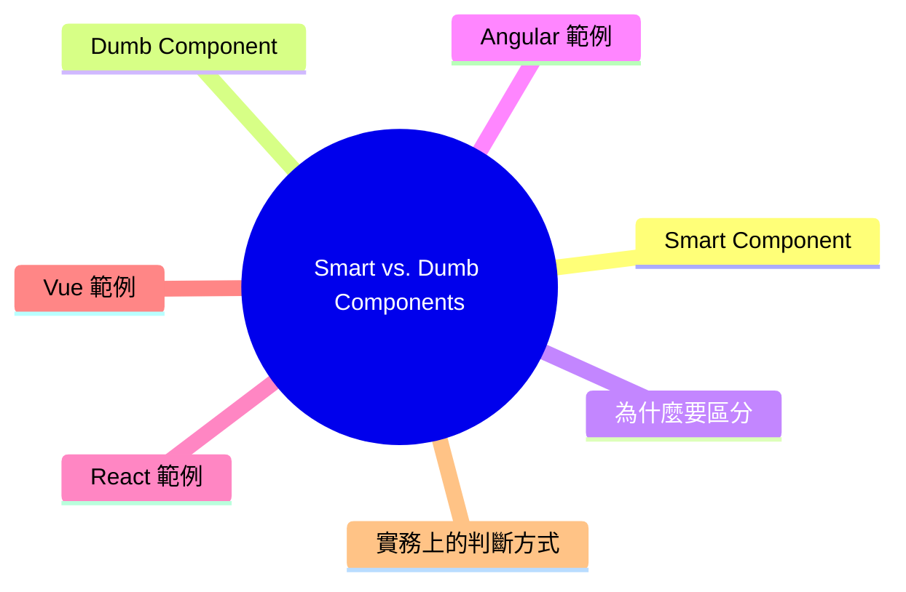

export const metadata = {
  title: 'Smart vs. Dumb Components：容器元件與展示元件',
  date: '2026-03-24',
  excerpt: '介紹 Smart vs. Dumb Components 的元件設計原則，包含容器元件與展示元件的職責差異、為什麼要區分，以及 Angular、React、Vue 三種框架的實作範例。',
  tags: ['前端', '前端架構', '元件設計', 'Angular', 'React', 'Vue'],
};

# Smart vs. Dumb Components：容器元件與展示元件

Smart/Dumb Components 是前端常見的元件設計原則，核心概念是將元件依照職責分成兩類：

- Smart Component (容器元件)：負責資料和邏輯
- Dumb Component (展示元件)：負責 UI 的呈現

這個原則不限框架，Angular、React、Vue 都適用。



- [Smart Component](#smart-component)
- [Dumb Component](#dumb-component)
- [為什麼要區分](#為什麼要區分)
- [Angular 範例](#angular-範例)
- [React 範例](#react-範例)
- [Vue 範例](#vue-範例)
- [實務上的判斷方式](#實務上的判斷方式)

---

## Smart Component

Smart Component 又稱為 Container Component (容器元件)。

職責：

- 呼叫 API 或 Service 取得資料
- 管理元件的狀態
- 處理業務邏輯
- 把資料傳遞給子元件

Smart Component 通常對應到一個頁面或頁面中的某個功能區塊。

---

## Dumb Component

Dumb Component 又稱為 Presentational Component (展示元件)。

職責：

- 接收資料 (透過 props 或 `@Input`)
- 發送事件 (透過 callback 或 `@Output`)
- 不直接呼叫 API 或 Service
- 不管理應用程式的狀態

Dumb Component 不知道資料從哪裡來，也不知道事件之後會發生什麼，它只負責「顯示」和「通知」。

---

## 為什麼要區分

### 提高可重用性

Dumb Component 不依賴特定的 Service 或業務邏輯，可以在不同的地方重複使用，只需傳入不同的資料。

### 更容易測試

Dumb Component 只依賴輸入的資料，沒有外部依賴，測試時只需傳入資料，驗證顯示結果是否正確。

Smart Component 的測試則可以專注在業務邏輯，不需要關心 UI 的細節。

### 關注點分離

每個元件只有一個職責：

- Smart Component：「資料從哪裡來、該怎麼處理」
- Dumb Component：「資料長什麼樣子、如何顯示」

當 UI 需要調整時，只需修改 Dumb Component；當業務邏輯變動時，只需修改 Smart Component。

---

## Angular 範例

Smart Component (頁面)

```typescript
@Component({
  standalone: true,
  imports: [UserListComponent],
  selector: 'app-user-page',
  template: `
    <app-user-list
      [users]="users"
      (deleteUser)="onDelete($event)"
    />
  `,
})
export class UserPageComponent implements OnInit {
  users: User[] = [];

  constructor(private userService: UserService) {}

  ngOnInit() {
    this.userService.getUsers().subscribe(users => {
      this.users = users;
    });
  }

  onDelete(userId: number) {
    this.userService.deleteUser(userId).subscribe(() => {
      this.users = this.users.filter(u => u.id !== userId);
    });
  }
}
```

Dumb Component (列表)

```typescript
@Component({
  standalone: true,
  imports: [NgFor],
  selector: 'app-user-list',
  template: `
    <ul>
      <li *ngFor="let user of users">
        {{ user.name }}
        <button (click)="deleteUser.emit(user.id)">刪除</button>
      </li>
    </ul>
  `,
})
export class UserListComponent {
  @Input() users: User[] = [];
  @Output() deleteUser = new EventEmitter<number>();
}
```

`UserListComponent` 不知道刪除後要做什麼，它只發出事件，讓 Smart Component 決定如何處理。

---

## React 範例

Smart Component (頁面)

```jsx
function UserPage() {
  const [users, setUsers] = useState([]);

  useEffect(() => {
    fetchUsers().then(data => setUsers(data));
  }, []);

  function handleDelete(userId) {
    deleteUser(userId).then(() => {
      setUsers(prev => prev.filter(u => u.id !== userId));
    });
  }

  return <UserList users={users} onDelete={handleDelete} />;
}
```

Dumb Component (列表)

```jsx
function UserList({ users, onDelete }) {
  return (
    <ul>
      {users.map(user => (
        <li key={user.id}>
          {user.name}
          <button onClick={() => onDelete(user.id)}>刪除</button>
        </li>
      ))}
    </ul>
  );
}
```

`UserList` 透過 props 接收資料，透過 `onDelete` callback 向上傳遞事件，本身不處理任何業務邏輯。

---

## Vue 範例

Smart Component (頁面)

```vue
<template>
  <UserList :users="users" @delete="handleDelete" />
</template>

<script setup>
import { ref, onMounted } from 'vue';
import UserList from './UserList.vue';
import { fetchUsers, deleteUser } from './userService';

const users = ref([]);

onMounted(async () => {
  users.value = await fetchUsers();
});

async function handleDelete(userId) {
  await deleteUser(userId);
  users.value = users.value.filter(u => u.id !== userId);
}
</script>
```

Dumb Component (列表)

```vue
<template>
  <ul>
    <li v-for="user in users" :key="user.id">
      {{ user.name }}
      <button @click="$emit('delete', user.id)">刪除</button>
    </li>
  </ul>
</template>

<script setup>
defineProps({ users: Array });
defineEmits(['delete']);
</script>
```

三個框架的實作細節不同，但分工方式完全一致：Smart Component 管資料，Dumb Component 管顯示。

---

## 實務上的判斷方式

幾個問題幫助判斷元件的歸屬：

- 這個元件需要呼叫 API 或 Service 嗎？→ Smart Component
- 這個元件需要知道資料從哪裡來嗎？→ Smart Component
- 這個元件在不同頁面都可以使用嗎？→ 通常是 Dumb Component
- 這個元件只需要資料就能運作嗎？→ Dumb Component

實務上，元件不一定非黑即白，有些元件介於兩者之間。原則是：盡量讓 Dumb Component 保持純粹，讓 Smart Component 集中管理邏輯。

---

## 總結

| | Smart Component | Dumb Component |
| - | - | - |
| 別名 | Container Component | Presentational Component |
| 職責 | 資料、業務邏輯 | UI 呈現 |
| 資料來源 | API、Service、狀態管理 | props / `@Input` |
| 事件處理 | 直接處理 | 向上傳遞 |
| 可重用性 | 較低 | 較高 |
| 測試難度 | 較複雜 | 較簡單 |
