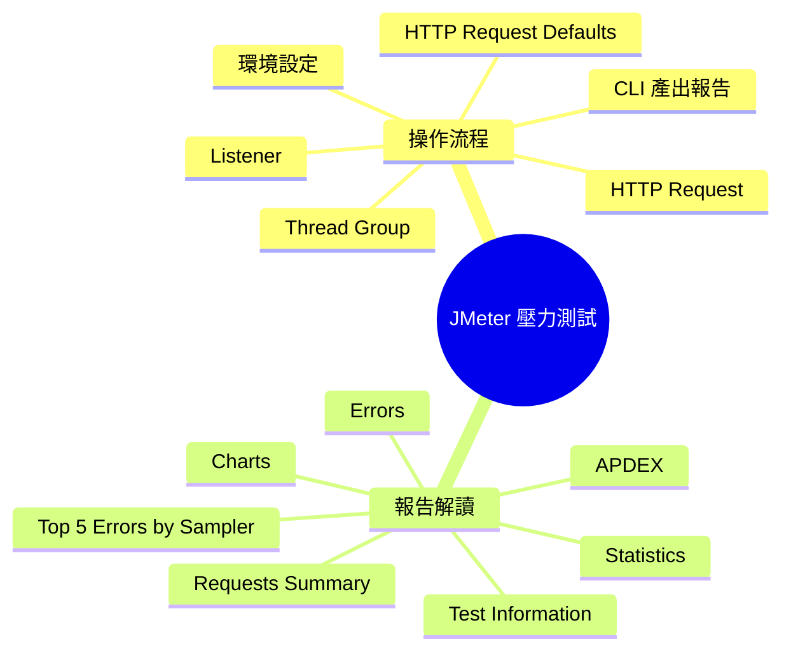
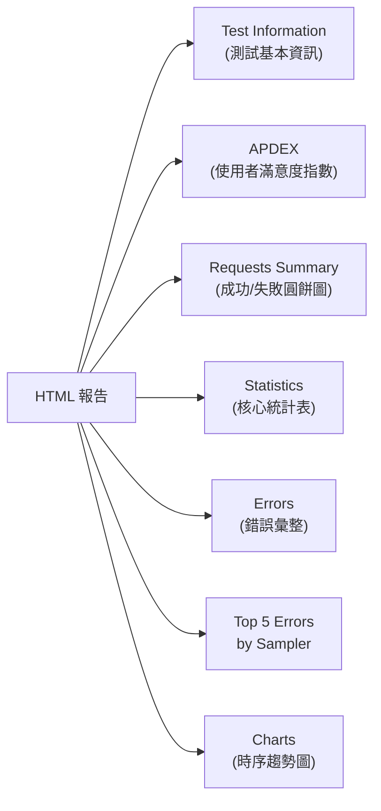
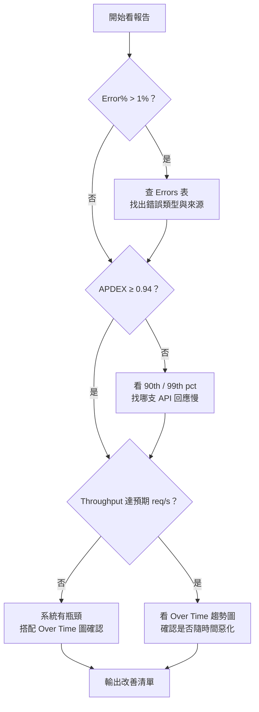

export const metadata = {
  title: 'JMeter 壓力測試：從環境設定到報告解讀',
  date: '2026-06-21',
  excerpt: '從零開始完整記錄 JMeter 壓力測試的操作流程，涵蓋 Thread Group、HTTP Request、Listener 的建立步驟，以及 APDEX、Statistics、Percentile 等 HTML 報告核心指標的深入解析。',
  tags: ['軟體測試', '效能', 'Java'],
};

# JMeter 壓力測試：從環境設定到報告解讀

Apache JMeter 是由 Apache 軟體基金會維護的 100% 純 Java 開源測試工具，主要用途是針對 Web App 及各類 API 進行效能測試、系統負載模擬與壓力承受能力的驗證。

這篇文章記錄了從環境設定、建立測試計畫，到用 CLI 產出 HTML 報告，以及解讀報告裡每個核心指標的完整流程。



- [環境設定](#環境設定)
- [Thread Group](#thread-group)
- [HTTP Request Defaults](#http-request-defaults)
- [HTTP Request](#http-request)
- [Listener](#listener)
- [存檔與試跑](#存檔與試跑)
- [CLI 產出 HTML 報告](#cli-產出-html-報告)
- [報告解讀](#報告解讀)
- [看報告的建議順序](#看報告的建議順序)

---

## 環境設定

Apache JMeter 是 Java 應用程式，啟動前必須先確保系統已安裝 Java。

### 步驟

1. 安裝 Java：版本建議 Java 21。可透過 [mise](https://mise.jdx.dev/)、SDKMAN，或直接從 Oracle / AdoptOpenJDK 官網下載安裝。
2. 安裝 JMeter：macOS 用 Homebrew 最方便 (`brew install jmeter`)；其他平台可至 [JMeter 官網](https://jmeter.apache.org/download_jmeter.cgi) 下載 Binary 壓縮檔，解壓後執行 `bin/jmeter` 即可。
3. 啟動 JMeter：在終端機輸入 `jmeter` (Windows 執行 `bin/jmeter.bat`)，JMeter GUI 就會開啟。


---

## Thread Group

Thread Group 定義了「要模擬幾個使用者、以什麼節奏啟動、跑幾輪」，是整個測試計畫的核心。

### 建立步驟

1. 在左側面板對著 `Test Plan` 點擊右鍵。
2. 選擇 `Add → Threads (Users) → Thread Group`。
3. 在右側面板設定三個核心參數。


- Number of Threads (users)
	要模擬幾個虛擬使用者同時對 Server 發送請求。新手建議先設 10，目的只是確認腳本邏輯是否正確，不需要一開始就打大流量。
- Ramp-up period (seconds)
	JMeter 要在幾秒內把所有使用者啟動完畢。以 Threads = 10、Ramp-up = 10 為例，代表每秒新增 1 個使用者。建議設成和 Threads 相同的秒數，讓流量平穩爬升，避免伺服器因瞬間大量連線而將流量誤判為攻擊。
- Loop Count
	每個使用者把測試流程重複幾次。新手建議先設 1；確認流程正確後再增加。勾選 Infinite 代表永遠執行，只適合長時間穩定性測試，不熟悉 JMeter 的情況下容易把 Server 打掛。

---

## HTTP Request Defaults

如果要測試同一網域底下的多個 API，HTTP Request Defaults 可以集中管理網域設定，避免每個 Request 都重複輸入。

### 建立步驟

1. 對著 `Thread Group` 點擊右鍵。
2. 選擇 `Add → Config Element → HTTP Request Defaults`。
3. 在右側面板填入：
	- Protocol：`https` (或 `http`)
	- Server Name or IP：目標網域，例如 `example.com`


---

## HTTP Request

HTTP Request 是實際發出 HTTP 請求的 Sampler，每新增一個就代表測試流程中的一個 API 呼叫。

### 建立步驟

1. 對著 `Thread Group` 點擊右鍵。
2. 選擇 `Add → Sampler → HTTP Request`。
3. 在右側面板填入：
	- Name：自訂名稱，例如 `Blog Home Page`
	- Method：`GET` (或依實際 API 選擇 POST / PUT 等)
	- Path：`/` (首頁)或具體的 API 路徑，例如 `/api/users`
	- Server Name 留空：JMeter 會自動套用 HTTP Request Defaults 中的網域設定


如果要測試多個 API，重複這個步驟在 Thread Group 底下新增多個 HTTP Request，它們會依序執行，模擬真實使用者的完整操作行為。

---

## Listener

Listener 是 JMeter 的結果收集器，負責收集並展示測試執行的結果。建議至少加入以下兩個：

- View Results Tree：顯示每個 Request 的詳細資訊，包含 Request Header、Response Body，適合除錯用。
- Summary Report：顯示彙整後的統計數據，包含平均回應時間、錯誤率、Throughput 等。

### 建立步驟

1. 對著 `Thread Group` 點擊右鍵，選擇 `Add → Listener → View Results Tree`。
2. 再次對著 `Thread Group` 點擊右鍵，選擇 `Add → Listener → Summary Report`。


> GUI 模式下的 Listener 會在測試執行時即時渲染圖表，消耗大量記憶體與 CPU。正式壓測應使用 CLI 模式，Listener 只留用來 GUI 試跑除錯，詳見下一節。

---

## 存檔與試跑

腳本建立完成後，先用少量使用者跑一輪，確認所有 Request 都有正確的回應，再進行正式壓測。

### 步驟

1. 點擊左上角的儲存按鈕，將腳本存到指定資料夾，例如 `Summary Report.jmx`。
2. 點擊工具列的綠色播放鍵 (Start) 執行測試。
3. 點擊左側面板的 `View Results Tree` 查看結果。

### 判斷是否成功

- 請求旁邊顯示綠色 (盾牌圖示或文字) → HTTP 2xx / 3xx，成功
- 請求旁邊顯示紅色 → HTTP 4xx / 5xx 或 Exception，需要排查原因


這個階段主要是「確認腳本是否正確」，用 10 個使用者跑一輪，全部 Request 都顯示綠色就代表腳本沒問題，可以進入下一步。

---

## CLI 產出 HTML 報告

不應該在 GUI 模式下進行正式壓測，JMeter 的圖形介面本身會持續消耗 CPU 與記憶體，導致壓測數據失真。JMeter 官方文件明確建議正式測試使用 Non-GUI (CLI) 模式。

正確的流程是：在 GUI 設定好腳本並確認正確，然後關閉 GUI，改用終端機執行。

### 步驟

1. 確認腳本已存檔 (例如 `Summary Report.jmx`)。
2. 開啟終端機，切換到 `.jmx` 檔案所在的目錄。
3. 執行以下指令：

```bash
jmeter -n -t "Summary Report.jmx" -l test_result.csv -e -o "Summary Report"
```

參數說明

| 參數 | 說明 |
| :--- | :--- |
| `-n` | Non-GUI 模式執行 |
| `-t <file>` | 指定要執行的 `.jmx` 腳本 |
| `-l <file>` | 將每筆請求的原始資料存成 CSV 檔 |
| `-e` | 測試結束後自動產生 HTML 報告 |
| `-o <dir>` | 指定 HTML 報告的輸出目錄 (必須是不存在的空目錄) |

> `-o` 指定的目錄必須不存在，JMeter 會自動建立。如果目錄已存在，JMeter 會報錯並停止執行，重新執行前需要手動刪除舊目錄或換一個名稱。


執行完成後，打開輸出目錄中的 `index.html`，即可在瀏覽器中查看完整的 HTML 報告。

---

## 報告解讀


JMeter HTML 報告由以下幾個主要區塊組成：



### Test and Report Information

報告頂部的 metadata 區塊，顯示本次測試的背景資訊：

| 欄位 | 說明 |
| :--- | :--- |
| Source file | 原始 CSV 結果檔名 |
| Start Time | 測試開始時間 |
| End Time | 測試結束時間 |
| Filter for display | 如有設定篩選則顯示，空白代表顯示全部 Sampler |

### APDEX

APDEX (Application Performance Index) 是一個量化使用者體驗的標準化指標，數值介於 0 到 1，越接近 1 越好。

計算公式：

```
APDEX = (Satisfied + Tolerating × 0.5) / Total Requests
```

JMeter 預設的閾值：

- Satisfied (滿意)：回應時間 ≤ 500ms (T 值，可自訂)
- Tolerating (可接受)：回應時間在 500ms ~ 2000ms 之間 (4T 值)
- Frustrated (不滿意)：回應時間 > 2000ms 或發生錯誤

分數對照表：

| 分數 | 等級 | 說明 |
| :--- | :--- | :--- |
| 1.00 | Excellent | 完美 |
| 0.94 ~ 0.99 | Good | 良好，達標 |
| 0.85 ~ 0.93 | Fair | 尚可，需持續觀察 |
| 0.70 ~ 0.84 | Poor | 差，需要優化 |
| < 0.70 | Unacceptable | 不可接受，需立即處理 |

APDEX 區塊的欄位：

| 欄位 | 說明 |
| :--- | :--- |
| Apdex | 分數，0 ~ 1 |
| T (Acceptable) | Satisfied 閾值，預設 500ms |
| F (Tolerated) | Tolerating 閾值，預設 2000ms |
| Label | 對應的 Thread Group 或 Sampler 名稱 |

### Requests Summary

這個圓餅圖顯示整體請求的成功與失敗比例：

- 綠色 (OK)：HTTP 2xx / 3xx，JMeter 判定成功
- 紅色 (KO)：HTTP 4xx / 5xx，或 Response Assertion 失敗

注意：JMeter 預設只看 HTTP Status Code 判斷成功。如果 API 回傳的 JSON Body 中包含錯誤訊息但 HTTP Status 是 200，JMeter 仍會標記為成功。要真正驗證回應內容，需要搭配 Response Assertion 或 JSON Extractor 來斷言。

### Statistics

Statistics 是整份報告最核心的資料表，每個 Sampler (API) 都會有一列。

基本量

| 欄位 | 說明 |
| :--- | :--- |
| #Samples | 總共發出幾個請求 |
| Fail | 失敗幾個 (KO) |
| Error% | 失敗率 = Fail ÷ #Samples × 100% |

回應時間 (單位：ms)

| 欄位 | 說明 | 重要性 |
| :--- | :--- | :--- |
| Average | 算術平均回應時間 | 參考用，容易被極端值拉偏 |
| Min | 最快的一次 | 理想狀態下的最佳表現 |
| Max | 最慢的一次 | 找出最壞情況 |
| Median (50th pct) | 一半的請求在這個時間內完成 | 比 Average 更能代表一般使用者的感受 |
| 90th pct | 90% 的請求在這個時間內完成 | 最常用的 SLA 指標，代表大多數使用者的體驗 |
| 95th pct | 95% 的請求在這個時間內完成 | 適合高要求的服務使用 |
| 99th pct | 99% 的請求在這個時間內完成 | 代表最差情況，用來找出離群值 |

> 為什麼 Percentile 比 Average 更重要？
>
> 假設 100 個請求中 99 個是 100ms，只有 1 個是 10000ms：
> - Average = 199ms，看起來還不錯
> - 99th pct = 10000ms，說明每 100 個使用者中就有 1 個人等了超過 10 秒
>
> Average 被那 1 個極端值稀釋了。99th pct 才能真正反映最差情況。

吞吐量

| 欄位 | 說明 |
| :--- | :--- |
| Throughput | 每秒處理幾個請求 (req/s)，數字越高代表系統的承載能力越強 |
| Received KB/sec | 每秒從 Server 接收的資料量 |
| Sent KB/sec | 每秒送出的資料量 |

### Errors

Errors 表列出本次測試中所有錯誤的類型和數量：

| 欄位 | 說明 |
| :--- | :--- |
| Type of error | 錯誤類型，例如 `Response code: 500` 或 `Connection timed out` |
| Number of errors | 這種錯誤發生幾次 |
| % in errors | 佔所有錯誤的比例 |
| % in all samples | 佔所有請求的比例 |

常見錯誤類型

| 錯誤訊息 | 原因 |
| :--- | :--- |
| `Response code: 500` | Server 內部錯誤，程式拋出了未處理的例外 |
| `Response code: 502 / 503` | Gateway 或 Server 暫時無法服務，通常是壓力過大或資源耗盡 |
| `Response code: 401 / 403` | 認證或授權失敗，Token 可能過期或未正確帶入 |
| `Connection timed out` | Server 太忙，無法在 JMeter 的逾時時間內回應 |
| `Connection refused` | Server 直接拒絕連線，可能已掛掉或 Port 未開放 |
| `java.net.SocketException` | JMeter 的網路連線被強制中斷 |

### Top 5 Errors by Sampler

把 Errors 依 Sampler (API endpoint) 分組，列出錯誤數最多的前五支 API。當測試出現大量錯誤時，這裡通常是最快找到問題根源的地方。

| 欄位 | 說明 |
| :--- | :--- |
| Sampler | 發生錯誤的 Thread Group 或 HTTP Request 名稱 |
| Type of error | 錯誤類型 |
| Number of errors | 發生次數 |
| % in errors | 佔所有錯誤的比例 |
| % in all samples | 佔所有請求的比例 |

### Charts

報告側欄的 Charts 分頁包含三個子頁面，每個子頁面都是互動式時序圖，用來觀察系統在壓力過程中的動態變化：

Over Time

- Response Time Over Time：壓力升高時，回應時間是否跟著拉長？有助於找出系統開始抖動的時間點。
- Active Threads Over Time：虛擬使用者數量的變化曲線。
- Transactions Per Second：吞吐量隨時間的波動，確認是否出現瓶頸。

Throughput

- Hits Per Second：每秒打到 Server 的 Request 數。
- Throughput vs Threads：加更多使用者時，吞吐量是線性上升還是開始走平？走平代表系統已達瓶頸。

Response Times

- Response Time Percentiles Over Time：各 Percentile 隨時間的變化趨勢。
- Response Time Distribution：次數分佈直方圖，看回應時間是否集中在某個區間，還是出現長尾。

---

## 看報告的建議順序



快速判斷參考值 (一般 Web 服務)

| 指標 | 建議門檻 | 說明 |
| :--- | :--- | :--- |
| Error% | < 1% | > 5% 代表系統嚴重異常，需立即排查 |
| 90th pct | < 2000ms | 代表大多數使用者的實際體驗 |
| APDEX | ≥ 0.94 | 低於此值使用者已有明顯感受 |
| Throughput | 依壓測設定而定 | 確認 Server 能否撐住預期的流量 |
| Max | 觀察與 99th pct 的差距 | 差距過大代表有偶發性的極端慢請求 |

---

## 總結

JMeter 的使用流程可以拆成兩個階段：腳本設計與報告解讀。腳本設計時，把測試對象、使用者人數、行為流程在 GUI 中設定好，用少量使用者試跑確認腳本正確，然後切換到 CLI 模式做正式壓測；報告出來後，優先看 Error%、APDEX、90th pct 這三個數字，搭配 Over Time 趨勢圖確認問題是否隨時間惡化。

越早把壓測納入開發流程，就越早能找到系統的邊界。
