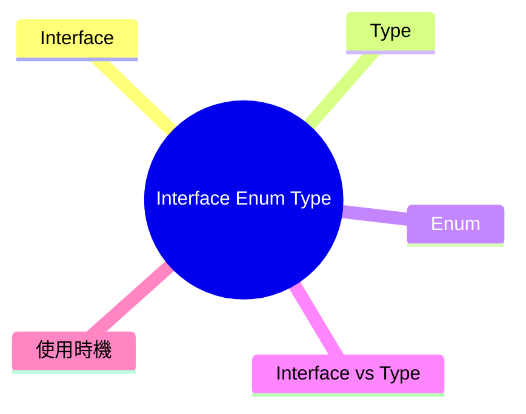

export const metadata = {
  title: 'TypeScript Interface、Enum、Type：作用與比較',
  date: '2026-04-19',
  excerpt: '介紹 TypeScript 中 Interface、Type、Enum 的作用與差異，包含各自的語法、使用場景、宣告合併、聯合型別、Enum 的編譯輸出，以及實務上如何選擇。',
  tags: ['前端', 'TypeScript'],
};

# TypeScript Interface、Enum、Type：作用與比較

TypeScript 提供了三種主要的型別定義工具：`interface`、`enum`、`type`。

三者都用來描述資料結構或型別，但用途和行為有明顯差異。



- [Interface](#interface)
- [Type](#type)
- [Enum](#enum)
- [Interface vs Type](#interface-vs-type)
- [使用時機](#使用時機)

---

## Interface

`interface` 用來描述物件的結構，定義物件應該有哪些屬性和方法。

```typescript
interface User {
  id: number;
  name: string;
  email: string;
}

const user: User = {
  id: 1,
  name: 'Charmy',
  email: 'charmy@example.com',
};
```

### 可選屬性與唯讀屬性

```typescript
interface User {
  id: number;
  name: string;
  email?: string;       // 可選屬性
  readonly createdAt: Date; // 唯讀屬性，賦值後不可修改
}
```

### 繼承

`interface` 可以繼承其他 `interface`，組合多個結構：

```typescript
interface Animal {
  name: string;
}

interface Dog extends Animal {
  breed: string;
}

const dog: Dog = {
  name: 'Max',
  breed: 'Labrador',
};
```

也可以繼承多個：

```typescript
interface C extends A, B { ... }
```

### 宣告合併 (Declaration Merging)

同名的 `interface` 會自動合併，這是 `interface` 獨有的特性：

```typescript
interface User {
  name: string;
}

interface User {
  age: number;
}

// 最終 User 同時有 name 和 age
const user: User = { name: 'Charmy', age: 25 };
```

這個特性在擴充第三方函式庫的型別定義時很有用。

---

## Type

`type` 是型別別名 (Type Alias)，可以給任何型別一個名稱，不限於物件。

```typescript
type UserId = number;
type UserName = string;

type User = {
  id: UserId;
  name: UserName;
};
```

### 聯合型別 (Union Type)

```typescript
type Status = 'active' | 'inactive' | 'pending';
type ID = number | string;

function getUser(id: ID): User { ... }
```

### 交叉型別 (Intersection Type)

```typescript
type Admin = User & { role: 'admin' };
```

相當於合併多個型別的所有屬性。

### 工具型別

`type` 可以搭配 TypeScript 的內建工具型別：

```typescript
type PartialUser = Partial<User>;   // 所有屬性變可選
type ReadonlyUser = Readonly<User>; // 所有屬性變唯讀
type UserKeys = keyof User;         // 取得所有屬性名稱的聯合型別
```

---

## Enum

`enum` 是一組具名常數的集合，讓相關的常數有明確的名稱和型別。

### 數字 Enum (預設)

```typescript
enum Direction {
  Up,    // 0
  Down,  // 1
  Left,  // 2
  Right, // 3
}

const move = Direction.Up; // 0
```

成員的值預設從 0 開始自動遞增。

### 字串 Enum

```typescript
enum Status {
  Active = 'ACTIVE',
  Inactive = 'INACTIVE',
  Pending = 'PENDING',
}

const status = Status.Active; // 'ACTIVE'
```

字串 Enum 的值在執行時可讀性更高，除錯時比數字更直觀。

### Const Enum

加上 `const` 關鍵字，Enum 在編譯時會被內聯替換，不會產生額外的 JavaScript 物件：

```typescript
const enum Direction {
  Up = 'UP',
  Down = 'DOWN',
}

// 編譯後不會有 Direction 物件，直接替換成 'UP'
const move = Direction.Up; // 編譯後：const move = 'UP';
```

### Enum 的編譯輸出

一般的 Enum 會編譯成真實的 JavaScript 物件：

```typescript
// TypeScript
enum Status {
  Active = 'ACTIVE',
  Inactive = 'INACTIVE',
}

// 編譯後的 JavaScript
var Status;
(function (Status) {
  Status["Active"] = "ACTIVE";
  Status["Inactive"] = "INACTIVE";
})(Status || (Status = {}));
```

這表示 Enum 在執行時是真實存在的物件，可以迭代，也可以用值反查名稱。

---

## Interface vs Type

`interface` 和 `type` 在很多場景下可以互換，但有幾個關鍵差異：

| | `interface` | `type` |
| - | - | - |
| 物件結構 | ✓ | ✓ |
| 聯合型別 | ✗ | ✓ |
| 交叉型別 | 透過 `extends` | 透過 `&` |
| 宣告合併 | ✓ (同名自動合併) | ✗ (同名會報錯) |
| 繼承語法 | `extends` | `&` (交叉型別) |
| 工具型別 | 可以作為泛型參數 | 可以作為泛型參數 |
| 遞迴型別 | ✓ | ✓ (部分情況有限制) |

```typescript
// interface 的寫法
interface Animal {
  name: string;
}
interface Dog extends Animal {
  breed: string;
}

// type 的等效寫法
type Animal = { name: string };
type Dog = Animal & { breed: string };
```

---

## 使用時機

### 用 `interface`

- 定義物件的結構 (特別是公開 API 的型別)
- 需要被繼承或實作 (`implements`)
- 需要讓第三方可以擴充 (宣告合併)

```typescript
// 類別實作 interface
interface Printable {
  print(): void;
}

class Document implements Printable {
  print() {
    console.log('Printing...');
  }
}
```

### 用 `type`

- 定義聯合型別或交叉型別
- 定義非物件的型別 (函式、元組、原始型別別名)
- 使用工具型別

```typescript
type EventHandler = (event: MouseEvent) => void;
type Pair = [string, number];
type StringOrNumber = string | number;
```

### 用 `enum`

- 一組固定的具名常數 (狀態、方向、顏色)
- 需要在執行時使用這些值 (迭代、反查)

```typescript
enum HttpStatus {
  Ok = 200,
  NotFound = 404,
  InternalServerError = 500,
}

function handleResponse(status: HttpStatus) {
  if (status === HttpStatus.Ok) {
    // ...
  }
}
```

不適合用 `enum` 的情況：如果只是需要一組字串常數，且不需要執行時的物件，用 `as const` 的字面型別通常是更輕量的選擇：

```typescript
// 取代 enum 的方式
const Status = {
  Active: 'ACTIVE',
  Inactive: 'INACTIVE',
} as const;

type Status = typeof Status[keyof typeof Status];
// 'ACTIVE' | 'INACTIVE'
```

---

## 總結

- `interface`：定義物件結構，支援繼承和宣告合併，適合定義公開 API 的型別
- `type`：型別別名，可以定義任何型別，適合聯合型別、交叉型別和工具型別
- `enum`：具名常數集合，編譯後是真實的 JavaScript 物件，適合一組固定的常數值

實務原則：物件結構優先用 `interface`，聯合型別用 `type`，固定常數集合用 `enum` 或 `as const`。
