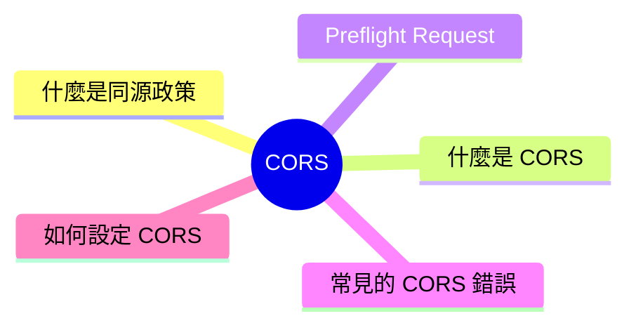
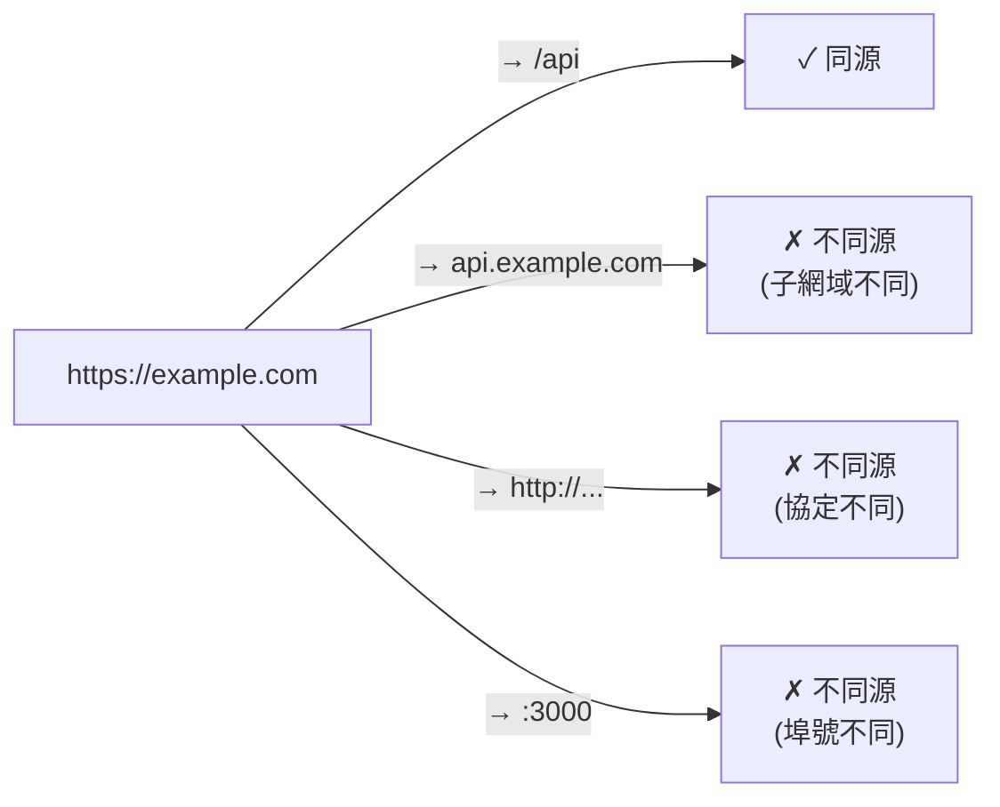

export const metadata = {
  title: 'CORS：跨來源資源共用',
  date: '2026-03-30',
  excerpt: '介紹 CORS 的運作原理，包含同源政策、CORS 標頭、Preflight Request 的觸發條件、常見錯誤訊息，以及如何在伺服器端正確設定 CORS。',
  tags: ['前端', 'Web'],
};

# CORS：跨來源資源共用

當你的前端程式碼嘗試向不同網域的 API 發送請求時，瀏覽器可能會阻擋這個請求，並在 Console 顯示 CORS 錯誤。

這篇文章說明 CORS 是什麼、為什麼存在，以及如何正確設定。



- [什麼是同源政策](#什麼是同源政策)
- [什麼是 CORS](#什麼是-cors)
- [Preflight Request](#preflight-request)
- [常見的 CORS 錯誤](#常見的-cors-錯誤)
- [如何設定 CORS](#如何設定-cors)

---

## 什麼是同源政策

CORS 的存在是為了配合同源政策 (Same-Origin Policy)。

同源政策是瀏覽器的安全機制，限制網頁只能向相同來源 (同源) 的伺服器發送請求。

所謂「同源」，是指以下三個條件都相同：

- 協定 (Protocol)：`http` vs `https`
- 網域 (Domain)：`example.com` vs `api.example.com`
- 埠號 (Port)：`:3000` vs `:8080`

只要其中一個不同，就是跨來源請求。



同源政策保護使用者不被惡意網站竊取另一個網站的資料。

---

## 什麼是 CORS

CORS (Cross-Origin Resource Sharing，跨來源資源共用)是一個 HTTP 機制，讓伺服器可以明確告訴瀏覽器：「允許哪些來源的跨來源請求」。

當瀏覽器發送跨來源請求時，會自動在請求標頭加上 `Origin`：

```
Origin: https://example.com
```

伺服器如果允許這個來源，回應中會加上：

```
Access-Control-Allow-Origin: https://example.com
```

或允許所有來源：

```
Access-Control-Allow-Origin: *
```

瀏覽器收到回應後，如果沒有 `Access-Control-Allow-Origin`，或來源不在允許清單中，就會阻擋這個回應，並在 Console 顯示 CORS 錯誤。

重要：CORS 是瀏覽器的行為，不是伺服器阻擋了請求。 伺服器其實已經收到並處理了請求，只是瀏覽器不讓前端程式碼讀取回應。

---

## Preflight Request

並不是所有跨來源請求都直接發出，某些情況下瀏覽器會先發送一個 Preflight Request (預檢請求)，確認伺服器是否允許，才發送真正的請求。

### 簡單請求 (不觸發 Preflight)

符合以下所有條件的請求，直接發送，不需要 Preflight：

- 方法是 `GET`、`POST`、`HEAD`
- Content-Type 是 `application/x-www-form-urlencoded`、`multipart/form-data`、`text/plain`
- 沒有自訂標頭

### 非簡單請求 (觸發 Preflight)

以下情況會觸發 Preflight：

- 方法是 `PUT`、`DELETE`、`PATCH`
- Content-Type 是 `application/json`
- 有自訂標頭 (如 `Authorization`)

Preflight 是一個 `OPTIONS` 請求：

```
OPTIONS /api/users HTTP/1.1
Origin: https://example.com
Access-Control-Request-Method: POST
Access-Control-Request-Headers: Content-Type, Authorization
```

伺服器回應：

```
Access-Control-Allow-Origin: https://example.com
Access-Control-Allow-Methods: GET, POST, PUT, DELETE
Access-Control-Allow-Headers: Content-Type, Authorization
Access-Control-Max-Age: 86400
```

`Access-Control-Max-Age` 表示這個 Preflight 結果可以被快取多少秒，避免每次請求都要先 Preflight。

---

## 常見的 CORS 錯誤

### 錯誤 1：沒有 Access-Control-Allow-Origin

```
Access to fetch at 'https://api.example.com' from origin 'https://example.com'
has been blocked by CORS policy: No 'Access-Control-Allow-Origin' header
is present on the requested resource.
```

原因：伺服器沒有設定 CORS 標頭。
解決：在伺服器加上 `Access-Control-Allow-Origin`。

### 錯誤 2：來源不在允許清單中

```
Access to fetch at 'https://api.example.com' from origin 'https://other.com'
has been blocked by CORS policy: The 'Access-Control-Allow-Origin' header
has a value 'https://example.com' that is not equal to the supplied origin.
```

原因：伺服器只允許特定來源，但請求來自其他來源。
解決：在伺服器的允許清單中加入該來源。

### 錯誤 3：Preflight 失敗

```
Method DELETE is not allowed by Access-Control-Allow-Methods
```

原因：伺服器的 `Access-Control-Allow-Methods` 沒有包含該請求方法。
解決：在伺服器加上對應的方法。

---

## 如何設定 CORS

CORS 必須在伺服器端設定，前端無法自行解決 CORS 問題。

### Node.js / Express

```javascript
const cors = require('cors');

// 允許所有來源
app.use(cors());

// 允許特定來源
app.use(cors({
  origin: 'https://example.com',
}));

// 允許多個來源
app.use(cors({
  origin: ['https://example.com', 'https://app.example.com'],
}));
```

### 開發環境的替代方案

開發時如果無法修改後端，可以透過前端框架的 Dev Server Proxy 繞過 CORS：

Vite

```javascript
// vite.config.js
export default {
  server: {
    proxy: {
      '/api': {
        target: 'https://api.example.com',
        changeOrigin: true,
      },
    },
  },
};
```

Angular CLI

```json
// proxy.conf.json
{
  "/api": {
    "target": "https://api.example.com",
    "changeOrigin": true
  }
}
```

Proxy 是開發環境的解決方案，不能用在正式環境，正式環境仍然需要後端設定 CORS。

---

## 總結

- 同源政策是瀏覽器的安全機制，限制跨來源請求
- CORS 讓伺服器明確宣告允許哪些來源的跨來源請求
- CORS 錯誤是瀏覽器阻擋回應，不是伺服器拒絕請求
- 非簡單請求 (`PUT`、`DELETE`、`application/json`、自訂標頭) 會先觸發 Preflight
- 解決 CORS 必須在伺服器端設定，前端只能在開發環境用 Proxy 繞過
