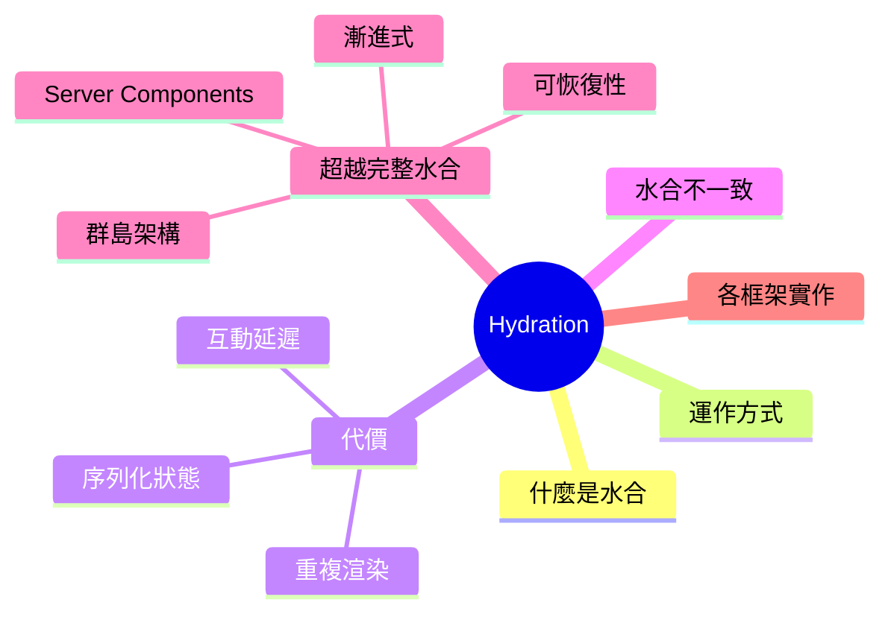
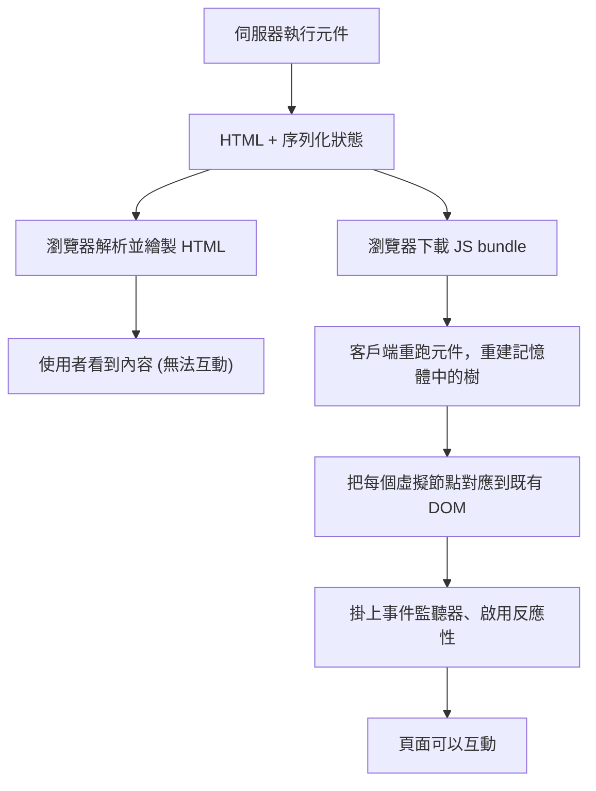
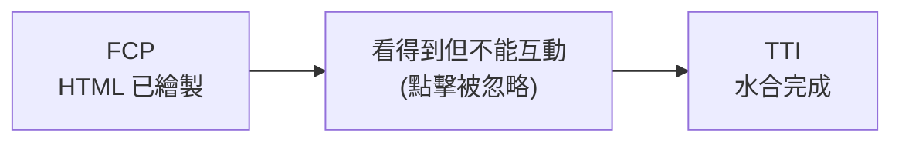
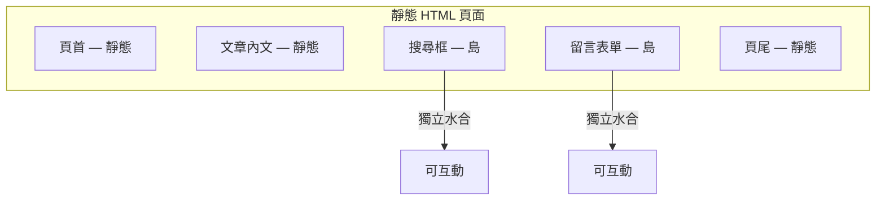
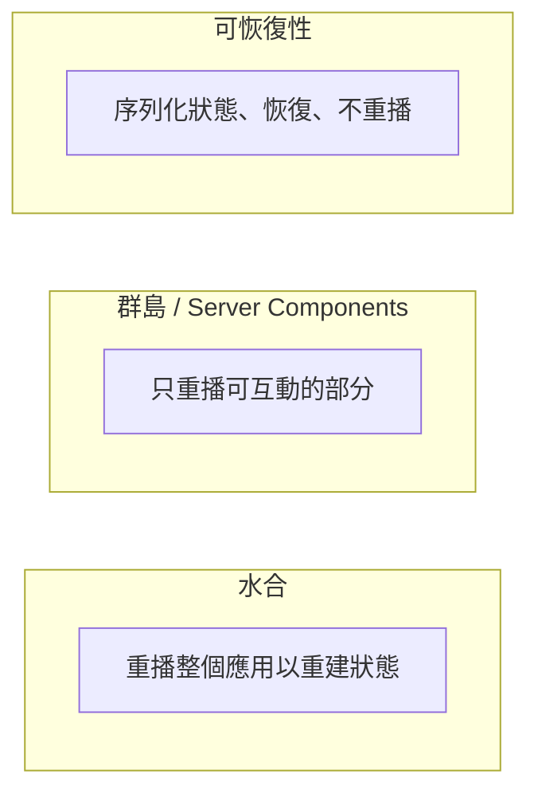

export const metadata = {
  title: 'Hydration 水合：讓伺服器渲染的 HTML 活起來',
  date: '2026-06-24',
  excerpt: '深入解析水合：它是什麼、客戶端如何重用伺服器渲染的 DOM、水合不一致為何發生、它背後的代價，以及漸進式水合、群島架構、可恢復性與 Server Components 如何超越它。',
  tags: ['前端', 'Web'],
};

# Hydration 水合：讓伺服器渲染的 HTML 活起來

伺服器端渲染給你的是一份很快抵達、對爬蟲也很友善的 HTML。但這份 HTML 是死的：按鈕點不動、表單送不出、下拉選單打不 —— 是標記，不是應用程式。總得有個東西把「看得到」和「能互動」之間的鴻溝補起來，那個東西就是水合 (Hydration)。

這個名字來自一個很直白的畫面。伺服器送來的是「乾的」 HTML —— 頁面完整的結構，但少了讓它運作的 JavaScript。瀏覽器接著注入「水」，也就是 JavaScript，頁面就活了起來。講得精確一點：水合是客戶端 JavaScript 在既有的伺服器渲染 DOM 之上，掛上事件監聽器、重建框架在記憶體裡的狀態的過 —— 重用那份 DOM，而不是從頭再生一份。

值得深入理解，是因為水合是[伺服器端渲染](/articles/web-csr-ssr-ssg)隱藏的稅。它解釋了為什麼一個頁面看起來已經完成，卻會有一秒鐘對你的點擊毫無反應；解釋了那些「hydration mismatch」警告從哪來；而它本身，正是整整一個世代的框 —— 島架構、可恢復性、Server Component —— 盡力氣想縮小或消除的問題。



- [什麼是水合](#什麼是水合)
- [水合的運作方式](#水合的運作方式)
- [水合的代價](#水合的代價)
- [水合不一致](#水合不一致)
- [超越完整水合](#超越完整水合)
- [各框架的水合實作](#各框架的水合實作)
- [快速對照](#快速對照)

---

## 什麼是水合

水合 (Hydration，有時也叫 rehydration) 是把靜態、伺服器渲染的 HTML 在客戶端變成一個可運作應用程式的步驟。它掛上事件處理器、重建框架對頁面的內部模 —— 且是透過重用已經存在的 DOM，而不是建一份新的。

最後這點才是重點。對照純[客戶端渲染](/articles/web-csr-ssr-ssg)就看得出原因。在 CSR 中，瀏覽器收到的是一個幾乎空白的外殼，JavaScript 從無到有建出整棵 DOM。而在伺服器渲染加上水合的情境裡，JavaScript 執行時 DOM 早就存在 —— 服器已經把它完整地送來了。客戶端的工作不是建立 DOM，而是接管它。

水合位在伺服器渲染流程的最末端。伺服器 (SSR 在請求時、SSG 在建置時) 產生了 HTML；水合則是 JavaScript 抵達後，客戶端對這份 HTML 做的事。

它最關鍵的性質是非破壞性 (non-destructive)。它刻意不把伺服器的 DOM 丟掉重建，因為重建會閃爍畫面、浪費掉伺服器的工，也把你好不容易換來的快速繪製給扔了。Angular 的歷史正好是個具體的例子：在 Angular 16 之前，它的伺服器渲染啟動流程是破壞性 —— 會清掉伺服器 DOM，在客戶端整個重新渲染一遍，造成肉眼可見的閃爍。Angular 16 引入了重用既有 DOM 的非破壞性水合，這也是現在幾乎每個框架的做法。

---

## 水合的運作方式

理解水合最好的方式，是把它看成同一棵元件樹的兩次渲染之間的交接：一次在伺服器，一次在客戶端。這兩次必須一致。



逐步來看：

1. 伺服器渲染。 框架執行元件並產生 HTML。關鍵在於，它同時把初始狀態與 props 序列化進頁 —— 常是放在一個 `<script>` 標籤裡的 JSO —— 讓客戶端稍後不必重新取資料，就能重現一模一樣的渲染結果。
2. 繪製。 瀏覽器解析 HTML 並把它畫出來。使用者很快就看到內容 (FCP 很快)，但頁面是無法互動的。同一時間，瀏覽器在下載 JavaScript bundle。
3. 客戶端渲染。 JavaScript 開始執行。框架重跑同一棵元件樹，重建它記憶體中的表 —— 擬 DOM、元件實例、反應性 —— 餵入序列化的狀態，讓輸出和伺服器完全一致。
4. 接管。 框架不建立新元素，而是讓自己剛建好的樹和既有的伺服器 DOM 同步前進，把每個節點認領為對應元件的所在位置。
5. 接線。 它掛上事件監聽器，啟用反應性與資料綁定。
6. 可互動。 頁面現在會回應輸入了。

最關鍵的假設藏在第 4 步：客戶端的第一次渲染，必須產生一棵和伺服器 HTML 結構完全相同的樹。水合信任這份標 —— 設情況下，它不會去比對 DOM 再修補差異。這份信任正是水合之所以快的原因，也正是兩邊一旦不一致就會出問題的原因 (下一節會談)。

在程式碼裡，水合和全新的客戶端渲染是不同的進入點。React 把這個區別講得很清楚：

```javascript
import { createRoot, hydrateRoot } from 'react-dom/client';

// 純客戶端：從頭建出 DOM。
createRoot(document.getElementById('root')).render(<App />);

// 伺服器渲染：接管既有 DOM，而不是重建。
hydrateRoot(document.getElementById('root'), <App />);
```

有個細節值得一提：「掛上事件監聽器」其實沒有聽起來那麼貴。像 React 這樣的框架不會為每個節點都綁一個處理 —— 在根容器上掛一小組監聽器，靠事件委派 (event delegation) 運作，所以接線的成本是隨事件種類的數量成長，而不是隨節點數量成長。

---

## 水合的代價

水合讓你拿到 SSR 的快速繪製和良好 SEO，又不必放棄互動性。但它不是免費的，而且這些代價是結構性的，不是偶發的。

它把工做了兩遍。 每個元件在伺服器渲染一次，在客戶端又渲染一次。伺服器耗 CPU 產生 HTML；客戶端又耗 CPU 重建那棵對應這份 HTML 的樹。對使用者來說，第二次渲染沒產生任何新像 —— 容早就在畫面上 —— 以它在通往可互動的路上，純粹是額外負擔。

它把內容送了兩遍。 頁面同時帶著渲染好的 HTML (讓使用者看) 和序列化的狀態 (讓客戶端不必重新取資料就能重建)。一個商品頁的資料，會以可見的標記送一次，又以一塊嵌進文件裡的 JSON 再送一次。這種重複讓 payload 變大，而使用者從中得不到任何看得見的好處。

它在「看起來好了」和「真的好了」之間打開一道縫。 這才是真正的 UX 問題。First Contentful Paint 來得 —— TML 在任何 JavaScript 執行前就繪製出來了。但 Time to Interactive 落後了，因為頁面要等 bundle 下載、解析、執行、水合完成之後才能回應。在這段空窗裡，頁面就是一張照片：使用者看到一個按鈕、點下去，什麼都沒發生。這個點擊可能被整個丟掉，也可能被排隊到水合完成才處理。這道空窗正是讓 Total Blocking Time 變糟、傷害 Interaction to Next Paint 的元兇。



傳統上，它是全有或全無。 在傳統水合裡，整個頁面必須先水合完，任何東西才能互動，而這份工會以一個單一、往往很長的任務跑著，阻塞主執行緒。應用程式越大，畫面凍得越久。成本是隨應用程式的大小成長 —— 恰恰是反過來的，因為越大的應用，正是你越希望互動能快點到位的地方。打破這個成長關係，就是 [超越完整水合](#超越完整水合) 裡所有做法的動機。

---

## 水合不一致

水合不一致 (hydration mismatch) 發生在伺服器送來的 DOM，和客戶端第一次渲染產生的結果對不起來的時候。因為水合假設兩者完全相同，任何分歧都會破壞接管：框架走到一個它預期會找到的節點，卻找到別的東西。

各框架的反應不太一樣，但沒有一種反應是免費的：

- React 會記錄一個錯誤，並對不一致的子樹退回客戶端渲 —— 把那一塊的伺服器 HTML 丟掉，在客戶端重新渲染。正確性保住了，但你失去了那一塊的 SSR 好處，還可能看到內容變動的一閃。React 19 把錯誤訊息講得更清楚，會用 diff 標出哪裡不一樣。
- Vue 會在開發模式發出 hydration mismatch 警告，並讓客戶端渲染接管出問題的節點。
- Angular 在開發模式下結構對不起來時，會丟出 `NG0500` 水合錯誤。

實務上，原因出奇地一致。幾乎全部都歸結到同一件事：伺服器和客戶端兩次渲染，被要求產生不同的輸出：

- 非決定性的 —— Date.now()`、`new Date()`、`Math.random()`、`crypto.randomUUID()`。伺服器算出一個值，客戶端算出另一個，渲染出來的文字就不一樣了。
- 渲染時用到只存在於瀏覽器的 AP —— 渲染過程中讀 `window`、`document`、`localStorage` 或 `navigator`。這些在伺服器上不存在，因此那些會依環境判斷的程式碼，在伺服器走一條分支、在瀏覽器走另一條。
- 語系與時區格 —— 服器通常跑在 UTC，訪客的瀏覽器跑在當地時區。同一個時間戳或數字，兩邊格式化出來不一樣。
- 不合法的 HTML 巢 —— <p>` 裡放 `<div>`、`<p>` 裡放 `<p>`、行內元素裡放區塊元素、`<table>` 少了 `<tbody>`。瀏覽器的解析器會默默「修正」不合法的標記，於是實際的 DOM 就和伺服器吐出的字串對不上了。
- 外部對 DOM 的改 —— 覽器擴充套件 (Grammarly、暗色模式注入器) 和第三方腳本，在水合執行前就改動了 DOM。

修法跟著原因走。讓客戶端的第一次渲染和伺服器一致，之後再去改：

```javascript
function LastUpdated() {
  // 錯：伺服器和客戶端算出不同的時間 → 不一致。
  return <span>{new Date().toLocaleTimeString()}</span>;
}

function LastUpdated() {
  // 對：第一次渲染先不渲染任何跟時間有關的東西，
  // 掛載後再填進 —— 裡只有客戶端會跑。
  const [time, setTime] = useState(null);
  useEffect(() => setTime(new Date().toLocaleTimeString()), []);
  return <span>{time}</span>;
}
```

通則是：讓渲染具有決定性；把只屬於瀏覽器、以及和時間相關的值，移到掛載後的 effect 裡 (`useEffect`、Vue 的 `onMounted`、Angular 的 `afterNextRender`)，讓第一次渲染和伺服器一致；讓兩邊用同樣的資料、語系、時區；並輸出合法的 HTML。至於真的避不開的情 —— 個你非得立刻渲染的時間 —— eact 提供了 `suppressHydrationWarning`，但把它當成手術刀：它只讓那一個元素的警告消音，並不會真的去調和那個差異。

---

## 超越完整水合

完整水合最致命的缺陷，是它的成本隨應用程式的大小成長。過去這些年框架圈大部分的努力，都是在打破這個關 —— 更少程式碼去水合，或乾脆不重跑整個應用。

### 漸進式與延遲水合

與其用一個阻塞的任務把所有東西一次水合完，不如把工攤開。漸進式水合 (progressive hydration) 讓元件隨時間陸續水合；延遲水合 (lazy hydration) 則把一個元件延到真正需要時才水 —— 瀏覽器閒置時 (`requestIdleCallback`)、在元件捲進視窗時 (`IntersectionObserver`)，或在第一次互動時。一個頁尾、一個位在很下面的留言區，並不需要在第一秒就能互動，所以它的水合成本可以等，不去阻塞那些真的需要的部分。

### 群島架構

群島架構 (Islands Architecture) 把預設值翻轉過來。不再是「一個全互動的頁面、再從中挖出靜態區塊」，而是頁面預設就是靜態 HTML，互動性被限縮在各自獨立水合的「島」裡。島與島之間的一切，送出的 JavaScript 是零。



Astro 是最清楚的例子：元件預設是靜態的，除非你用 `client:*` 指示詞讓它加入互 —— client:load` (立即水合)、`client:idle` (瀏覽器閒置時)、`client:visible` (捲進視窗時)，或 `client:only` (完全跳過 SSR)。對於大部分都是文字和圖片的內容型網站，群島架構把水合的帳單砍到幾乎為零。

### Server Components 與串流

React Server Components 把這個想法推進到元件模型本身。一個 Server Component 只在伺服器執行，渲染成一種序列化格式，送出零 JavaScript，而且永遠不會水合。只有 Client Component —— 用 `'use client'` 標記的那 —— 會被送到瀏覽器並水合。再搭配串流 SSR 和 `Suspense`，伺服器就能分塊把 HTML 送出來，同時 React 依優先順序水合那些可互動的葉節點，甚至能先水合使用者剛點的那一塊，再處理其餘的。整體效果是：需要水合的程式碼量，縮到只剩這棵樹裡真正可互動的部分。

### 可恢復性

可恢復性 (Resumability) 由 Qwik 開創，是最激進的解法：完全跳過水合。它的洞見在於，水合本質上是一種重 —— 戶端重跑元件，去重建伺服器早就算好的狀態。可恢復性改成把那個結果序列化下來。伺服器把應用程式狀態以及框架的執行狀 —— 哪些監聽器、接下來要跑什 —— 接嵌進 HTML。客戶端什麼都不重播；它從伺服器停下的地方恢復 (resume)，只在某個處理器真的觸發時，才去延遲載入它的程式碼。



因為沒有重播，啟動成本實際上是 O(1 —— 應用程式有多大無關。這正是完整水合永遠做不到的性質。代價是複雜度：序列化執行狀態、接好延遲載入的處理器都很精細，圍繞它的生態系也比 React 或 Vue 年輕。

貫穿這四者的主線是：水合重播整個應用，去重建伺服器早就知道的東西；群島和 Server Components 縮小重播多少；可恢復性則乾脆把重播本身拿掉。

---

## 各框架的水合實作

概念是共通的，但 API 與預設行為各有不同。

React。 `hydrateRoot(container, <App />)` (React 18，取代了舊的 `ReactDOM.hydrate`) 負責接管伺服器 HTML。串流來自 `renderToPipeableStream`，選擇性水合來自 `<Suspense>` 邊界，零 JS 的路徑則來自 Server Components 加上 `'use client'`。`suppressHydrationWarning` 是針對單一元素的逃生口。

Vue。 呼叫 `createSSRApp(...).mount('#app')` 會觸發水合，而不是全新掛載 (`createApp` 是純客戶端的對應做法)。Vue 3.5 透過 `defineAsyncComponent` 為非同步元件加入了延遲水合，提供 `hydrateOnIdle`、`hydrateOnVisible`、`hydrateOnInteraction`、`hydrateOnMediaQuery` 等策略。

Angular。 `provideClientHydration()` (Angular 16+) 啟用完整的非破壞性水合。`withEventReplay()` 會捕捉水合完成前就觸發的事件，並在之後重播，讓早期的點擊不會遺失。`withIncrementalHydration()` (Angular 19) 把 `@defer` 區塊和 `hydrate on ...` 觸發條 —— 例如 `viewport`、`interaction`、`idle`、`never —— 配起來，達成區塊的延遲水合。

Svelte、SolidStart、Astro、Qwik。 SvelteKit 預設就會水合，並把元件編譯成小而精準的更新程式碼。SolidStart 水合的是細粒度的反應性基元，而不是虛擬 DOM。Astro 以群島為先。Qwik 則是可恢復性框 —— 根本不水合。

---

## 快速對照

| 策略 | 送出的 JS | 何時變得可互動 | 成本 vs. 應用大小 | 代表 |
| - | - | - | - | - |
| 完整水合 | 整個應用 | 整頁水合完之後 | 隨應用成長 | 傳統 React / Vue / Angular SSR |
| 漸進式 / 延遲 | 整個應用，但延後 | 閒置時、進入視窗時、互動時 | 攤開，但仍會成長 | Vue 3.5、延遲水合函式庫 |
| 群島架構 | 只有島 | 每座島各自獨立 | 隨島的數量成長 | Astro、Fresh |
| Server Components | 只有 Client Components | 串流、依優先順序 | 隨可互動的葉節點成長 | React、Next.js App Router |
| 可恢復性 | 前期為零，按需載入 | 幾乎即時 | 大致恆定 | Qwik |

---

## 總結

水合是從靜態的伺服器渲染 HTML，通往一個活的應用程式的橋：重用既有的 DOM、掛上監聽器，並在它之上重建框架的狀態。

- 它的運作方式，是把同一棵元件樹跑兩 —— 次在伺服器產生 HTML，一次在客戶端接管 —— 這兩次渲染必須一致。
- 它的代價是結構性的：重複渲染、重複的 payload，以及一道介於 First Contentful Paint 與 Time to Interactive 之間的空窗；在傳統水合裡，這道空窗會隨應用程式的大小成長。
- 它的風險是不一 —— 決定性的值、只屬於瀏覽器的 API、語系差異、不合法的 HTML 是常見元兇，而修法是讓客戶端的第一次渲染和伺服器一致，之後再改。
- 前進的方向，是水合得更少、或乾脆不重播：漸進式與延遲水合把工攤開，群島和 Server Components 把它縮小，可恢復性則拿掉重播，讓啟動成本不再隨應用大小成長。

水合只有在你知道 HTML 從哪來之後才說得 —— 考 [CSR vs. SSR vs. SSG](/articles/web-csr-ssr-ssg)。想知道在這一切之前，瀏覽器拿到這份 HTML 會做什麼，參考 [瀏覽器渲染流程](/articles/web-browser-rendering)；想看從請求到可互動頁面的完整旅程，參考 [從原始碼到畫面](/articles/web-source-to-screen)。
