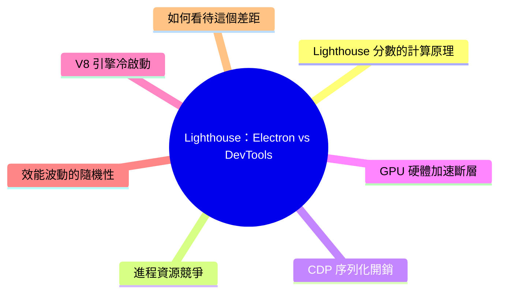

export const metadata = {
  title: 'Lighthouse：Electron 與 Chrome DevTools 的分數差異成因',
  date: '2026-06-20',
  excerpt: '使用 Electron 打造 Lighthouse 自動化跑分工具時，分數常比 Chrome DevTools 低 5–20 分。本文從進程競爭、CDP 序列化、GPU 旗標、V8 冷啟動等底層機制，解析這個結構性差異的根本成因。',
  tags: ['SEO', '前端', 'Web', '效能'],
};

# Lighthouse：Electron 與 Chrome DevTools 的分數差異成因

如果你用 Electron 開發了一個 Lighthouse 自動化跑分工具，然後發現分數永遠比 Chrome DevTools 低 5 到 20 分，這並不是你的程式碼有問題。

這是結構性的差異，來自 Electron 執行 Chromium 的方式與 DevTools 執行 Lighthouse 的方式本質上的不同。理解這個差距，才能正確判讀你的測試結果。

- [Lighthouse 分數的計算原理](#lighthouse-分數的計算原理)
- [進程資源競爭](#進程資源競爭)
- [CDP 序列化開銷](#cdp-序列化開銷)
- [GPU 硬體加速斷層](#gpu-硬體加速斷層)
- [V8 引擎冷啟動](#v8-引擎冷啟動)
- [效能波動的隨機性](#效能波動的隨機性)
- [如何看待這個差距](#如何看待這個差距)

---

## Lighthouse 分數的計算原理

Lighthouse 並非線性加總各項指標，而是將各指標的原始時間值透過對數正態分佈的累積分布函數 (CDF) 映射為 0–100 的分數：

$$Score = 100 \times \Phi\left( \frac{\ln(\text{median}) - \ln(p)}{\sigma} \right)$$

其中 $p$ 為實測值，$\text{median}$ 為參考中位數，$\sigma$ 決定曲線形狀。比中位數快的頁面得分高於 50，比中位數慢的低於 50。

此模型的關鍵特性在於：在中間段 (約 40–60 分) 的曲線斜率最陡峭。這意味著在這個區間，原始執行時間即使只有幾毫秒的差異，換算成分數時都會被放大。

在目前的 Lighthouse 權重配置中，TBT (30%) 與 LCP (25%) 合計佔了 55%。這兩個指標對 CPU 負載與執行緒排程最敏感，也正是 Electron 環境最容易施加壓力的地方。

---

## 進程資源競爭

在 Chrome DevTools 中執行 Lighthouse，環境相對純粹：瀏覽器透過內部 CDP 連線直接與自身通訊，Lighthouse Runner 在獨立沙箱中運作，不與頁面主執行緒競爭資源。

Electron 自動化工具則是另一回事。典型的設定下，同時運行著：

- Electron 的 Main 進程 (Node.js)
- 工具自身 UI 的 Renderer 進程 (React)
- 本地開發伺服器 (Vite 等)
- 進程間頻繁的 IPC 通訊

以上全都與被測 Chromium 實例爭奪同一顆 CPU 的核心與記憶體頻寬。作業系統不會自動將資源優先分配給被測網頁，不像 Chrome 身為前台視窗時那樣。

當 CPU 在多個進程間頻繁切換時，被測頁面的 JavaScript 長任務 (Long Tasks) 執行時間就會被拉長，直接導致 TBT 上升，並拖累渲染管線，讓 LCP 變慢。

---

## CDP 序列化開銷

Puppeteer 與 Playwright 透過 WebSocket 的 Chrome DevTools Protocol (CDP) 連線驅動 Chromium。在原生 DevTools 內部，CDP 指令是進程內的直接呼叫，幾乎零延遲。

透過 Puppeteer，Lighthouse 監聽的數百個事件與資料流，每一筆都必須：

1. 序列化為 JSON
2. 透過本地 Socket 傳輸
3. 在另一端反序列化

這在單次稽核中會發生數百次。累積的 I/O 開銷，在 Lighthouse 正在測量的關鍵渲染時間點上插入了微秒級的額外延遲。

---

## GPU 硬體加速斷層

日常使用的 Chrome 瀏覽器完整啟用了系統層級的 GPU 硬體加速。Puppeteer 為了確保在 headless 環境與 CI 流程中的穩定性，通常帶上 `--disable-gpu` 旗標。

少了 GPU 協助處理圖層合成 (Compositing)，渲染工作回落至 CPU。這直接造成 Speed Index 與 LCP 的結構性下降，並非是頁面變差了，而是測量環境的硬體支援不如日常瀏覽器。

---

## V8 引擎冷啟動

Chrome 的 V8 引擎採用多層級 JIT 編譯：從 Ignition 解譯器開始，隨著程式碼重複執行逐步升級至 TurboFan 優化編譯器。在正常的瀏覽器工作階段中，核心執行模組、DNS 解析結果與字體快取都已在背景完成預熱。

Electron 自動化工具每次都拉起一個全新、冰冷的 Chromium 實例。V8 必須從冷路徑重新編譯，圖片與字體解碼快取皆為空。這個冷啟動的代價，會直接反映在 FCP 與 LCP 的初始數值上。

---

## 效能波動的隨機性

即使在同一台機器、相同配置下連續執行，同一個頁面跑兩次也不會得到完全相同的分數。主要的變動來源：

- 作業系統排程：macOS 的 GCD 或 Linux 的 CFS 會因為背景系統任務 (iCloud 同步、Spotlight 索引等) 動態抽調 CPU 時間片。一次排程中斷剛好發生在 JavaScript 執行期間，TBT 就會被拉高一個難以預測的量。
- V8 Major GC：批量測試期間記憶體堆積，V8 會週期性觸發 Major GC (Mark-Sweep-Compact)。如果 GC 週期剛好與稽核視窗重疊，TBT 可能偏移 ±15 分，完全取決於時機點。
- CPU 散熱降頻：持續的高負載讓 CPU 溫度升高，硬體為了保護自身會強制降頻。第 1 個頁面測試時 CPU 跑在 3.2 GHz，第 20 個頁面時可能已降至 2.4 GHz。頁面沒有變差，是測量環境本身在物理層面退化了。

這些因素不限於 Electron，任何自動化 Lighthouse 工具都會受到影響。

---

## 如何看待這個差距

解法不是放棄自動化，而是正確地使用它。

專注相對趨勢，而非絕對數值。 自動化工具的真正價值在於建立穩定的基準線 (Baseline)。只要測試環境與配置保持一致，下週跑出的 65 分相較於本週的 70 分，這 5 分的跌幅就是有意義的技術警訊 (Regression)。絕對數值不需要與 DevTools 吻合，趨勢本身就是有效的訊號。

建立兩階段工作流程。 用自動化工具大面積掃描，找出分數明顯低於基準線的異常頁面；一旦鎖定目標，再開啟 Chrome DevTools 執行詳細的 Performance Profile，追蹤到程式碼層級的根本原因。

自動化負責大規模篩選，DevTools 負責深度診斷。
