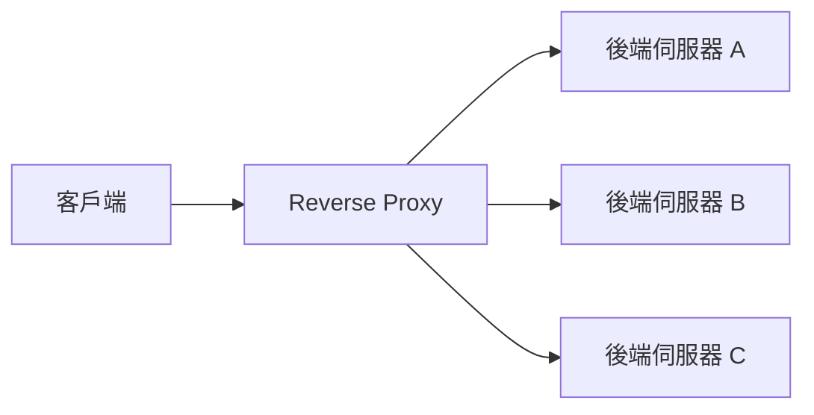

export const metadata = {
  title: 'Proxy：正向代理與反向代理',
  date: '2026-03-30',
  excerpt: '介紹 Proxy 的兩種類型，包含 Forward Proxy 與 Reverse Proxy 的運作機制與用途，以及前端開發環境中 Dev Server Proxy 的設定方式。',
  tags: ['前端', 'Web'],
};

# Proxy：正向代理與反向代理

Proxy (代理) 是一個在客戶端和伺服器之間轉發請求的中間層。

根據代理的方向不同，分為兩種：

- Forward Proxy (正向代理)：代替客戶端發送請求
- Reverse Proxy (反向代理)：代替伺服器接收請求

```text
Proxy
├─ Forward Proxy
├─ Reverse Proxy
├─ Forward vs Reverse 的差異
└─ 前端開發環境的 Dev Server Proxy
```

- [Forward Proxy](#forward-proxy)
- [Reverse Proxy](#reverse-proxy)
- [Forward vs Reverse 的差異](#forward-vs-reverse-的差異)
- [前端開發環境的 Dev Server Proxy](#前端開發環境的-dev-server-proxy)

---

## Forward Proxy

Forward Proxy 站在客戶端這一側，代替客戶端向外部伺服器發送請求。

```text
客戶端 → Forward Proxy → 目標伺服器
```

目標伺服器看到的是 Proxy 的 IP，而不是客戶端的真實 IP。

### 主要用途

突破地區限制

某些網站或服務有地區限制，透過位於其他地區的 Forward Proxy，客戶端可以存取這些被封鎖的資源。VPN 的原理與此類似。

隱藏客戶端身份

目標伺服器無法得知實際發送請求的客戶端 IP，提供一定程度的匿名性。

企業內網存取控制

公司可以在內網出口設置 Forward Proxy，監控員工的網路流量、限制可存取的網站。

快取

Forward Proxy 可以快取常用的外部資源，減少重複請求，加快存取速度。

---

## Reverse Proxy

Reverse Proxy 站在伺服器這一側，代替後端伺服器接收來自客戶端的請求，再轉發給內部伺服器。

```text
客戶端 → Reverse Proxy → 後端伺服器
```

客戶端只知道 Reverse Proxy 的存在，不知道背後有哪些伺服器。

### 主要用途

負載平衡 (Load Balancing)

Reverse Proxy 可以將請求分散到多台後端伺服器，避免單一伺服器過載：



SSL 終止 (SSL Termination)

Reverse Proxy 處理 HTTPS 加解密，後端伺服器只需處理 HTTP，簡化後端設定。

隱藏後端架構

客戶端無法直接存取後端伺服器，增加安全性，也讓後端架構可以自由調整而不影響外部介面。

快取與壓縮

Reverse Proxy 可以快取靜態資源、壓縮回應，減輕後端伺服器的負擔。

### Nginx 作為 Reverse Proxy

Nginx 是最常用的 Reverse Proxy 之一，基本設定如下：

```nginx
server {
    listen 80;
    server_name example.com;

    location /api/ {
        proxy_pass http://backend:3000/;
        proxy_set_header Host $host;
        proxy_set_header X-Real-IP $remote_addr;
    }

    location / {
        root /var/www/html;
        try_files $uri $uri/ /index.html;
    }
}
```

這個設定讓 `/api/` 的請求轉發到後端的 `3000` 埠，其他請求則提供前端靜態檔案。

---

## Forward vs Reverse 的差異

| | Forward Proxy | Reverse Proxy |
| - | - | - |
| 站在哪一側 | 客戶端 | 伺服器 |
| 誰知道 Proxy 的存在 | 客戶端知道 | 客戶端不知道 |
| 隱藏誰的身份 | 隱藏客戶端 | 隱藏伺服器 |
| 主要用途 | 突破限制、匿名、存取控制 | 負載平衡、SSL 終止、安全 |

---

## 前端開發環境的 Dev Server Proxy

在前端開發中，Dev Server Proxy 是一種特殊的 Forward Proxy，用來解決開發環境的 CORS 問題。

當前端 (`localhost:4200`) 需要呼叫後端 API (`https://api.example.com`) 時，會遇到跨來源問題。Dev Server Proxy 讓前端把請求發給自己的 Dev Server，再由 Dev Server 轉發給後端，繞過瀏覽器的 CORS 限制。

```text
瀏覽器 → localhost:4200/api → Dev Server Proxy → https://api.example.com
```

瀏覽器只看到 `localhost:4200`，不會觸發 CORS。

### Vite

```javascript
// vite.config.js
export default {
  server: {
    proxy: {
      '/api': {
        target: 'https://api.example.com',
        changeOrigin: true,
        rewrite: path => path.replace(/^\/api/, ''),
      },
    },
  },
};
```

### Angular CLI

```json
// proxy.conf.json
{
  "/api": {
    "target": "https://api.example.com",
    "changeOrigin": true,
    "pathRewrite": {
      "^/api": ""
    }
  }
}
```

```json
// angular.json
{
  "serve": {
    "options": {
      "proxyConfig": "proxy.conf.json"
    }
  }
}
```

注意：Dev Server Proxy 只在開發環境有效，正式環境必須由後端正確設定 CORS，或使用 Reverse Proxy 統一處理。

---

## 總結

- Forward Proxy：代替客戶端發送請求，用於突破限制、隱藏身份、存取控制
- Reverse Proxy：代替伺服器接收請求，用於負載平衡、SSL 終止、隱藏後端架構
- Dev Server Proxy：開發環境的 Forward Proxy，用來繞過 CORS，不適用於正式環境
