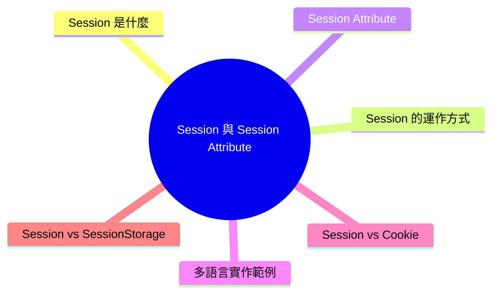

export const metadata = {
  title: 'Session 與 Session Attribute',
  date: '2026-03-31',
  excerpt: '介紹 Session 與 Session Attribute 的核心概念，包含 Session 的運作方式、Session Attribute 的設定與讀取，以及 Java、Node.js、Python、PHP 的實作範例，並比較 Session 與 Cookie、SessionStorage 的差異。',
  tags: ['前端', '後端', '資訊安全'],
};

# Session 與 Session Attribute

HTTP 是無狀態協定，每次請求對伺服器來說都是全新的，不會記得你是誰。

Session 是解決這個問題的機制，讓伺服器能在多個請求之間維持使用者的狀態。Session Attribute 則是儲存在 Session 中的個別資料項目。



- [Session 是什麼](#session-是什麼)
- [Session 的運作方式](#session-的運作方式)
- [Session Attribute](#session-attribute)
- [多語言實作範例](#多語言實作範例)
- [Session vs Cookie](#session-vs-cookie)
- [Session vs SessionStorage](#session-vs-sessionstorage)

---

## Session 是什麼

Session (會話) 是伺服器為每個使用者建立的一個暫時性儲存空間，用來在多個 HTTP 請求之間保存使用者的狀態。

每個 Session 有一個唯一的 Session ID。伺服器將這個 ID 傳給客戶端 (通常透過 Cookie)，客戶端之後的每次請求都帶上這個 ID，伺服器就能識別是哪位使用者。

Session 的特性：

- 儲存在伺服器端，敏感資料不暴露給客戶端
- 有效期限，閒置一段時間後自動失效
- 每個使用者有獨立的 Session，彼此隔離

常見的使用場景：使用者登入狀態、購物車、使用者偏好設定。

---

## Session 的運作方式

```text
1. 使用者第一次訪問，伺服器建立 Session
   Session ID: "abc123"
   Session Data: {}

2. 伺服器將 Session ID 透過 Cookie 傳給客戶端
   Set-Cookie: sessionId=abc123; HttpOnly; Secure

3. 之後每次請求，客戶端自動帶上 Cookie
   Cookie: sessionId=abc123

4. 伺服器用 Session ID 查找對應的 Session 資料

5. 使用者登出或 Session 過期，伺服器刪除 Session 資料
```

---

## Session Attribute

Session Attribute (會話屬性) 是儲存在 Session 中的個別資料項目，每個 Attribute 有一個名稱 (Key) 和對應的值 (Value)。

透過 Session Attribute，伺服器可以在整個 Session 期間記住各種使用者相關資訊：

| Attribute | 用途 |
| - | - |
| `userId` | 已登入的使用者 ID |
| `role` | 使用者權限 (admin、user 等) |
| `cart` | 購物車內容 |
| `language` | 語言偏好 |
| `csrfToken` | CSRF 防護 Token |

---

## 多語言實作範例

### Java (Servlet)

```java
// 取得或建立 Session
HttpSession session = request.getSession();

// 設定 Session Attribute
session.setAttribute("user", "Charmy");

// 讀取 Session Attribute
String user = (String) session.getAttribute("user");

// 刪除 Session Attribute
session.removeAttribute("user");

// 使 Session 失效 (登出)
session.invalidate();
```

### Node.js (Express)

```javascript
const session = require('express-session');

app.use(session({
  secret: 'mySecret',
  resave: false,
  saveUninitialized: false,
  cookie: { secure: true, httpOnly: true }
}));

// 設定 Session Attribute
req.session.username = 'Charmy';

// 讀取 Session Attribute
const username = req.session.username;

// 登出
req.session.destroy();
```

### Python (Flask)

```python
from flask import Flask, session

app = Flask(__name__)
app.secret_key = 'mySecret'

# 設定 Session Attribute
session['username'] = 'Charmy'

# 讀取 Session Attribute
username = session.get('username', 'Guest')

# 刪除 Session Attribute
session.pop('username', None)
```

### PHP

```php
session_start();

// 設定 Session Attribute
$_SESSION['username'] = 'Charmy';

// 讀取 Session Attribute
$username = $_SESSION['username'];

// 刪除 Session Attribute
unset($_SESSION['username']);

// 登出
session_destroy();
```

---

## Session vs Cookie

| | Session | Cookie |
| - | - | - |
| 儲存位置 | 伺服器端 | 客戶端 (瀏覽器) |
| 安全性 | 較高，敏感資料不暴露 | 較低，可被讀取 |
| 儲存容量 | 較大 (受伺服器限制) | 約 4KB |
| 生命週期 | 到期或登出後刪除 | 可設定過期時間 |
| 適合儲存 | 敏感資料 (登入狀態、權限) | 非敏感偏好設定 |

Session ID 本身通常存在 Cookie 中，但 Session 資料存在伺服器，這是兩者搭配使用的常見方式。

---

## Session vs SessionStorage

SessionStorage 是瀏覽器的前端儲存 API，雖然名稱類似，但與 Session 是完全不同的東西。

| | Session | SessionStorage |
| - | - | - |
| 儲存位置 | 伺服器端 | 客戶端 (瀏覽器) |
| 儲存範圍 | 同一 Session 的所有頁面 | 單一分頁 |
| 生命週期 | Session 結束或過期時清除 | 分頁關閉時清除 |
| 跨分頁共享 | 是 | 否 |
| 安全性 | 較高，適合敏感資料 | 不適合敏感資料 |
| 典型用途 | 登入狀態、購物車、權限 | 表單暫存、UI 狀態 |

---

## 總結

- Session 是伺服器端的使用者狀態儲存機制，透過 Session ID 識別使用者
- Session Attribute 是儲存在 Session 中的個別資料項目
- Session 儲存在伺服器，安全性高於 Cookie 和 SessionStorage
- Session 適合儲存敏感資料 (登入狀態、權限)，SessionStorage 適合儲存前端的臨時 UI 狀態
