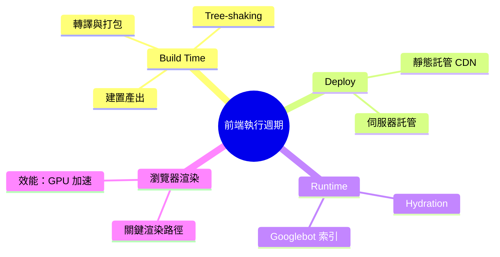
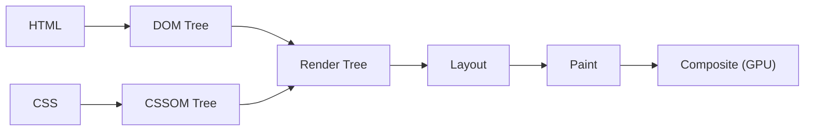

export const metadata = {
  title: '從原始碼到畫面：前端應用完整執行週期',
  date: '2026-06-18',
  excerpt: '介紹前端應用從建置、部署、執行到瀏覽器渲染的完整生命週期，包含打包機制、Content Hash、Hydration 的運作原理、Googlebot 雙階段索引，以及關鍵渲染路徑的效能考量。',
  tags: ['前端', 'Web', '效能'],
};

# 從原始碼到畫面：前端應用完整執行週期

按下 `npm run build` 到使用者看到畫面，中間發生的事遠比「把檔案傳上伺服器」複雜。整個流程可以清楚地分成四個階段：Build Time → Deploy → Runtime → Browser Rendering。

理解這條完整的鏈路，是進行效能優化、排查線上問題，以及深入理解各種渲染策略的必要基礎。



- [Build Time](#build-time)
- [Deploy](#deploy)
- [Runtime](#runtime)
- [瀏覽器渲染](#瀏覽器渲染)
- [總結](#總結)

---

## Build Time

Build Time 是在開發環境或 CI/CD 流程 (例如 GitHub Actions) 中執行的靜態轉換階段。目標是把模組化的原始碼轉化為瀏覽器可以高效載入的最佳化資產。

### 轉譯與打包 (Transpiling & Bundling)

工具 —— 例如 SWC 或 esbuild —— 把 TypeScript、JSX/TSX 轉成目標瀏覽器支援的 JavaScript。接著打包工具 (Vite 內建的 Rollup、Webpack) 分析整個模組依賴圖，將數百個分散的原始碼檔案合併成少數幾個 Bundle。

### Tree-shaking 與 Code Splitting

ES Modules 的靜態結構讓打包工具能在 AST 層級分析，找出「被引入但從未使用」的程式碼並剔 —— 就是 Tree-shaking，能顯著縮小 Bundle 體積。

Code Splitting 則利用動態 `import()` 把應用切成多個非同步 Chunks，讓初次載入只下載必要的程式碼，其餘按需載入。

### 建置產出結構

```bash
dist/
├── index.html              # CSR：空殼 HTML；SSG：完整預渲染的 HTML
├── assets/
│   ├── main-9a7b2c.js      # 主程式 Bundle (含 Content Hash)
│   ├── vendor-f4e2d1.js    # 分離的第三方套件 (利於長效快取)
│   └── style-b3e8a9.css    # 壓縮後的全域樣式表
└── assets/images/
    └── hero.webp           # 轉換格式並壓縮後的圖片
```

檔名帶有 Content Hash (例如 `main-9a7b2c.js`)：只要程式碼不變，檔名就不變，瀏覽器可以安全地長期快取；程式碼一更新，檔名改變，舊快取自動失效，使用者必然拿到最新版本。

---

## Deploy

建置完成後，將 `dist/` 的資產推送到基礎設施。

靜態託管

CSR 與 SSG 的產出都是靜態檔案，直接部署到 Vercel、Netlify、Cloudflare Pages 或 AWS S3 + CloudFront。這些平台會把檔案同步到全球各地的 CDN 邊緣節點 (Edge Nodes)，使用者的請求就近命中最近的節點，延遲極低。

伺服器託管

SSR 需要一個持續運行的 Node.js 環境接收請求並即時渲染 HTML。可以部署到傳統主機，或現代邊緣運算服務 (Vercel Edge Functions、Cloudflare Workers)，後者能把伺服器邏輯推到更靠近使用者的位置，進一步縮短 TTFB。

---

## Runtime

使用者在瀏覽器輸入網址的那一刻，Runtime 開始了。根據採用的渲染策略，伺服器的回應方式不同：

- CSR：回傳空殼 HTML + JS Bundle，瀏覽器下載並執行 JS 後才產生畫面
- SSG：從 CDN 直接回傳 build time 預先渲染好的靜態 HTML
- SSR：伺服器接收請求後即時執行程式碼、fetch 資料、renderToString，再回傳完整 HTML

三種策略的詳細對比與使用時機，參考 [CSR vs. SSR vs. SSG](/articles/web-csr-ssr-ssg)。

### Hydration

SSG 和 SSR 的第一幀 HTML 有內容，使用者能立刻看到畫面，但此時頁面還沒有任何互動能 —— avaScript 還沒執行，事件監聽器都還沒綁定。

Hydration (水合) 是讓靜態 HTML「活起來」的過程。框架不是重新建立整個 DOM，而是走過伺服器已渲染的 DOM 節點，和自己虛擬 DOM 的預期結構做比對，然後就地綁定事件監聽器：

```tsx
// React 18+
import { hydrateRoot } from 'react-dom/client';
import App from './App';

const container = document.getElementById('root');

// 接管伺服器已渲染的 DOM，就地綁定事件監聽器
hydrateRoot(container, <App />);
```

`hydrateRoot` 和 `createRoot` 的差別在於：`createRoot` 假設 DOM 是空的，從頭建立；`hydrateRoot` 假設 DOM 已存在，只做「接管」。

如果伺服器渲染的 HTML 和客戶端的預期結構不符，React 會拋出 Hydration Mismatch 警告，並嘗試修復；嚴重時會退回到客戶端完整重渲染，喪失 SSR 帶來的效能優勢。

### Googlebot 如何索引動態頁面

常見誤解：Googlebot 無法執行 JavaScript。事實上，Google 使用基於 Chromium 的 Web Rendering Service (WRS) 是可以跑 JS 的，但索引流程是兩階段的：

1. 第一階段 (即時解析)：爬蟲抓到 HTML 後立刻解析文字內容。SSR/SSG 頁面此時已有完整內容，可以立刻被精確索引。
2. 第二階段 (延遲渲染)：純 CSR 頁面在第一階段只有空殼，Googlebot 會把它放進「渲染佇列」，等到雲端計算資源空閒再執行 J —— 個延遲可能是數天到數週。

對 SEO 有要求的頁面，SSR 或 SSG 能確保爬蟲在第一階段就拿到完整內容。

---

## 瀏覽器渲染

HTML、CSS、JS 資產抵達瀏覽器後，渲染引擎 (Chromium 使用的是 Blink) 啟動關鍵渲染路徑 (Critical Rendering Path，CRP)，將資料轉化為螢幕像素：



六個關鍵步驟：

1. DOM 建構：解析 HTML 建立 DOM Tree。遇到沒有 `async`/`defer` 的 `<script>` 會暫停解析，先執行腳本。
2. CSSOM 建構：解析 CSS 建立 CSSOM Tree。CSSOM 未完成前，整個畫面渲染被阻塞 (Render-blocking)。
3. Render Tree：DOM + CSSOM 合併，只保留需要顯示的節點 (`display: none` 的節點整棵子樹被排除)。
4. Layout：計算每個節點在視窗中的確切位置與大小，相對單位 (`rem`、`%`) 轉為絕對像素。
5. Paint：根據 Layout 結果繪製視覺元素 (文字、顏色、邊框、陰影)。
6. Composite：各圖層提交給 GPU，按 z-index 順序合層輸出到螢幕。

這條管線的快慢直接影響 Core Web Vital —— CP (First Contentful Paint) 衡量使用者首次看到有意義內容的時間；LCP (Largest Contentful Paint) 衡量最大可見元素完成渲染的時間。Chrome DevTools 的 Performance 面板可以錄製完整的渲染過程，幫助找出瓶頸所在。

### 效能關鍵：只觸發 Composite，跳過 Layout 和 Paint

修改 `top`、`left` 等幾何屬性會觸發 Layout → Paint → Composite 的完整流程，每一幀都重新計算，代價高。

`transform` 和 `opacity` 則只觸發 Composit —— 接交給 GPU 處理，完全繞過 Layout 和 Paint，動畫流暢度明顯更好：

```css
/* 每幀觸發 Layout → Paint → Composite */
.box {
  position: absolute;
  top: 10px;
  transition: top 0.3s ease;
}
.box:hover {
  top: 100px;
}

/* 只觸發 Composite，GPU 直接處理 */
.box {
  position: absolute;
  transform: translateY(10px);
  will-change: transform; /* 提示瀏覽器提前將此元素提升為獨立合成圖層 */
  transition: transform 0.3s ease;
}
.box:hover {
  transform: translateY(100px);
}
```

深入了解 Reflow 和 Repaint 的完整優化技巧，參考 [Browser Rendering Pipeline](/articles/web-browser-rendering)。

---

## 總結

從原始碼到畫面，前端應用走過的四個階段：

| 階段 | 核心工作 | 主要效能考量 |
| - | - | - |
| Build Time | 轉譯、打包、tree-shaking、生成資產 | Bundle 體積、Content Hash 快取 |
| Deploy | 靜態資產推送至 CDN 或伺服器 | CDN 邊緣節點分布、快取設定 |
| Runtime | 伺服器回應請求、Hydration 接管 | 渲染策略選擇、避免 Hydration Mismatch |
| 瀏覽器渲染 | CRP：DOM/CSSOM → Layout → Paint → Composite | 避免 Reflow，優先使用 GPU 加速屬性 |

每個階段都有自己的效能瓶頸。理解整條鏈路，才能在排查問題時精準定位，而不是漫無目的地猜測。
