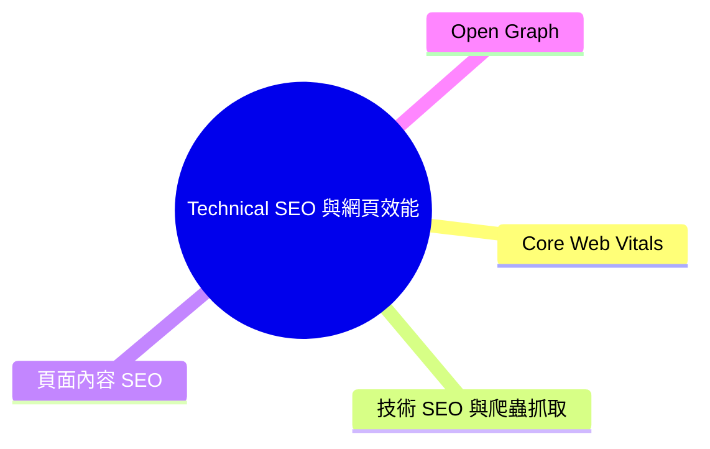

export const metadata = {
  title: 'Technical SEO 與網頁效能參考字典',
  date: '2026-06-20',
  excerpt: '涵蓋 Core Web Vitals、爬蟲抓取、頁面內容標籤到 Open Graph 社群優化的完整定義與標準規範，作為工程與優化團隊的日常參考指南。',
  tags: ['SEO', '前端', 'Web', '效能'],
};

# Technical SEO 與網頁效能參考字典

建構一個效能優秀且搜尋排名良好的網站，需要同時掌握兩個相互交疊的領域：網站效能指標與技術 SEO 配置。

本字典提供你在 Lighthouse 稽核與 SEO 工具中會遇到的完整術語定義、目標值與實作規範。

- [Core Web Vitals](#core-web-vitals)
- [技術 SEO 與爬蟲抓取](#技術-seo-與爬蟲抓取)
- [頁面內容 SEO](#頁面內容-seo)
- [Open Graph](#open-graph)

---

## Core Web Vitals

這些指標衡量網站的載入速度、視覺穩定性與互動反應，Google 直接將其列入搜尋排名的評分依據。

| 指標 | 全名 | 測量內容 | 目標值 |
| :--- | :--- | :--- | :--- |
| LCP | Largest Contentful Paint (最大內容繪製) | 視窗中最大的可見內容元素 (文字區塊或圖片) 完全渲染完成的時間 | ≤ 2.5 秒 |
| CLS | Cumulative Layout Shift (累計版面配置轉移) | 頁面整個生命週期中非預期版面位移的累計量 | ≤ 0.1 |
| TBT | Total Blocking Time (總阻塞時間) | FCP 到可互動時間之間，主執行緒被超過 50ms 的長任務封鎖的累計時間；常作為 INP 的實驗室代理指標 | ≤ 200 毫秒 |
| FCP | First Contentful Paint (首次內容繪製) | 瀏覽器首次在螢幕上渲染出任何 DOM 內容 (文字、圖片或非白色 canvas) 的時間點 | ≤ 1.8 秒 |
| SI | Speed Index (速度指數) | 頁面視覺內容填滿視窗的速度，透過逐格計算視覺進度得出 | ≤ 3.4 秒 |

五個指標均以越低越好為優化方向。

---

## 技術 SEO 與爬蟲抓取

這些設定決定了搜尋引擎能否順利找到、存取並正確理解你的頁面。

- **HTTPS**：全站必須強制啟用 HTTPS。Google 明確將 HTTPS 列為排名因素。
- **robots.txt**：放置於網站根目錄的純文字檔，指示爬蟲哪些路徑可以存取、哪些禁止。語法必須正確，切勿誤擋重要的 CSS 或 JS 資源。
- **Sitemap**：列出全站重要網址的 XML 文件，主動提交給搜尋引擎提升探索效率。不應包含返回 4xx/5xx 或帶有 `noindex` 的無效網址。
- **Canonical 標記**：`<link rel="canonical" href="..." />` 告訴爬蟲哪個 URL 是權威版本，用於解決重複內容或相似 URL 造成的 PageRank 稀釋問題。
- **Robots Meta Tag**：`<meta name="robots">` 控制單一頁面的索引與追蹤行為。公開頁面設定 `index, follow`，後台或隱私頁面設定 `noindex, nofollow`。
- **Viewport Meta**：行動裝置顯示的必要設定，也是 Mobile-First Indexing 的基本要求。標準寫法：`<meta name="viewport" content="width=device-width, initial-scale=1">`。
- **Lang 屬性**：`<html lang="...">` 宣告頁面的主要語言，必須與實際內容一致，協助瀏覽器與搜尋引擎進行語系判斷。
- **hreflang**：多語系或跨國網站專用，指示搜尋引擎在不同地區與語言的搜尋結果中應提供哪個版本的 URL。必須雙向配對，語系代碼需符合 ISO 規範。
- **Schema 結構化資料**：以 JSON-LD 格式嵌入的特殊標記，幫助搜尋引擎理解頁面內容語意 (例如 Article、Product、FAQ 等)。配置正確有機會在搜尋結果中觸發豐富摘要 (Rich Snippets)。

---

## 頁面內容 SEO

影響搜尋引擎排名與搜尋結果呈現方式的內容與結構訊號。

- **Title 標題標籤**：最關鍵的頁面 SEO 排名因素。必須包含核心關鍵字且能吸引使用者點擊。
    - 繁體中文：建議 25–30 個中文字以內
    - 英文/半形字元：建議 50–60 個字元以內
    - 超過上限會在搜尋結果中被截斷為「...」
- **Meta Description 描述標籤**：顯示於搜尋結果標題下方的說明文字。不直接計入排名，但對自然點擊率 (CTR) 影響顯著。
    - 繁體中文：建議 75–80 個中文字以內
    - 英文/半形字元：建議 150–160 個字元以內
- **H1**：最高層級的語意標題，每個頁面有且僅有一個，內容需高度概括核心主題並融入主要關鍵字。
- **H2**：次級結構標題，數量依內容長度而定，職責是將頁面劃分成清晰的語意段落層次。
- **圖片 Alt 屬性**：每張具備實質意義的圖片都必須設定描述性的 `alt` 替代文字。這是爬蟲解讀圖片的唯一途徑，同時也是無障礙網頁 (Accessibility) 的硬性要求。缺少 alt 的圖片數量目標為零。
- **內部連結**：指向同網域其他頁面的連結，能引導使用者、傳遞 PageRank 並協助爬蟲探索全站。數量應自然，過度堆疊會被視為垃圾連結。
- **字數**：文章類頁面建議實質文字達 500 字以上，有助於覆蓋更廣的長尾關鍵字，但重質不重量。

---

## Open Graph

Open Graph 標籤決定了頁面被分享到 LINE、Slack、Facebook 等平台時的預覽卡片樣式，是社群引流的關鍵基礎。

- **og:title**：預覽卡片上的粗體大標題。可與網頁 `<title>` 一致，或針對社群分享情境進行調整。
- **og:description**：卡片上的摘要文字，建議控制在 65–200 個字元之間，以確保在各平台上完整顯示。
- **og:image**：對點擊率影響最大的預覽圖片。黃金標準尺寸為 1200 × 630 像素 (1.91:1 比例)，核心視覺不可被卡片邊緣裁切。
