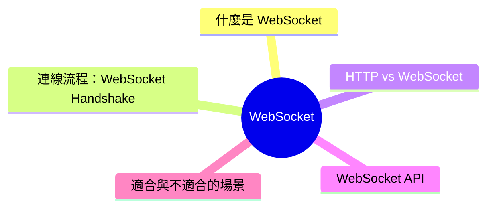
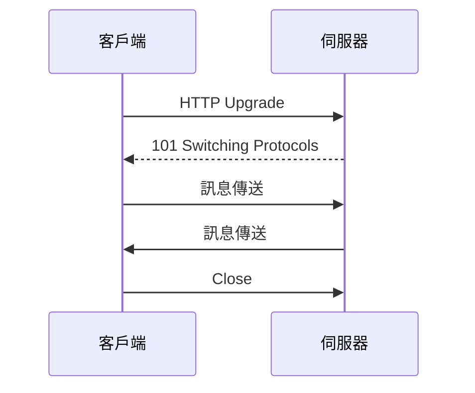

export const metadata = {
  title: 'WebSocket：全雙工即時通訊',
  date: '2026-03-31',
  excerpt: '介紹 WebSocket 的運作原理，包含連線握手流程、與 HTTP 的差異、瀏覽器 WebSocket API 的使用方式，以及適合與不適合使用 WebSocket 的場景。',
  tags: ['前端', 'Web'],
};

# WebSocket：全雙工即時通訊

傳統的 HTTP 請求是單向的：客戶端發送請求，伺服器回傳回應，連線就關閉了。

WebSocket 提供了一種不同的模式：客戶端和伺服器建立一條持久連線，雙方都可以隨時主動發送訊息，不需要每次都重新建立連線。



- [什麼是 WebSocket](#什麼是-websocket)
- [連線流程：WebSocket Handshake](#連線流程websocket-handshake)
- [HTTP vs WebSocket](#http-vs-websocket)
- [WebSocket API](#websocket-api)
- [適合與不適合的場景](#適合與不適合的場景)

---

## 什麼是 WebSocket

WebSocket 是一個應用層協定，建立在 TCP 之上，提供全雙工 (Full-Duplex) 的通訊管道。

全雙工代表連線的兩端可以同時互相傳送訊息，不需要等待對方回應，就像電話通話一樣。

WebSocket 的 URL 使用 `ws://` 或 `wss://` (加密版本)：

```
ws://example.com/chat
wss://example.com/chat
```

---

## 連線流程：WebSocket Handshake

WebSocket 的連線從一個 HTTP 請求開始，稱為 WebSocket Handshake (握手)。

### 1. 客戶端發送升級請求

客戶端透過 HTTP 請求，要求將連線升級為 WebSocket：

```
GET /chat HTTP/1.1
Host: example.com
Upgrade: websocket
Connection: Upgrade
Sec-WebSocket-Key: dGhlIHNhbXBsZSBub25jZQ==
Sec-WebSocket-Version: 13
```

### 2. 伺服器確認升級

伺服器回應 `101 Switching Protocols`，確認升級：

```
HTTP/1.1 101 Switching Protocols
Upgrade: websocket
Connection: Upgrade
Sec-WebSocket-Accept: s3pPLMBiTxaQ9kYGzzhZRbK+xOo=
```

### 3. 連線建立，開始雙向通訊

握手完成後，HTTP 連線升級為 WebSocket 連線，雙方可以自由傳送訊息，直到任一方主動關閉連線。



---

## HTTP vs WebSocket

| | HTTP | WebSocket |
| - | - | - |
| 連線模式 | 每次請求建立新連線 | 持久連線 |
| 通訊方向 | 單向 (客戶端發起) | 雙向 (雙方都可主動) |
| 延遲 | 每次請求都有開銷 | 低延遲 |
| 伺服器推送 | 需要輪詢或 SSE | 原生支援 |
| 適合場景 | 一般 API 請求 | 即時通訊 |

---

## WebSocket API

瀏覽器內建 WebSocket API，不需要額外安裝套件。

### 建立連線

```javascript
const ws = new WebSocket('wss://example.com/chat');
```

### 監聽事件

```javascript
// 連線成功
ws.addEventListener('open', () => {
  console.log('已連線');
});

// 收到訊息
ws.addEventListener('message', event => {
  console.log('收到：', event.data);
});

// 連線關閉
ws.addEventListener('close', event => {
  console.log('連線關閉', event.code, event.reason);
});

// 發生錯誤
ws.addEventListener('error', error => {
  console.error('WebSocket 錯誤', error);
});
```

### 發送訊息

```javascript
// 發送字串
ws.send('Hello');

// 發送 JSON
ws.send(JSON.stringify({ type: 'message', content: 'Hello' }));
```

### 關閉連線

```javascript
ws.close();

// 帶有狀態碼和原因
ws.close(1000, '正常關閉');
```

### 連線狀態

```javascript
ws.readyState
// 0 - CONNECTING：正在連線
// 1 - OPEN：連線已建立
// 2 - CLOSING：正在關閉
// 3 - CLOSED：已關閉
```

### 完整範例：即時聊天室

```javascript
const ws = new WebSocket('wss://example.com/chat');

ws.addEventListener('open', () => {
  console.log('已連線到聊天室');
});

ws.addEventListener('message', event => {
  const message = JSON.parse(event.data);
  displayMessage(message);
});

function sendMessage(content) {
  if (ws.readyState === WebSocket.OPEN) {
    ws.send(JSON.stringify({
      type: 'chat',
      content,
      timestamp: Date.now(),
    }));
  }
}

ws.addEventListener('close', () => {
  console.log('已離開聊天室');
});
```

---

## 適合與不適合的場景

### 適合使用 WebSocket

需要低延遲的雙向即時通訊：

- 即時聊天室：訊息需要即時送達所有參與者
- 多人協作工具：文件同時編輯、游標即時同步 (例如 Figma、Google Docs)
- 即時遊戲：玩家位置、遊戲狀態需要持續同步
- 即時通知：股票價格、運動賽事比分、系統警報
- IoT 裝置資料串流：感測器資料持續推送

### 不適合使用 WebSocket

一般的 API 請求

如果只是取得資料、提交表單，用 HTTP 就足夠了，WebSocket 的持久連線反而是多餘的開銷。

單向的伺服器推送

如果只需要伺服器推送訊息給客戶端 (不需要客戶端回傳)，Server-Sent Events (SSE) 是更簡單的選擇，它基於 HTTP，不需要特別的伺服器設定。

---

## 總結

WebSocket 提供了持久的雙向連線，讓伺服器和客戶端都可以主動發送訊息：

- 從 HTTP Handshake 開始，升級為 WebSocket 連線
- 低延遲，適合需要即時雙向通訊的場景
- 不適合一般的 API 請求，HTTP 就夠用了
- 只需要伺服器推送時，考慮 SSE 作為更簡單的替代方案
